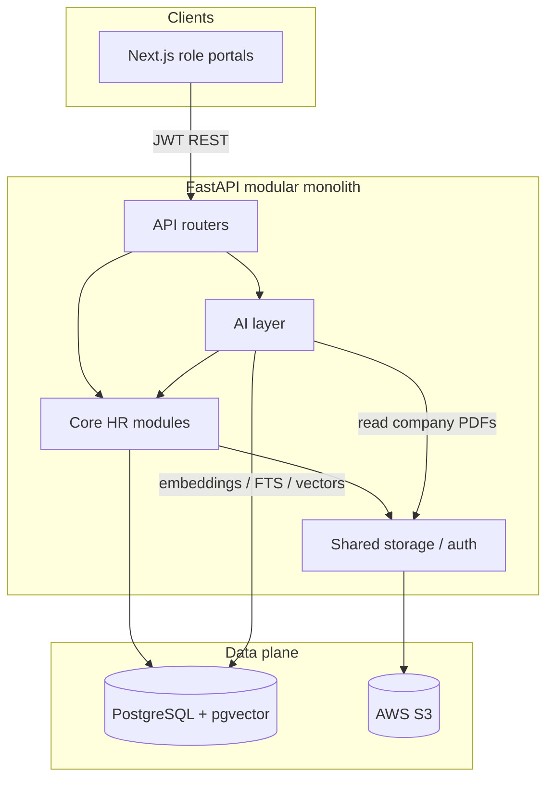
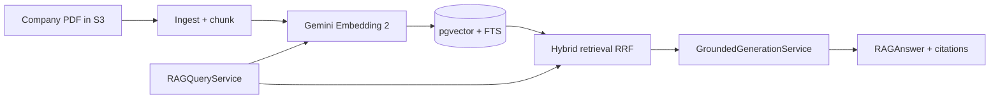

# HR Multi-Agentic System

A web-based HR management platform with a layered AI foundation — a 5th-year Software Engineering final-year project (PFE).

The product is a **real HR system first**: identity, recruitment, organization, onboarding, leave, documents, and dashboards. The AI layer sits beside Core HR — it never invents authorization, never touches the database directly, and answers company-knowledge questions only from retrieved, ACL-filtered documents.

---

## Architecture



### Design principles

| Principle | Practice |
|-----------|----------|
| Modular monolith | Domain modules under `backend/app/modules/` — one deployable API |
| User ≠ Employee | Identity accounts are separate from employment records ([ADR 002](docs/decisions/002-user-vs-employee.md)) |
| Agents never hit the DB | `Agent → Tool → Service → DB` ([ADR 003](docs/decisions/003-agent-database-isolation.md)) |
| Auth before generation | `AIExecutionContext` + permission filters run in retrieval; the LLM only sees authorized context |
| Embed ≠ generate | `gemini-embedding-2` for vectors; conversational `GEMINI_MODEL` for grounded answers |

### Backend layout

```
backend/app/
├── api/                 # Versioned HTTP routes
├── core/                # Config, security, database
├── modules/             # Core HR domains
│   ├── identity/        # Auth, RBAC, seed admin
│   ├── employees/       # Workforce records
│   ├── recruitment/     # Jobs & applications
│   ├── interviews/      # Slots, outcomes, hire
│   ├── onboarding/      # Tasks & verification
│   ├── documents/       # Employee docs + company library
│   ├── training/        # Assignments
│   ├── leave/           # Policies, dual approval
│   ├── notifications/   # In-app alerts
│   ├── dashboard/       # Aggregated HR metrics
│   └── profile/         # Self-service profile
├── ai/                  # AI foundation (in-tree)
│   ├── core/            # LLM providers, AIExecutionContext
│   ├── tools/           # Registry, auth, leave-balance tool
│   ├── orchestration/   # Tool roundtrips (no multi-agent yet)
│   └── rag/             # Ingest → embed → retrieve → answer
└── shared/              # StorageService (S3), cross-cutting helpers
```

### AI / RAG pipeline (Phases 5.1–5.8)



1. **Ingest** — download company-library PDF via `StorageService`, parse pages, deterministic chunking with provenance (`chunk_id`, pages, `content_hash`).
2. **Embed** — persist 768-d vectors (`RETRIEVAL_DOCUMENT`); query embeds use `RETRIEVAL_QUERY`.
3. **Retrieve** — ACL (`company_documents:read`, ACTIVE docs for non-HR) → cosine HNSW + PostgreSQL FTS → RRF fusion → context budget.
4. **Generate** — conversational Gemini answers **only** from that context; citations mapped from retrieval metadata (not invented by the model). Empty context → deterministic abstention (no LLM call).

Authorization is decided **before** generation. Document text is treated as untrusted data (prompt-injection defense).

---

## Tech stack

| Layer | Choice |
|-------|--------|
| Frontend | Next.js 15, React 19, TypeScript, Tailwind CSS |
| Backend | FastAPI, SQLAlchemy 2, Alembic |
| Database | PostgreSQL 16 + **pgvector** |
| Object storage | AWS S3 (`StorageService`) |
| Embeddings | Gemini Embedding 2 (`gemini-embedding-2`) |
| Generation / tools | Gemini Flash (`GEMINI_MODEL`), provider-agnostic `LLMProvider` (Mistral adapter also present) |
| Auth | JWT + RBAC permissions |

---

## Features

### Identity & access

- JWT authentication with roles: admin, HR, manager, employee, candidate
- Admin creates HR accounts; candidates self-register for careers
- HR-staff gates on sensitive recruitment and onboarding writes
- Organization integrity: managers must exist, cannot be self, cannot introduce cycles; **new** manager assignments must be **ACTIVE**

### Recruitment & interviews

- Job posting, application questions, CV / cover letter upload to S3
- Status workflow: submitted → screening → shortlisted / rejected
- Interview invitations (2–5 slots), outcomes, shortlist notifications
- Hire → employee creation and onboarding kickoff

### Organization & employees

- Departments, org positions, reporting hierarchy / directory
- Employee create/edit with manager and position assignment

### Onboarding, documents & training

- Hire-triggered onboarding with task templates and verification sync
- **Employee documents** (onboarding / personal files) and **Company Document Library** + private docs (separate stores)
- Training assignments tied to the employee lifecycle
- Lifecycle and task notifications

### Leave

- Leave types, policies, and balances
- Dual manager / HR approval workflow and calendar views
- Derived on-leave work status for dashboards

### HR dashboard & portals

- Aggregated HR dashboard API and animated UI
- Role shells: admin, HR, manager, employee, and careers / candidate portals
- In-app notifications (bell + pages)

### AI foundation (shipped)

- Provider-agnostic LLM layer + `AIExecutionContext`
- Tool registry with authorization (e.g. leave-balance tool)
- Full RAG path through **grounded generation + citations** (see pipeline above)
- Smoke scripts under `backend/scripts/` for ingest → answer

### Not yet

- Knowledge Agent / multi-agent orchestration UI
- Conversational HTTP chat API for end users
- Recruitment AI (CV scoring, ranking)
- LLM rerank / query reformulation

---

## Quick start

### Prerequisites

- Docker & Docker Compose
- Node.js 20+ (local frontend)
- Python 3.12+ (local backend)
- Gemini API key for AI / RAG smoke tests
- AWS credentials for S3 document flows

### Run with Docker

```bash
docker compose up --build
```

| Service | URL |
|---------|-----|
| Frontend | http://localhost:3000 |
| Backend | http://localhost:8000 |
| API docs | http://localhost:8000/docs |
| PostgreSQL | `localhost:5433` → container `5432` |

> Host port **5433** avoids clashing with a local Postgres on 5432. Use `127.0.0.1:5433` in `backend/.env` when running uvicorn on the host.

### Default admin

```
Email:    admin@hr-platform.local
Password: admin123
```

Copy `backend/.env.example` → `backend/.env` and set at least:

- `GEMINI_API_KEY` / `GEMINI_MODEL`
- `AWS_*` for S3
- `DATABASE_URL` (Compose vs host — see comments in `.env.example`)

---

## Development

### Backend (local)

```bash
cd backend
python -m venv .venv
# Windows:
.\.venv\Scripts\Activate.ps1
# macOS / Linux:
# source .venv/bin/activate

pip install -r requirements.txt
cp .env.example .env
alembic upgrade head
uvicorn app.main:app --reload
```

### Frontend (local)

```bash
cd frontend
npm install
cp .env.example .env.local
npm run dev
```

On Windows, helpers under `scripts/` can stop stale ports and start a clean stack (`dev-stop.ps1`, `dev-start.ps1`; frontend also supports `npm run dev:fresh`).

### RAG smoke (after a company PDF is indexed)

From `backend/` with the venv active:

```powershell
$env:PYTHONPATH = "."
python scripts/smoke_rag_answer.py
```

Expect exactly **one** embedding call and **one** generation call, plus `smoke_rag_answer_ok: True`.

Earlier pipeline checks: `smoke_ingest_pdf.py` → `smoke_embed_chunks.py` → `smoke_hybrid_retrieve.py` → `smoke_rag_query.py`.

---

## Project structure

```
HR-Multi-Agentic-System/
├── backend/                 # FastAPI app, Alembic, RAG smoke scripts
│   ├── app/
│   │   ├── api/
│   │   ├── ai/              # LLM, tools, RAG
│   │   ├── modules/         # Core HR domains
│   │   └── shared/          # S3 storage, etc.
│   ├── alembic/
│   ├── scripts/             # RAG / ingest smoke tests
│   └── tests/
├── frontend/                # Next.js role portals
├── docs/
│   ├── architecture/        # Architecture index
│   └── decisions/           # ADRs
├── scripts/                 # Local Windows dev helpers
├── docker-compose.yml       # db (pgvector) + backend + frontend
└── README.md
```

Architecture decisions: [docs/architecture/README.md](docs/architecture/README.md).

---

## Current status

- [x] Backend foundation (FastAPI, PostgreSQL, Alembic, pgvector)
- [x] Identity & authentication (JWT, RBAC)
- [x] Recruitment (jobs, applications, interviews, hiring)
- [x] Organization structure (departments, positions, reporting tree)
- [x] Onboarding workflow (tasks, verification, notifications)
- [x] Employee documents, company library, private documents & training
- [x] Leave management (policies, dual approval, calendar, on-leave status)
- [x] Premium HR dashboard & role portals
- [x] Core HR security hardening (RBAC / IDOR, inactive-manager validation)
- [x] AI foundation (LLM providers, execution context, authorized tools)
- [x] RAG through grounded generation + citations (Phases 5.1–5.8)
- [ ] Knowledge Agent / multi-agent orchestration & chat UX
- [ ] Recruitment AI (scoring, ranking, CV extraction)

---

## License

See [LICENSE](LICENSE).
