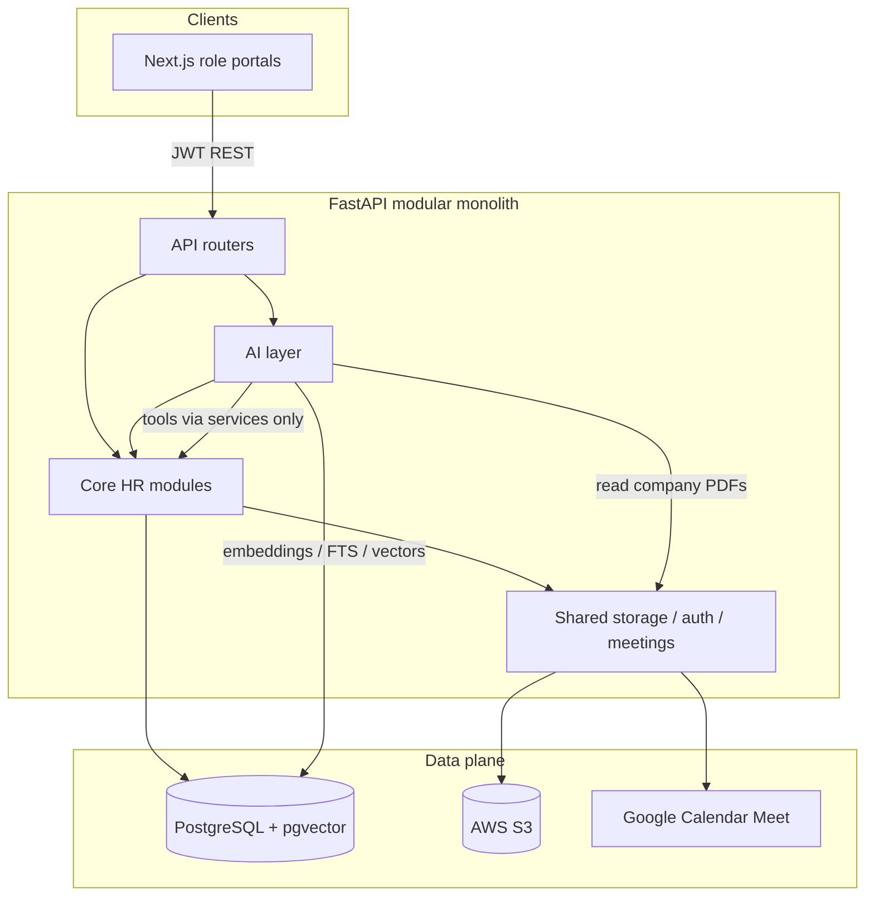
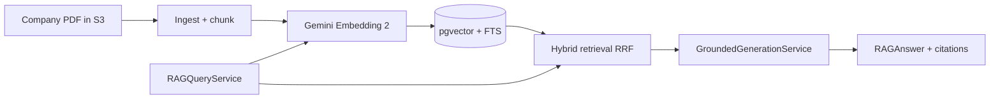
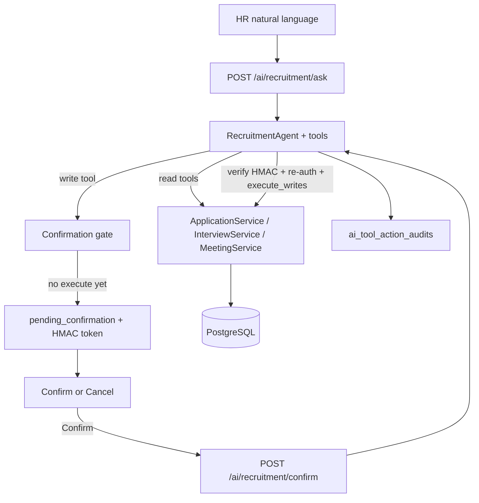
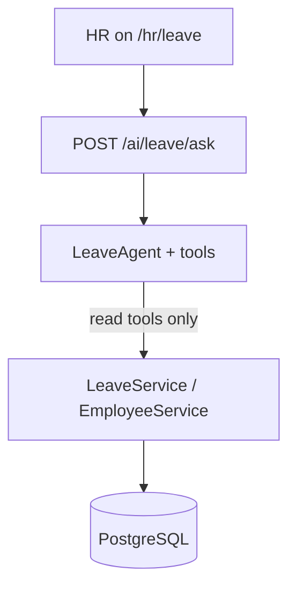

# HR Multi-Agentic System

A web-based HR management platform with a layered AI foundation — a 5th-year Software Engineering final-year project (PFE).

The product is a **real HR system first**: identity, recruitment, organization, onboarding, leave, documents, and dashboards. The AI layer sits beside Core HR — it never invents authorization, never touches the database directly, and answers only from authorized tools or retrieved, ACL-filtered documents.

---

## Architecture


```mermaid
flowchart TB
  subgraph clients [Clients]
    Web[Next.js role portals]
  end

  subgraph backend [FastAPI modular monolith]
    API[API routers]
    Modules[Core HR modules]
    AI[AI layer]
    Shared[Shared storage / auth / meetings]
    API --> Modules
    API --> AI
    Modules --> Shared
    AI --> Modules
  end

  subgraph data [Data plane]
    PG[(PostgreSQL + pgvector)]
    S3[(AWS S3)]
    Meet[Google Calendar Meet]
  end

  Web -->|JWT REST| API
  Modules --> PG
  Shared --> S3
  Shared --> Meet
  AI -->|embeddings / FTS / vectors| PG
  AI -->|tools via services only| Modules
  AI -->|read company PDFs| Shared
```

### Design principles

| Principle | Practice |
|-----------|----------|
| Modular monolith | Domain modules under `backend/app/modules/` — one deployable API |
| User ≠ Employee | Identity accounts are separate from employment records ([ADR 002](docs/decisions/002-user-vs-employee.md)) |
| Agents never hit the DB | `Agent → Tool → Service → DB` ([ADR 003](docs/decisions/003-agent-database-isolation.md)) |
| Auth before generation | `AIExecutionContext` + permission filters run before tools / retrieval; the LLM only sees authorized context |
| Writes need confirmation | Recruitment write tools return an HMAC-signed pending action; HR must Confirm in the UI before mutation |
| Embed ≠ generate | `gemini-embedding-2` for vectors; conversational `GEMINI_MODEL` for grounded answers |

### Backend layout

```
backend/app/
├── api/                 # Versioned HTTP routes (incl. /ai/recruitment, /ai/leave, /ai/knowledge)
├── core/                # Config, security, database
├── modules/             # Core HR domains
│   ├── identity/        # Auth, RBAC, seed admin
│   ├── employees/       # Workforce records
│   ├── recruitment/     # Jobs, applications, fit fields, rejection_reason
│   ├── interviews/      # Invites, slots, feedback, outcomes, Meet
│   ├── onboarding/      # Tasks & verification
│   ├── documents/       # Employee docs + company library
│   ├── training/        # Assignments
│   ├── leave/           # Policies, dual approval
│   ├── notifications/   # In-app alerts
│   ├── dashboard/       # Aggregated HR metrics
│   └── profile/         # Self-service profile
├── ai/                  # AI foundation (in-tree)
│   ├── core/            # LLM providers, AIExecutionContext
│   ├── agents/          # KnowledgeAgent, RecruitmentAgent, LeaveAgent
│   ├── tools/           # Registry, auth, recruitment / interview / leave tools
│   ├── confirmation/    # HMAC confirmation tokens for AI writes
│   ├── audit/           # ai_tool_action_audits (minimal write audit)
│   ├── orchestration/   # Tool roundtrips
│   └── rag/             # Ingest → embed → retrieve → answer
└── shared/              # StorageService (S3), MeetingProvider, helpers
```

### Floating assistant (frontend)

On authenticated portals, the floating assistant is **one UI** that routes to a backend agent by path (interim until a multi-agent orchestrator):

| Path | Backend |
|------|---------|
| `/hr/leave*` | **Leave Agent** (`POST /api/v1/ai/leave/ask`) — read-only |
| Other `/hr/*` | **Recruitment Agent** (`POST /api/v1/ai/recruitment/ask` + `/confirm`) |
| Elsewhere (e.g. employee) | **Knowledge Agent** (RAG over company documents) |

Switching paths clears the in-session conversation so answers are not mixed across agents. HR recruitment write proposals show a **Confirm / Cancel** card. The confirmation token stays in client state (not rendered as text). Cancel drops the token locally; Confirm calls the dedicated confirm endpoint.

---

### AI / RAG pipeline (Phases 5.1–5.8)


```mermaid
flowchart LR
  PDF[Company PDF in S3]
  Ingest[Ingest + chunk]
  Embed[Gemini Embedding 2]
  Store[(pgvector + FTS)]
  Query[RAGQueryService]
  Hybrid[Hybrid retrieval RRF]
  Gen[GroundedGenerationService]
  Answer[RAGAnswer + citations]

  PDF --> Ingest --> Embed --> Store
  Query --> Embed
  Query --> Hybrid
  Store --> Hybrid
  Hybrid --> Gen --> Answer
```

1. **Ingest** — download company-library PDF via `StorageService`, parse pages, deterministic chunking with provenance (`chunk_id`, pages, `content_hash`).
2. **Embed** — persist 768-d vectors (`RETRIEVAL_DOCUMENT`); query embeds use `RETRIEVAL_QUERY`.
3. **Retrieve** — ACL (`company_documents:read`, ACTIVE docs for non-HR) → cosine HNSW + PostgreSQL FTS → RRF fusion → context budget.
4. **Generate** — conversational Gemini answers **only** from that context; citations mapped from retrieval metadata (not invented by the model). Empty context → deterministic abstention (no LLM call).

Authorization is decided **before** generation. Document text is treated as untrusted data (prompt-injection defense).

---

### Recruitment AI (Phases 6.1–6.4G) — functionally complete


```mermaid
flowchart TD
  HR[HR natural language]
  Ask[POST /ai/recruitment/ask]
  Agent[RecruitmentAgent + tools]
  Gate[Confirmation gate]
  Pending[pending_confirmation + HMAC token]
  UI[Confirm or Cancel]
  Conf[POST /ai/recruitment/confirm]
  Svc[ApplicationService / InterviewService / MeetingService]
  DB[(PostgreSQL)]
  Audit[ai_tool_action_audits]

  HR --> Ask --> Agent
  Agent -->|read tools| Svc
  Agent -->|write tool| Gate
  Gate -->|no execute yet| Pending --> UI
  UI -->|Confirm| Conf --> Agent
  Agent -->|verify HMAC + re-auth + execute_writes| Svc --> DB
  Agent --> Audit
```

**What it covers**

| Phase | Capability |
|-------|------------|
| 6.1 | CV extraction (careers apply pre-fill) |
| 6.2 | Candidate ↔ job fit analysis (HR-only scores) |
| 6.3 | Recruitment Agent reads + overview + shortlist/reject |
| 6.4A–C | Multi-interviewer invites, notifications, slots, structured feedback |
| 6.4D | Real Google Meet via Calendar `conferenceData` (`MeetingProvider`) |
| 6.4E | Interview **read** tools on the agent |
| 6.4F | Interview **write** tools behind confirmation |
| 6.4G | Hardening: rejection reason, audits, confirm UX, regression |

**Read tools (examples)** — `get_job`, `get_application`, `get_application_fit`, `list_recruitment_applications`, `find_employees`, `get_interview`, `list_interviews`, `get_interview_feedback`, `get_candidate_interviews`, `get_upcoming_interviews`.

**Write tools (all confirmation-gated, `recruitment:write`)**

1. `shortlist_application`
2. `reject_application` (optional reason **persisted** as `rejection_reason`; blocked while an active interview exists)
3. `create_interview_invitation` (primary + optional panel — only at invite time)
4. `retry_interview_meeting` (idempotent Meet provisioning; never calls Google from the agent)
5. `record_interview_outcome` (`rejected` \| `another_interview` \| `hired` — explicit HR only)

**Confirmation security**

- Opaque HMAC token binds `user_id`, `tool_name`, exact `arguments`, and expiry (~10 minutes).
- Confirm re-checks permission and current business state; a valid HMAC alone is not enough.
- Replay after a successful mutate is blocked by domain transitions (Meet retry stays intentionally idempotent).
- Minimal append-only audit: `ai_tool_action_audits` (`proposed` → `confirmed` → `executed` / `failed`).

**Interview workflow (domain)**

- HR creates invitation (shortlisted application) → primary proposes slots → candidate selects → Meet ensured → primary completes with recommendation → HR records outcome (hire may create employee + onboarding).
- Agent does **not** propose/select slots, submit feedback, cancel/reschedule, or change panel after invite (known domain limits).
- Interviewer recommendation ≠ automatic hire/reject.

Hardening report: [`backend/docs/phase_6_4g_recruitment_hardening_report.md`](backend/docs/phase_6_4g_recruitment_hardening_report.md).

---

### Leave AI (Phases 7.1–7.2) — read-only HR agent


```mermaid
flowchart TD
  HR[HR on /hr/leave]
  Ask[POST /ai/leave/ask]
  Agent[LeaveAgent + tools]
  Svc[LeaveService / EmployeeService]
  DB[(PostgreSQL)]

  HR --> Ask --> Agent
  Agent -->|read tools only| Svc --> DB
```

**What it covers**

| Phase | Capability |
|-------|------------|
| 7.1 | Leave Agent + six leave read tools + `POST /ai/leave/ask` (HR staff, `leaves:read`) |
| 7.2 | Hardening: HR-role tool auth, `find_employees` identity resolution, leave types/policy-by-name, UTC dates, status semantics, expanded tests |
| FE | Path route `/hr/leave*` → Leave Agent for in-app testing |

**Read tools** — `find_employees`, `list_leave_types`, `get_leave_balance`, `get_leave_request`, `list_leave_requests`, `list_pending_leave_requests`, `list_currently_on_leave`, `get_leave_policy`.

**Rules (summary)**

- Agent → Tool → `LeaveService` / `EmployeeService` only (no direct DB).
- Tools require **HR or admin** roles plus `leaves:read` (endpoint also uses `require_hr_staff`).
- Balances report service integers as-is (`days_available` does not subtract pending).
- No leave writes yet (create / approve / cancel remain Core HR UI only).
- Name → employee via `find_employees`; ambiguous matches must be clarified, never guessed.

---

## Tech stack

| Layer | Choice |
|-------|--------|
| Frontend | Next.js 15, React 19, TypeScript, Tailwind CSS |
| Backend | FastAPI, SQLAlchemy 2, Alembic |
| Database | PostgreSQL 16 + **pgvector** |
| Object storage | AWS S3 (`StorageService`) |
| Meetings | Google Calendar API + Meet (`MeetingProvider`: noop / fake / google) |
| Embeddings | Gemini Embedding 2 (`gemini-embedding-2`) |
| Generation / tools | Gemini Flash (`GEMINI_MODEL`), provider-agnostic `LLMProvider` (Mistral adapter also present) |
| Auth | JWT + RBAC permissions |

---

## Features

### Identity & access

- JWT authentication with roles: admin, HR, manager, employee, candidate
- Admin creates HR accounts; candidates self-register for careers
- HR-staff gates on sensitive recruitment and onboarding writes
- Organization integrity: managers must exist, cannot be self, cannot introduce cycles; **new** manager assignments must be **ACTIVE**

### Recruitment & interviews

- Job posting, application questions, CV / cover letter upload to S3
- CV extraction pre-fill on careers apply
- Status workflow: submitted → screening → shortlisted / rejected / hired (hire only via interview outcome)
- Optional **rejection reason** (HR-visible); candidates get status notifications on shortlist and reject
- Fit analysis for HR review (score, skills, explanation)
- Multi-interviewer invitations (one primary + panel), primary-led slots, candidate slot confirm
- Structured interviewer feedback + recommendation; HR final outcome
- Google Meet link provisioning (idempotent; credentials never exposed to the frontend or AI tool output)
- Hire → employee creation and onboarding kickoff

### Organization & employees

- Departments, org positions, reporting hierarchy / directory
- Employee create/edit with manager and position assignment

### Onboarding, documents & training

- Hire-triggered onboarding with task templates and verification sync
- **Employee documents** (onboarding / personal files) and **Company Document Library** + private docs (separate stores)
- Training assignments tied to the employee lifecycle
- Lifecycle and task notifications

### Leave

- Leave types, policies, and balances
- Dual manager / HR approval workflow and calendar views
- Derived on-leave work status for dashboards
- Cancellation request / approve / reject flows
- **Leave Agent** (HR, read-only): balances, requests, pending queue, currently on leave, policies — via `/hr/leave*` assistant or `POST /api/v1/ai/leave/ask`

### HR dashboard & portals

- Aggregated HR dashboard API and animated UI
- Role shells: admin, HR, manager, employee, and careers / candidate portals
- In-app notifications (bell + pages)
- Floating AI assistant (Knowledge elsewhere; Recruitment on most `/hr/*`; Leave on `/hr/leave*`)

### AI foundation (shipped)

- Provider-agnostic LLM layer + `AIExecutionContext`
- Tool registry with authorization
- **Knowledge Agent** — RAG Q&A with citations over company documents
- **Recruitment Agent** — authorized read/write tools over recruitment & interviews (writes confirmation-gated)
- **Leave Agent** — authorized read tools over leave data (no writes yet)
- Full RAG path through **grounded generation + citations** (see pipeline above)
- Smoke scripts under `backend/scripts/` (RAG + recruitment agent helpers)

### Not yet

- Leave **write** tools (approve / cancel via agent) and confirmation UX for leave
- Onboarding / Training / Document specialized agents
- Multi-agent orchestrator (intent-based routing across agents in one chat)
- Persistent chat history / rich Markdown renderer for the assistant
- LLM rerank / query reformulation for RAG

---

## Quick start

### Prerequisites

- Docker & Docker Compose
- Node.js 20+ (local frontend)
- Python 3.12+ (local backend)
- Gemini API key for AI / RAG / Recruitment Agent
- AWS credentials for S3 document flows
- Optional: Google OAuth client + refresh token for live Meet (`MEETING_PROVIDER=google`)

### Run with Docker

```bash
docker compose up --build
```

| Service | URL |
|---------|-----|
| Frontend | http://localhost:3000 |
| Backend | http://localhost:8000 |
| API docs | http://localhost:8000/docs |
| PostgreSQL | `localhost:5433` → container `5432` |

> Host port **5433** avoids clashing with a local Postgres on 5432. Use `127.0.0.1:5433` in `backend/.env` when running uvicorn on the host.

### Default admin

```
Email:    admin@hr-platform.local
Password: admin123
```

Copy `backend/.env.example` → `backend/.env` and set at least:

- `GEMINI_API_KEY` / `GEMINI_MODEL`
- `AWS_*` for S3
- `DATABASE_URL` (Compose vs host — see comments in `.env.example`)
- `SECRET_KEY` (also used for AI write confirmation HMAC unless `AI_CONFIRMATION_SECRET` is set)
- Optional Meet: `MEETING_PROVIDER`, `GOOGLE_MEET_*`

After pulling, apply migrations:

```bash
cd backend
alembic upgrade head
# Current head includes 045_application_rejection_reason
```

---

## Development

### Backend (local)

```bash
cd backend
python -m venv .venv
# Windows:
.\.venv\Scripts\Activate.ps1
# macOS / Linux:
# source .venv/bin/activate

pip install -r requirements.txt
cp .env.example .env
alembic upgrade head
uvicorn app.main:app --reload
```

### Frontend (local)

```bash
cd frontend
npm install
cp .env.example .env.local
npm run dev
```

On Windows, helpers under `scripts/` can stop stale ports and start a clean stack (`dev-stop.ps1`, `dev-start.ps1`; frontend also supports `npm run dev:fresh`).

### RAG smoke (after a company PDF is indexed)

From `backend/` with the venv active:

```powershell
$env:PYTHONPATH = "."
python scripts/smoke_rag_answer.py
```

Expect exactly **one** embedding call and **one** generation call, plus `smoke_rag_answer_ok: True`.

Earlier pipeline checks: `smoke_ingest_pdf.py` → `smoke_embed_chunks.py` → `smoke_hybrid_retrieve.py` → `smoke_rag_query.py`.

### Leave Agent (HR)

1. Log in as HR → open **Leave** (`/hr/leave*`) → floating assistant (Leave mode).
2. Ask read questions (balances by employee name, pending requests, who is on leave, policies).
3. Ambiguous names prompt for `employee_id` — the agent must not guess.
4. Other `/hr/*` pages still use the Recruitment Agent until orchestration lands.

### Recruitment Agent (HR)

1. Log in as HR → open any non-leave `/hr/*` page → floating assistant.
2. Ask read questions (applications, fit, interviews).
3. For writes (e.g. “Shortlist application 12”), expect a confirmation card → **Confirm** mutates; **Cancel** does nothing.
4. Writes never claim success until the confirm path and tool result succeed.

---

## Project structure

```
HR-Multi-Agentic-System/
├── backend/                 # FastAPI app, Alembic, smoke scripts
│   ├── app/
│   │   ├── api/
│   │   ├── ai/              # LLM, agents, tools, confirmation, audit, RAG
│   │   ├── modules/         # Core HR domains
│   │   └── shared/          # S3, MeetingProvider, etc.
│   ├── alembic/
│   ├── docs/                # Phase reports (e.g. 6.4G hardening)
│   ├── scripts/             # RAG / recruitment smoke helpers
│   └── tests/
├── frontend/                # Next.js role portals + AI assistant
├── docs/
│   ├── architecture/        # Architecture index
│   └── decisions/           # ADRs
├── scripts/                 # Local Windows dev helpers
├── docker-compose.yml       # db (pgvector) + backend + frontend
└── README.md
```

Architecture decisions: [docs/architecture/README.md](docs/architecture/README.md).

---

## Current status

- [x] Backend foundation (FastAPI, PostgreSQL, Alembic, pgvector)
- [x] Identity & authentication (JWT, RBAC)
- [x] Recruitment (jobs, applications, interviews, hiring)
- [x] Organization structure (departments, positions, reporting tree)
- [x] Onboarding workflow (tasks, verification, notifications)
- [x] Employee documents, company library, private documents & training
- [x] Leave management (policies, dual approval, calendar, on-leave status)
- [x] Premium HR dashboard & role portals
- [x] Core HR security hardening (RBAC / IDOR, inactive-manager validation)
- [x] AI foundation (LLM providers, execution context, authorized tools)
- [x] RAG through grounded generation + citations (Phases 5.1–5.8)
- [x] Knowledge Agent + in-app floating assistant
- [x] Recruitment AI (CV extraction, fit, agent reads/writes, Meet, confirmation, audit) — Phases 6.1–6.4G
- [x] Leave Agent (read-only tools + `/hr/leave*` assistant routing) — Phases 7.1–7.2
- [ ] Leave write tools + confirmation; other domain agents; multi-agent orchestrator
- [ ] Assistant chat history & richer answer rendering

---

## License

See [LICENSE](LICENSE).
