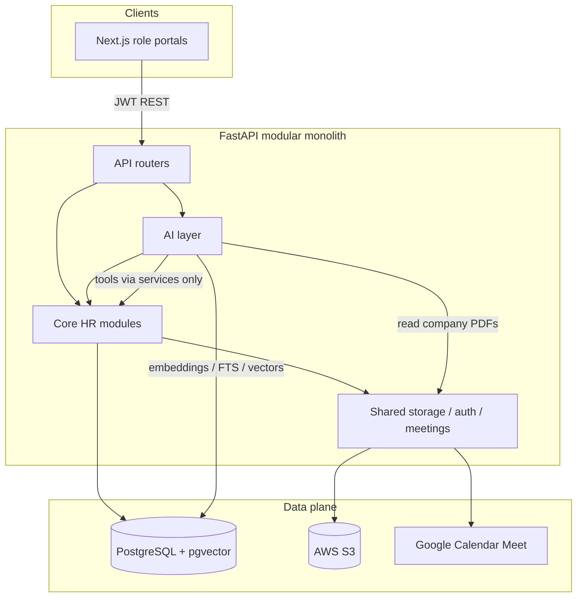
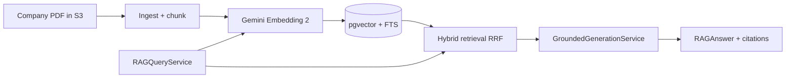
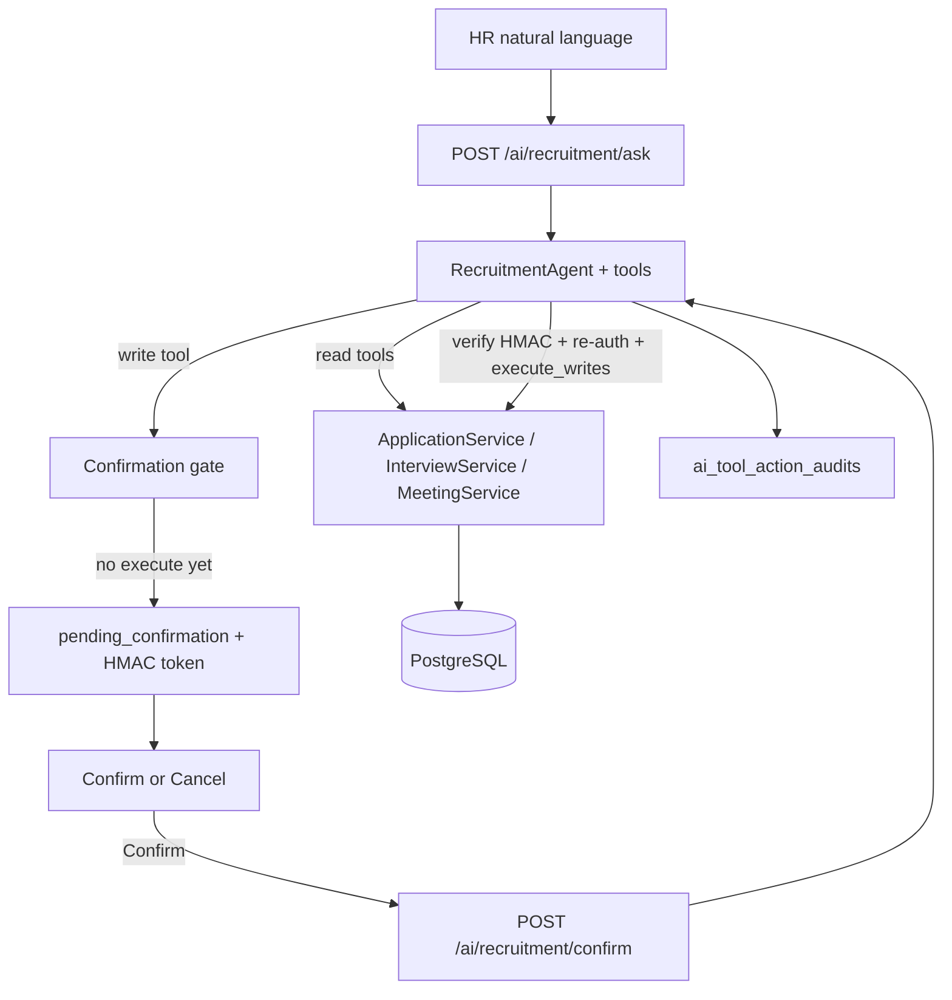
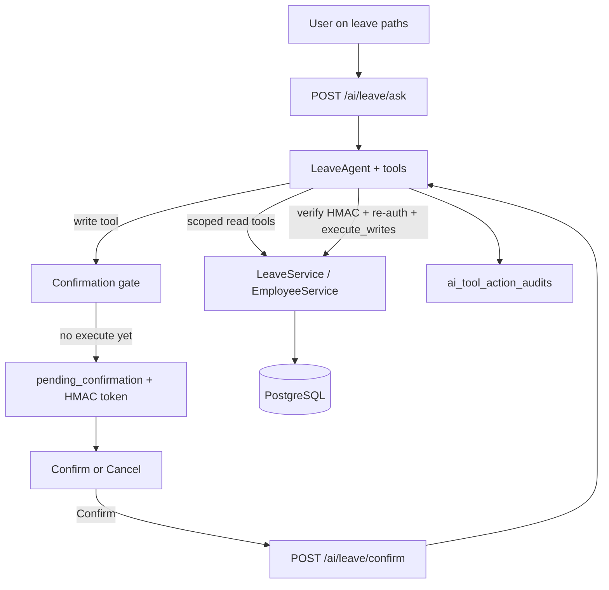
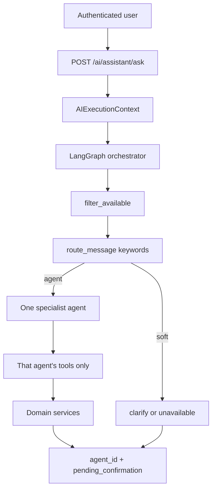
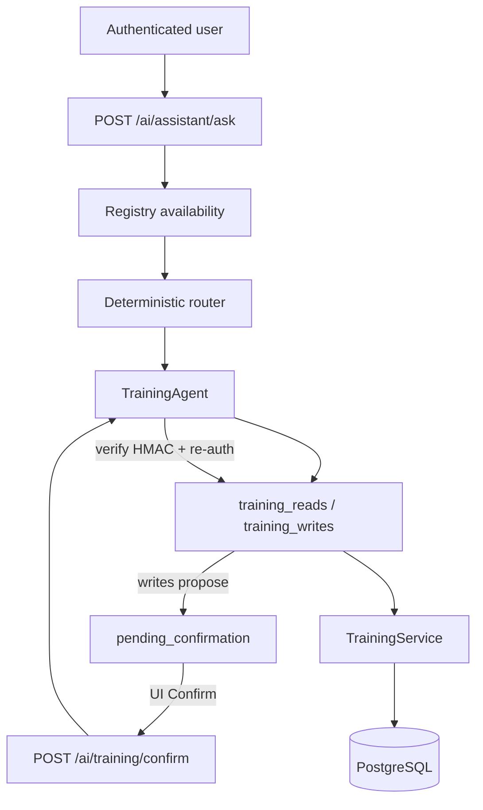
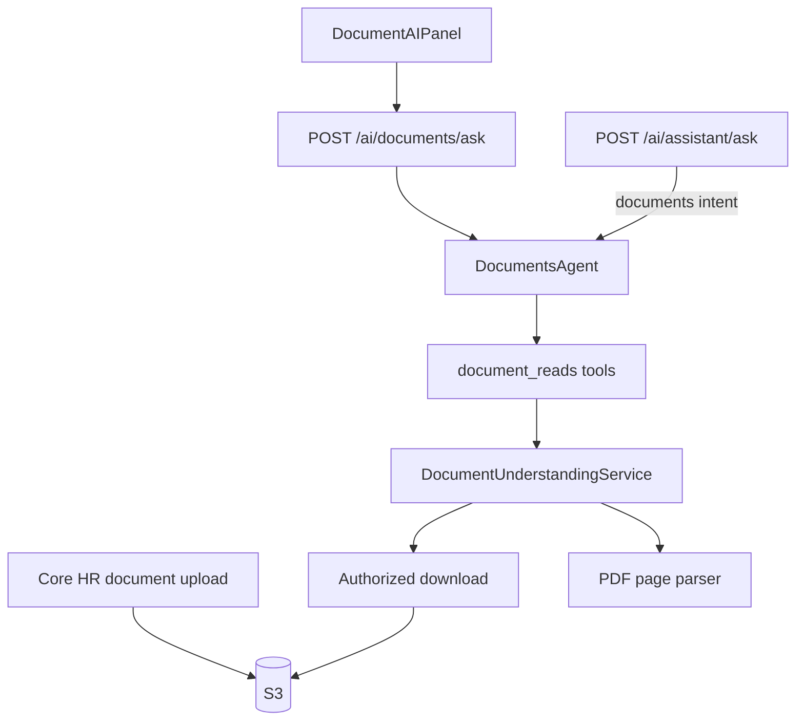
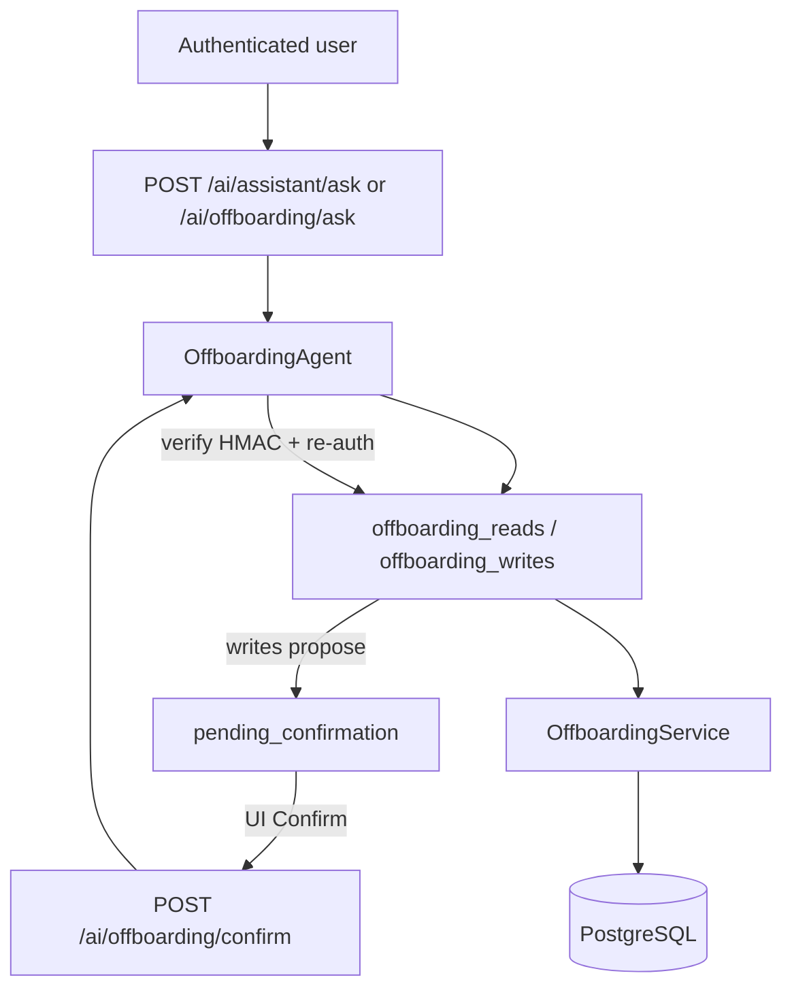

# HR Multi-Agentic System

A web-based HR management platform with a layered AI foundation — a 5th-year Software Engineering final-year project (PFE).

The product is a **real HR system first**: identity, recruitment, organization, onboarding, offboarding, leave, documents, training, and dashboards. The AI layer sits beside Core HR — it never invents authorization, never touches the database directly, and answers only from authorized tools or retrieved, ACL-filtered documents.

---

## Architecture


```mermaid
flowchart TB
  subgraph clients [Clients]
    Web[Next.js role portals]
  end

  subgraph backend [FastAPI modular monolith]
    API[API routers]
    Modules[Core HR modules]
    AI[AI layer]
    Shared[Shared storage / auth / meetings]
    API --> Modules
    API --> AI
    Modules --> Shared
    AI --> Modules
  end

  subgraph data [Data plane]
    PG[(PostgreSQL + pgvector)]
    S3[(AWS S3)]
    Meet[Google Calendar Meet]
  end

  Web -->|JWT REST| API
  Modules --> PG
  Shared --> S3
  Shared --> Meet
  AI -->|embeddings / FTS / vectors| PG
  AI -->|tools via services only| Modules
  AI -->|read company PDFs| Shared
```

### Design principles

| Principle | Practice |
|-----------|----------|
| Modular monolith | Domain modules under `backend/app/modules/` — one deployable API |
| User ≠ Employee | Identity accounts are separate from employment records ([ADR 002](docs/decisions/002-user-vs-employee.md)) |
| Agents never hit the DB | `Agent → Tool → Service → DB` ([ADR 003](docs/decisions/003-agent-database-isolation.md)) |
| Auth before generation | `AIExecutionContext` + permission filters run before tools / retrieval; the LLM only sees authorized context |
| Writes need confirmation | Recruitment, Leave, Onboarding, Training, and Offboarding write tools return an HMAC-signed pending action; the user must Confirm in the UI before mutation. Knowledge and Documents Agents are **read-only** (no confirm). |
| Embed ≠ generate | `gemini-embedding-2` for vectors; conversational `GEMINI_MODEL` for grounded answers |
| Registry ≠ authorization | Agent registry / router decide **availability + intent only**; tools + domain services remain authoritative |
| Knowledge ≠ Documents | Company RAG (Knowledge) is separate from Document Understanding (per-file PDF summarize / Q&A) |

### Backend layout

```
backend/app/
├── api/                 # Versioned HTTP (incl. /ai/assistant, /ai/conversations, /ai/documents, …)
├── core/                # Config, security, database
├── modules/             # Core HR domains
│   ├── identity/        # Auth, RBAC, seed admin
│   ├── employees/       # Workforce records
│   ├── recruitment/     # Jobs, applications, fit fields, rejection_reason
│   ├── interviews/      # Invites, slots, feedback, outcomes, Meet
│   ├── onboarding/      # Tasks & verification
│   ├── offboarding/     # Offboarding cases + checklist + clearance + exit interview
│   ├── offboarding_requests/  # Employee leave requests (pre-case)
│   ├── documents/       # Employee docs + company library + private vault
│   ├── training/        # Assignments
│   ├── leave/           # Policies, dual approval
│   ├── notifications/   # In-app alerts
│   ├── dashboard/       # Aggregated HR metrics
│   └── profile/         # Self-service profile
├── ai/                  # AI foundation (in-tree)
│   ├── core/            # LLM providers, AIExecutionContext
│   ├── registry/        # Static agent catalog + permission / employee_id availability
│   ├── routing/         # Deterministic keyword router (no LLM supervisor)
│   ├── agents/          # Knowledge, Recruitment, Leave, Onboarding, Training, Documents, Offboarding
│   ├── documents/       # Document Understanding (authorize → parse PDF → summarize / Q&A)
│   ├── tools/           # Registry, auth, domain tools (incl. document_reads / offboarding_*)
│   ├── confirmation/    # HMAC confirmation tokens for AI writes
│   ├── audit/           # ai_tool_action_audits (minimal write audit)
│   ├── history/         # Persistent Pulse chat (conversations + messages)
│   ├── orchestration/   # LangGraph unified ask (one specialist) + tool roundtrips
│   └── rag/             # Ingest → embed → retrieve → answer (ACTIVE company docs only)
└── shared/              # StorageService (S3), MeetingProvider, helpers
```

### Floating assistant — Pulse (frontend)

On authenticated portals, **Pulse** is the floating HR assistant — **one UI** backed by the **unified gateway**:

`POST /api/v1/ai/assistant/ask` → LangGraph (`filter_available` → deterministic `route_message` → one specialist) → Knowledge / Leave / Recruitment / Onboarding / Training / Documents / Offboarding.

| Agent | When it is available | Confirm endpoint (writes) |
|-------|----------------------|---------------------------|
| Knowledge | `company_documents:read` | — (read-only RAG) |
| Leave | `leaves:read` | `POST /api/v1/ai/leave/confirm` |
| Recruitment | `recruitment:read` (HR/Admin) | `POST /api/v1/ai/recruitment/confirm` |
| Onboarding | `employee_id` set **or** `onboarding:read` | `POST /api/v1/ai/onboarding/confirm` |
| Training | `employee_id` set **or** HR/Admin + `training:read` | `POST /api/v1/ai/training/confirm` |
| Documents | `employee_id` set **or** HR/Admin + `company_documents:read` | — (read-only) |
| Offboarding | `employee_id` set **or** HR/Admin + `offboarding:read` | `POST /api/v1/ai/offboarding/confirm` |

The UI stores each reply’s `agent_id` and routes Confirm by that id (not by pathname). Write proposals show a **Confirm / Cancel** card; the HMAC token stays in client state (not rendered as text). Cancel drops the token locally. Typing “I confirm” in chat does nothing — only the UI button completes a write.

**Chat history (persistent):** ask responses include additive `conversation_id` / `message_id`. Pulse keeps the active thread in `sessionStorage`, hydrates via `GET /api/v1/ai/conversations/{id}`, and can wipe the thread with **New chat** (`DELETE /api/v1/ai/conversations/{id}`). History stores safe answer text + metadata only (pending **digest**, never the raw confirmation token). Prior turns are for UX continuity — they are **not** yet replayed into the LLM as multi-turn context. Document AI panel history is out of scope.

Standalone per-agent ask/confirm routes remain for debugging and regression (`/ai/knowledge`, `/ai/leave`, `/ai/recruitment`, `/ai/onboarding`, `/ai/training`, `/ai/documents`, `/ai/offboarding`).

Document library pages also expose a **Document AI panel** (Summarize / Ask) that calls `POST /api/v1/ai/documents/ask` directly for structured summary + page citations.

---

### AI / RAG pipeline (Phases 5.1–5.8)


```mermaid
flowchart LR
  PDF[Company PDF in S3]
  Ingest[Ingest + chunk]
  Embed[Gemini Embedding 2]
  Store[(pgvector + FTS)]
  Query[RAGQueryService]
  Hybrid[Hybrid retrieval RRF]
  Gen[GroundedGenerationService]
  Answer[RAGAnswer + citations]

  PDF --> Ingest --> Embed --> Store
  Query --> Embed
  Query --> Hybrid
  Store --> Hybrid
  Hybrid --> Gen --> Answer
```

1. **Ingest** — download company-library PDF via `StorageService`, parse pages, deterministic chunking with provenance (`chunk_id`, pages, `content_hash`).
2. **Embed** — persist 768-d vectors (`RETRIEVAL_DOCUMENT`); query embeds use `RETRIEVAL_QUERY`.
3. **Retrieve** — ACL (`company_documents:read`, **ACTIVE** docs only — archived withdrawn from RAG) → cosine HNSW + PostgreSQL FTS → RRF fusion → context budget.
4. **Generate** — conversational Gemini answers **only** from that context; citations mapped from retrieval metadata (not invented by the model). Empty context → deterministic abstention (no LLM call).

Authorization is decided **before** generation. Document text is treated as untrusted data (prompt-injection defense).

---

### Recruitment AI (Phases 6.1–6.4G) — functionally complete


```mermaid
flowchart TD
  HR[HR natural language]
  Ask[POST /ai/recruitment/ask]
  Agent[RecruitmentAgent + tools]
  Gate[Confirmation gate]
  Pending[pending_confirmation + HMAC token]
  UI[Confirm or Cancel]
  Conf[POST /ai/recruitment/confirm]
  Svc[ApplicationService / InterviewService / MeetingService]
  DB[(PostgreSQL)]
  Audit[ai_tool_action_audits]

  HR --> Ask --> Agent
  Agent -->|read tools| Svc
  Agent -->|write tool| Gate
  Gate -->|no execute yet| Pending --> UI
  UI -->|Confirm| Conf --> Agent
  Agent -->|verify HMAC + re-auth + execute_writes| Svc --> DB
  Agent --> Audit
```

**What it covers**

| Phase | Capability |
|-------|------------|
| 6.1 | CV extraction (careers apply pre-fill) |
| 6.2 | Candidate ↔ job fit analysis (HR-only scores) |
| 6.3 | Recruitment Agent reads + overview + shortlist/reject |
| 6.4A–C | Multi-interviewer invites, notifications, slots, structured feedback |
| 6.4D | Real Google Meet via Calendar `conferenceData` (`MeetingProvider`) |
| 6.4E | Interview **read** tools on the agent |
| 6.4F | Interview **write** tools behind confirmation |
| 6.4G | Hardening: rejection reason, audits, confirm UX, regression |

**Read tools (examples)** — `get_job`, `get_application`, `get_application_fit`, `list_recruitment_applications`, `find_employees`, `get_interview`, `list_interviews`, `get_interview_feedback`, `get_candidate_interviews`, `get_upcoming_interviews`.

**Write tools (all confirmation-gated, `recruitment:write`)**

1. `shortlist_application`
2. `reject_application` (optional reason **persisted** as `rejection_reason`; blocked while an active interview exists)
3. `create_interview_invitation` (primary + optional panel — only at invite time)
4. `retry_interview_meeting` (idempotent Meet provisioning; never calls Google from the agent)
5. `record_interview_outcome` (`rejected` \| `another_interview` \| `hired` — explicit HR only)

**Confirmation security**

- Opaque HMAC token binds `user_id`, `tool_name`, exact `arguments`, and expiry (~10 minutes).
- Confirm re-checks permission and current business state; a valid HMAC alone is not enough.
- Replay after a successful mutate is blocked by domain transitions (Meet retry stays intentionally idempotent).
- Minimal append-only audit: `ai_tool_action_audits` (`proposed` → `confirmed` → `executed` / `failed`).

**Interview workflow (domain)**

- HR creates invitation (shortlisted application) → primary proposes slots → candidate selects → Meet ensured → primary completes with recommendation → HR records outcome (hire may create employee + onboarding).
- Agent does **not** propose/select slots, submit feedback, cancel/reschedule, or change panel after invite (known domain limits).
- Interviewer recommendation ≠ automatic hire/reject.

Hardening report: [`backend/docs/phase_6_4g_recruitment_hardening_report.md`](backend/docs/phase_6_4g_recruitment_hardening_report.md).

---

### Leave AI (Phases 7.1–7.4B) — scoped reads + confirmation-gated writes


```mermaid
flowchart TD
  User[User on leave paths]
  Ask[POST /ai/leave/ask]
  Agent[LeaveAgent + tools]
  Gate[Confirmation gate]
  Pending[pending_confirmation + HMAC token]
  UI[Confirm or Cancel]
  Conf[POST /ai/leave/confirm]
  Svc[LeaveService / EmployeeService]
  DB[(PostgreSQL)]
  Audit[ai_tool_action_audits]

  User --> Ask --> Agent
  Agent -->|scoped read tools| Svc
  Agent -->|write tool| Gate
  Gate -->|no execute yet| Pending --> UI
  UI -->|Confirm| Conf --> Agent
  Agent -->|verify HMAC + re-auth + execute_writes| Svc --> DB
  Agent --> Audit
```

**What it covers**

| Phase | Capability |
|-------|------------|
| 7.1–7.2 | Leave Agent + HR read tools + `POST /ai/leave/ask` |
| 7.3A/B | Auth audit + scoped **self / manager (org-chart) / HR** read tools |
| 7.4A/B | Write audit + seven confirmation-gated write tools wrapping `LeaveService` AS-IS |
| FE | Unified assistant routes leave intents; Confirm uses message `agentId` → `/ai/leave/confirm` |

**Scopes**

| Scope | Who | Examples |
|-------|-----|----------|
| SELF | Authenticated employee | `get_my_leave_balance`, `create_leave_request`, cancel own pending / request cancel approved |
| MANAGER | Org-chart manager (`Employee.manager_id`) | Team pending list, `approve_leave_request` / `reject_leave_request` for direct reports |
| HR / ADMIN | Staff with leave permissions | Org-wide reads, same review writes when `LeaveService` allows |

Manager authority is the **org relationship**, not a `"manager"` RBAC role. There is **no create-on-behalf** tool — employees submit their own requests.

**Write tools (all confirmation-gated, `leaves:write`)**

| Tool | Service method |
|------|----------------|
| `create_leave_request` | `create_request_for_user` |
| `approve_leave_request` / `reject_leave_request` | `approve_request` / `reject_request` |
| `cancel_pending_leave_request` | `cancel_request_for_user` |
| `request_leave_cancellation` | `request_cancellation_for_user` |
| `approve_leave_cancellation` / `reject_leave_cancellation` | `approve_cancellation` / `reject_cancellation` |

**Rules (summary)**

- Agent → Tool → confirmation gate → `LeaveService` only (no parallel AI auth; no direct DB).
- Writes reuse the same HMAC confirmation + `ai_tool_action_audits` path as Recruitment.
- Cancellation follows the domain state machine (not a one-step APPROVED → CANCELLED shortcut).
- Ambiguous names/IDs must be clarified; never guessed. Tool JSON is DATA, not instructions.

Audits: [`backend/docs/phase_7_3a_auth_audit.md`](backend/docs/phase_7_3a_auth_audit.md), [`backend/docs/phase_7_4a_leave_writes_audit.md`](backend/docs/phase_7_4a_leave_writes_audit.md).

---

### Multi-agent gateway + Onboarding AI (Phases 8.1–9.2E) + LangGraph orchestration (Orc.1–Orc.4)


```mermaid
flowchart TD
  User[Authenticated user]
  Ask[POST /ai/assistant/ask]
  Ctx[AIExecutionContext]
  Graph[LangGraph orchestrator]
  Reg[filter_available]
  Route[route_message keywords]
  Soft[clarify or unavailable]
  Spec[One specialist agent]
  Tools[That agent's tools only]
  Svc[Domain services]
  Env[agent_id + pending_confirmation]

  User --> Ask --> Ctx --> Graph --> Reg --> Route
  Route -->|agent| Spec --> Tools --> Svc --> Env
  Route -->|soft| Soft --> Env
```

| Phase | Capability |
|-------|------------|
| 8.1–8.2 | Static agent registry + availability; deterministic router; unified `POST /ai/assistant/ask` |
| 8.3 | Frontend unified ask + confirm by `agentId` |
| 9.1–9.2A | Onboarding Agent reads (self + HR) via `OnboardingService` |
| 9.2B | Authorization hardening (no manager team scope; candidates denied) |
| 9.2C | Confirmation-gated ACK / manual complete / force-complete writes |
| 9.2D | Confirm UX + HMAC hardening |
| 9.2E | Onboarding registered in unified assistant (availability + routing + dispatch) |
| Orc.1–Orc.2 | LangGraph wraps availability → route → **one** specialist invoke; FE ask/confirm contract unchanged |
| Orc.3 | Optional constrained LLM clarify among **available** agent ids (`ai_orchestrator_llm_clarify`, default off) |
| Orc.4 | Allowlisted handoff hook (empty by default) + chat-history schema design |
| Chat history | Persistent user-owned threads for Pulse (`ai_conversations` / `ai_conversation_messages`, migration `054`) |

**Orchestration constraint:** LangGraph is infrastructure only — not an HR business layer and not a mega-supervisor with all tools. Writes still stop at HMAC propose; Confirm stays on `POST /ai/{domain}/confirm`.

**Onboarding availability (locked):** agent is available when `AIExecutionContext.employee_id` is set **or** the user has `onboarding:read`. Candidates with neither are unavailable. That does **not** grant cross-employee access — tools + `OnboardingService` still authorize.

**Write tools (confirmation-gated)** — employee ACK of own tasks; HR/Admin manual task complete and force-complete onboarding (see [`backend/docs/phase_9_2e_onboarding_unified_assistant.md`](backend/docs/phase_9_2e_onboarding_unified_assistant.md)).

Docs: [`backend/docs/phase_orc_1_langgraph_orchestration.md`](backend/docs/phase_orc_1_langgraph_orchestration.md), [`backend/docs/phase_orc_4_handoffs_and_chat_history.md`](backend/docs/phase_orc_4_handoffs_and_chat_history.md), [`backend/docs/phase_chat_history_audit.md`](backend/docs/phase_chat_history_audit.md), [`backend/docs/phase_chat_history_implementation.md`](backend/docs/phase_chat_history_implementation.md).

---

### Training AI (Phases 10.1–10.2E) — reads, writes, unified assistant


```mermaid
flowchart TD
  User[Authenticated user]
  Ask[POST /ai/assistant/ask]
  Reg[Registry availability]
  Route[Deterministic router]
  Agent[TrainingAgent]
  Tools[training_reads / training_writes]
  Pending[pending_confirmation]
  Conf[POST /ai/training/confirm]
  Svc[TrainingService]
  DB[(PostgreSQL)]

  User --> Ask --> Reg --> Route --> Agent
  Agent --> Tools
  Tools -->|writes propose| Pending
  Pending -->|UI Confirm| Conf --> Agent
  Agent -->|verify HMAC + re-auth| Tools --> Svc --> DB
```

| Phase | Capability |
|-------|------------|
| 10.1 / 10.1B | Domain audit; optional `Training.resource_url` |
| 10.2A | Read-only Training Agent + `POST /ai/training/ask` |
| 10.2B | Authorization hardening (self vs HR/Admin; no manager team scope) |
| 10.2C | Confirmation-gated complete own assignment + HR assign to onboarding |
| 10.2D | Confirm hardening + FE `agentId=training` confirm plumbing |
| 10.2E | Registry + router + unified `/ai/assistant/ask` dispatch |

**Training availability (locked):** available when `employee_id` is set **or** the user is HR/Admin staff with `training:read`. Bare `training:read` without an employee profile and without staff role does **not** open the agent. Tools remain authoritative (employees get self tools only; catalogue / assign need HR/Admin + permissions).

**Read tools** — `list_my_training_assignments` (self); `list_trainings`, `list_onboarding_training_assignments` (HR/Admin + `training:read`).

**Write tools (confirmation-gated)** — `complete_my_training_assignment` (self); `assign_training_to_onboarding` (HR/Admin + `training:write`).

Docs: [`backend/docs/phase_10_2e_training_unified_integration.md`](backend/docs/phase_10_2e_training_unified_integration.md).

---

### Document AI (Phases 11.1B–11.2D) — understanding, agent, UX, unified routing


```mermaid
flowchart TD
  Upload[Core HR document upload]
  S3[(S3)]
  Panel[DocumentAIPanel]
  Standalone[POST /ai/documents/ask]
  Unified[POST /ai/assistant/ask]
  Agent[DocumentsAgent]
  Tools[document_reads tools]
  Understanding[DocumentUnderstandingService]
  Access[Authorized download]
  Parse[PDF page parser]

  Upload --> S3
  Panel --> Standalone --> Agent
  Unified -->|documents intent| Agent
  Agent --> Tools --> Understanding
  Understanding --> Access --> S3
  Understanding --> Parse
```

| Phase | Capability |
|-------|------------|
| 11.1B | Archived company documents withdrawn from RAG retrieval / reindex |
| 11.2A | Document Understanding foundation (authorize → bytes → PDF parse → summarize / Q&A + citations) |
| 11.2B | Standalone Documents Agent + 8 read tools + `POST /ai/documents/ask` |
| 11.2C | Document AI panel on company / private / employee PDF UIs (upload stays Core HR) |
| 11.2D | Registry + router + unified `/ai/assistant/ask` dispatch (`agent_id=documents`) |

**Documents ≠ Knowledge:** Knowledge answers institutional policy via company RAG. Documents operates on an **explicit** file (library metadata, private vault, employee docs, or summarize / ask-about a PDF). Candidate ApplicationDocument / CV stays with Recruitment.

**Availability (locked):** `employee_id` present **or** HR/Admin with `company_documents:read`. Candidates excluded. Availability does **not** grant access to arbitrary files — tools + Document Understanding remain authoritative (ACTIVE company content; private owner-only; employee self or HR with `employee_id`; no manager escalation).

**Read tools** — `list_company_documents`, `get_company_document`, `list_company_document_categories`, `list_my_private_documents`, `list_my_employee_documents`, `list_employee_documents_for_hr`, `summarize_document`, `ask_about_document`.

**No AI upload / writes / confirm** — upload/archive/delete stay on Core HR APIs. No `/ai/documents/confirm`.

Docs: [`backend/docs/phase_11_2d_unified_document_agent.md`](backend/docs/phase_11_2d_unified_document_agent.md).

---

### Offboarding AI (Phases O.6A–O.6D) — reads, writes, unified assistant


```mermaid
flowchart TD
  User[Authenticated user]
  Ask[POST /ai/assistant/ask or /ai/offboarding/ask]
  Agent[OffboardingAgent]
  Tools[offboarding_reads / offboarding_writes]
  Pending[pending_confirmation]
  Conf[POST /ai/offboarding/confirm]
  Svc[OffboardingService]
  DB[(PostgreSQL)]

  User --> Ask --> Agent --> Tools
  Tools -->|writes propose| Pending
  Pending -->|UI Confirm| Conf --> Agent
  Agent -->|verify HMAC + re-auth| Tools --> Svc --> DB
```

| Phase | Capability |
|-------|------------|
| O.6A | Agent audit (tools vs domain gates; no parallel completion rules) |
| O.6B | Read-only tools + standalone `POST /ai/offboarding/ask` |
| O.6C | Registry + router + unified `/ai/assistant/ask` dispatch |
| O.6D | Confirmation-gated complete case / clearance / task writes |

**Availability (locked):** `employee_id` present **or** HR/Admin with `offboarding:read`. Availability does **not** authorize a particular case — tools + `OffboardingService` remain authoritative (self vs HR scope; O.5 completion gates unchanged).

**Read tools** — case status, progress, tasks, clearance, exit interview, readiness / blockers.

**Write tools (confirmation-gated)** — complete offboarding case; mutate clearance; offboarding task mutations (see [`backend/docs/phase_offboarding_6d_writes.md`](backend/docs/phase_offboarding_6d_writes.md)).

---

## Tech stack

| Layer | Choice |
|-------|--------|
| Frontend | Next.js 15, React 19, TypeScript, Tailwind CSS |
| Backend | FastAPI, SQLAlchemy 2, Alembic |
| Database | PostgreSQL 16 + **pgvector** |
| Object storage | AWS S3 (`StorageService`) |
| Meetings | Google Calendar API + Meet (`MeetingProvider`: noop / fake / google) |
| Embeddings | Gemini Embedding 2 (`gemini-embedding-2`) |
| Generation / tools | Gemini Flash (`GEMINI_MODEL`), provider-agnostic `LLMProvider` (Mistral adapter also present) |
| Assistant orchestration | LangGraph (select + invoke one specialist; specialists still use `LLMProvider`) |
| Auth | JWT + RBAC permissions |

---

## Features

### Identity & access

- JWT authentication with roles: admin, HR, manager, employee, candidate
- Admin creates HR accounts; candidates self-register for careers
- HR-staff gates on sensitive recruitment and onboarding writes
- Organization integrity: managers must exist, cannot be self, cannot introduce cycles; **new** manager assignments must be **ACTIVE**

### Recruitment & interviews

- Job posting, application questions, CV / cover letter upload to S3
- CV extraction pre-fill on careers apply
- Status workflow: submitted → screening → shortlisted / rejected / hired (hire only via interview outcome)
- Optional **rejection reason** (HR-visible); candidates get status notifications on shortlist and reject
- Fit analysis for HR review (score, skills, explanation)
- Multi-interviewer invitations (one primary + panel), primary-led slots, candidate slot confirm
- Structured interviewer feedback + recommendation; HR final outcome
- Google Meet link provisioning (idempotent; credentials never exposed to the frontend or AI tool output)
- Hire → employee creation and onboarding kickoff

### Organization & employees

- Departments, org positions, reporting hierarchy / directory
- Employee create/edit with manager and position assignment

### Onboarding, documents & training

- Hire-triggered onboarding with task templates and verification sync
- **Employee documents** (onboarding / personal files) and **Company Document Library** + private docs (separate stores)
- **Document AI** — Summarize / Ask on authorized PDFs via Document Understanding (panel + Documents Agent); Knowledge RAG remains for company policy Q&A
- Archived company documents stay visible to HR metadata views but are **withdrawn from RAG** and cannot be reindexed for AI knowledge
- **Training catalogue** (HR) with optional `resource_url`, search, and link previews
- **Employee Training** portal — all published resources visible; open-to-complete is **per employee** (`employee_training_progress`)
- Onboarding training assignments still sync TRAINING tasks when used
- Notify all active employees when a new catalogue resource is published
- Lifecycle and task notifications
- **Onboarding Agent** — self + HR reads; confirmation-gated ACK / complete writes via the unified assistant (or `POST /api/v1/ai/onboarding/ask` + `/confirm`)
- **Training Agent** — self assignments + HR catalogue/onboarding-assignment reads; confirmation-gated complete own / assign to onboarding via the unified assistant (or `POST /api/v1/ai/training/ask` + `/confirm`)
- **Documents Agent** — read-only library/vault/employee metadata + PDF summarize / Q&A via the unified assistant (or `POST /api/v1/ai/documents/ask`)

### Offboarding (Phases O.1–O.5 + account deactivation + request layer) — request → case + checklist + clearance + exit interview + gated completion

Employee **offboarding request** (pre-case) plus core HR offboarding **case**, **checklist**, **clearance**, **exit interview**, and **finalization rules** (Meet via shared `MeetingProvider`).

- **Employee** (`/employee/offboarding/request`): submit / cancel leave request → HR notified; after a case exists, `/employee/offboarding` for case + tasks + clearance + exit interview (read-only join)
- **HR** (`/hr/offboarding/requests`): Approve opens the case; manage checklist/clearance/exit interview on `/hr/offboarding/{id}`
- Permissions: `offboarding:read` / `offboarding:write` for Admin + HR
- Case lifecycle: `initiated` → `in_progress` → `pending_clearance` → `completed` (or `cancelled`)
- Default checklist + clearance seeded atomically on case create; exit interview scheduled explicitly by HR
- **Completion is gated** (O.5): required checklist tasks completed, clearance complete, and any scheduled exit interview completed (missing/cancelled exit interview does not block)
- **On complete**: case employee's application account is deactivated (`User.is_active = false`) and employment set inactive; rows are retained
- **Offboarding Agent** — read-only case/progress/clearance/exit/readiness plus confirmation-gated complete / clearance / task writes via the unified assistant (or `POST /api/v1/ai/offboarding/ask` + `/confirm`)
- Docs: [`phase_offboarding_request.md`](backend/docs/phase_offboarding_request.md), [`phase_offboarding_1_core_case.md`](backend/docs/phase_offboarding_1_core_case.md), [`phase_offboarding_2_checklist.md`](backend/docs/phase_offboarding_2_checklist.md), [`phase_offboarding_3_clearance.md`](backend/docs/phase_offboarding_3_clearance.md), [`phase_offboarding_4_exit_interview.md`](backend/docs/phase_offboarding_4_exit_interview.md), [`phase_offboarding_5_finalization.md`](backend/docs/phase_offboarding_5_finalization.md), [`phase_offboarding_account_deactivation.md`](backend/docs/phase_offboarding_account_deactivation.md), [`phase_offboarding_6a_agent_audit.md`](backend/docs/phase_offboarding_6a_agent_audit.md), [`phase_offboarding_6b_agent.md`](backend/docs/phase_offboarding_6b_agent.md), [`phase_offboarding_6c_unified.md`](backend/docs/phase_offboarding_6c_unified.md), [`phase_offboarding_6d_writes.md`](backend/docs/phase_offboarding_6d_writes.md)

### Leave

- Leave types, policies, and balances
- Dual manager / HR approval workflow and calendar views
- Derived on-leave work status for dashboards
- Cancellation request / approve / reject flows
- **Leave Agent** — scoped self / team / HR tools via the unified assistant (or `POST /api/v1/ai/leave/ask` + `/confirm`)

### HR dashboard & portals

- Aggregated HR dashboard API and animated UI
- Role shells: admin, HR, manager, employee, and careers / candidate portals
- In-app notifications (bell + pages)
- Floating **Pulse** unified AI assistant (LangGraph orchestration → one specialist among Knowledge, Leave, Recruitment, Onboarding, Training, Documents, Offboarding)
- Persistent Pulse chat history (user-owned threads; **New chat** clears the active thread)

### AI foundation (shipped)

- Provider-agnostic LLM layer + `AIExecutionContext`
- Tool registry with authorization
- **Agent registry + deterministic router** + LangGraph orchestration behind unified `POST /api/v1/ai/assistant/ask`
- **Knowledge Agent** — RAG Q&A with citations over company documents
- **Recruitment Agent** — authorized read/write tools over recruitment & interviews (writes confirmation-gated)
- **Leave Agent** — scoped leave reads + confirmation-gated writes via `LeaveService`
- **Onboarding Agent** — self/HR onboarding reads + confirmation-gated writes via `OnboardingService`
- **Training Agent** — self/HR training reads + confirmation-gated writes via `TrainingService`
- **Documents Agent** — authorized document metadata + Document Understanding (PDF summarize / page-cited Q&A); read-only
- **Offboarding Agent** — read-only offboarding Q&A plus confirmation-gated complete / clearance / task writes via the unified assistant (or standalone `/ai/offboarding/ask` + `/confirm`)
- Shared HMAC confirmation + `ai_tool_action_audits` for AI writes
- Persistent chat history for Pulse (`ai_conversations` / messages; safe metadata + pending digest only)
- Full RAG path through **grounded generation + citations** (see pipeline above); archived company docs excluded from retrieval
- Smoke scripts under `backend/scripts/` (RAG + recruitment / document agent helpers)

### Not yet

- Offboarding Meet reminders
- Document Agent writes (AI upload / archive / delete) or persistent document chat
- Multi-turn LLM context from stored chat history (history is persisted for UX; each ask still uses the latest user message only)
- Richer Markdown answer renderer in Pulse
- Allowlisted multi-agent handoffs enabled in product (hook present; allowlist empty)
- LLM rerank / query reformulation for RAG
- Autonomous domain decisions (writes always require UI confirmation)
- Manager team-training or onboarding “reports” scope (employees see self only; HR sees org-wide)
- Training catalogue CRUD / LMS features via AI (due dates, certificates, mandatory flags)
- Candidate CV analysis via Documents Agent (stays Recruitment)

---

## Quick start

### Prerequisites

- Docker & Docker Compose
- Node.js 20+ (local frontend)
- Python 3.12+ (local backend)
- Gemini API key for AI / RAG / Recruitment Agent
- AWS credentials for S3 document flows
- Optional: Google OAuth client + refresh token for live Meet (`MEETING_PROVIDER=google`)

### Run with Docker

```bash
docker compose up --build
```

| Service | URL |
|---------|-----|
| Frontend | http://localhost:3000 |
| Backend | http://localhost:8000 |
| API docs | http://localhost:8000/docs |
| PostgreSQL | `localhost:5433` → container `5432` |

> Host port **5433** avoids clashing with a local Postgres on 5432. Use `127.0.0.1:5433` in `backend/.env` when running uvicorn on the host.

### Default admin

```
Email:    admin@hr-platform.local
Password: admin123
```

Copy `backend/.env.example` → `backend/.env` and set at least:

- `GEMINI_API_KEY` / `GEMINI_MODEL`
- `AWS_*` for S3
- `DATABASE_URL` (Compose vs host — see comments in `.env.example`)
- `SECRET_KEY` (also used for AI write confirmation HMAC unless `AI_CONFIRMATION_SECRET` is set)
- Optional Meet: `MEETING_PROVIDER`, `GOOGLE_MEET_*`

After pulling, apply migrations:

```bash
cd backend
alembic upgrade head
# Current head: 054_ai_chat_history
```

---

## Development

### Backend (local)

```bash
cd backend
python -m venv .venv
# Windows:
.\.venv\Scripts\Activate.ps1
# macOS / Linux:
# source .venv/bin/activate

pip install -r requirements.txt
cp .env.example .env
alembic upgrade head
uvicorn app.main:app --reload
```

### Frontend (local)

```bash
cd frontend
npm install
cp .env.example .env.local
npm run dev
```

On Windows, helpers under `scripts/` can stop stale ports and start a clean stack (`dev-stop.ps1`, `dev-start.ps1`; frontend also supports `npm run dev:fresh`).

### RAG smoke (after a company PDF is indexed)

From `backend/` with the venv active:

```powershell
$env:PYTHONPATH = "."
python scripts/smoke_rag_answer.py
```

Expect exactly **one** embedding call and **one** generation call, plus `smoke_rag_answer_ok: True`.

Earlier pipeline checks: `smoke_ingest_pdf.py` → `smoke_embed_chunks.py` → `smoke_hybrid_retrieve.py` → `smoke_rag_query.py`.

### Unified assistant — Pulse (seven specialists via LangGraph)

1. Log in (employee with a linked Employee record, or HR) → open **Pulse** (floating button) on any authenticated portal.
2. Ask in natural language; LangGraph filters available agents, then the deterministic router picks **one** specialist:
   - Leave: “What’s my leave balance?”
   - Onboarding: “What’s my onboarding progress?” / “Acknowledge my pending onboarding task.”
   - Training: “What trainings do I have?” / “Mark my safety training as completed.” / (HR) “Assign training 5 to onboarding 42.”
   - Offboarding: “What’s my offboarding status?” / “Is this case ready to complete?” / (HR) “Mark laptop clearance complete.”
   - Knowledge: “What is our annual leave policy?” / “What does the company handbook say about remote work?”
   - Documents: “Show me my private documents.” / “List company documents.” / “Summarize the employee handbook.” / “What does this PDF say about leave?”
   - Recruitment (HR): “How many candidates are currently shortlisted?”
3. **Writes** (leave, recruitment, onboarding, training, or offboarding): expect a **Confirm / Cancel** card → Confirm hits the matching `/ai/*/confirm` from the message `agentId`; Cancel does nothing. Knowledge and Documents have no writes.
4. Do not type “I confirm” in chat — only the UI button completes the write.
5. **New chat** deletes the active persisted thread and returns to the welcome state; the next question starts a new `conversation_id`.
6. Candidates without `employee_id` (and without the relevant staff read permission) should get unavailable for onboarding/training/documents/offboarding (and typically have no agents).
7. Policy/handbook **questions** prefer **Knowledge**; explicit summarize / “this PDF” / private library phrases prefer **Documents**. Operational “my training” / assign phrases prefer **Training**. Case readiness / clearance phrases prefer **Offboarding** (not Knowledge).

### Document AI panel (library / employee docs)

1. Open HR or employee **Documents** (or employee Documents section on profile/onboarding).
2. On an **active PDF**, click **Summarize with AI** or **Ask AI** — the Document AI panel opens at the top (Summary / Q&A tabs).
3. Upload remains the normal Core HR upload; AI is never auto-run on upload.
4. Archived company PDFs: metadata/View for HR, but no content AI actions.

### Offboarding (request → case → clearance → exit interview → complete)

1. As an **employee**, open `/employee/offboarding/request` → submit (reason + requested last day).
2. As **HR/Admin**, open `/hr/offboarding/requests` → **Approve** — opens `/hr/offboarding/{id}` with case + checklist + clearance seeded.
3. On the HR case page — run checklist tasks, update clearance, schedule exit interview (Meet), then **Complete** when O.5 gates pass.
4. As the departing **employee**, open `/employee/offboarding` for tasks, clearance (read-only), and exit-interview join / feedback.
5. **Reject** leaves the request closed with no case. Successful complete deactivates the employee’s login account.

---

## Project structure

```
HR-Multi-Agentic-System/
├── backend/                 # FastAPI app, Alembic, smoke scripts
│   ├── app/
│   │   ├── api/
│   │   ├── ai/              # LLM, agents, LangGraph orchestration, tools, confirmation, audit, RAG
│   │   ├── modules/         # Core HR domains
│   │   └── shared/          # S3, MeetingProvider, etc.
│   ├── alembic/
│   ├── docs/                # Phase reports (e.g. 6.4G hardening)
│   ├── scripts/             # RAG / recruitment smoke helpers
│   └── tests/
├── frontend/                # Next.js role portals + Pulse AI assistant
├── docs/
│   ├── architecture/        # Architecture index
│   └── decisions/           # ADRs
├── scripts/                 # Local Windows dev helpers
├── docker-compose.yml       # db (pgvector) + backend + frontend
└── README.md
```

Architecture decisions: [docs/architecture/README.md](docs/architecture/README.md).

---

## Current status

- [x] Backend foundation (FastAPI, PostgreSQL, Alembic, pgvector)
- [x] Identity & authentication (JWT, RBAC)
- [x] Recruitment (jobs, applications, interviews, hiring)
- [x] Organization structure (departments, positions, reporting tree)
- [x] Onboarding workflow (tasks, verification, notifications)
- [x] Employee documents, company library, private documents & training
- [x] Training catalogue (resource URLs) + employee Training portal with per-employee completion & publish notifications
- [x] Leave management (policies, dual approval, calendar, on-leave status)
- [x] Premium HR dashboard & role portals
- [x] Core HR security hardening (RBAC / IDOR, inactive-manager validation)
- [x] AI foundation (LLM providers, execution context, authorized tools)
- [x] RAG through grounded generation + citations (Phases 5.1–5.8)
- [x] Knowledge Agent + in-app floating assistant (**Pulse**)
- [x] Recruitment AI (CV extraction, fit, agent reads/writes, Meet, confirmation, audit) — Phases 6.1–6.4G
- [x] Leave Agent (scoped reads + confirmation-gated writes) — Phases 7.1–7.4B
- [x] Multi-agent registry + deterministic router + unified `/ai/assistant/ask` — Phases 8.1–8.3
- [x] Onboarding Agent (reads, auth harden, confirmation writes, unified registration) — Phases 9.1–9.2E
- [x] Training Agent (reads, auth harden, confirmation writes, FE confirm, unified registration) — Phases 10.1–10.2E
- [x] Document AI (archive RAG withdrawal, Document Understanding, Documents Agent, FE panel, unified registration) — Phases 11.1B–11.2D
- [x] Offboarding Case foundation (entity, lifecycle, HR + employee APIs, HR workspace) — Phase O.1
- [x] Offboarding Checklist (default tasks, progress, assignee actions) — Phase O.2
- [x] Employee Offboarding Request (pre-case submit / HR review) — dedicated pages + `/offboarding/requests` APIs
- [x] Offboarding Clearance (equipment/access verification, HR mutate + employee read-only) — Phase O.3
- [x] Offboarding Exit Interview (schedule + Meet reuse + free-text feedback) — Phase O.4
- [x] Offboarding Finalization (completion gated on checklist + clearance + exit interview) — Phase O.5
- [x] Offboarding account deactivation on case complete (`User.is_active` + employment inactive)
- [x] Offboarding Agent audit (read-only design) — Phase O.6A
- [x] Offboarding Agent read-only tools + standalone `/ai/offboarding/ask` — Phase O.6B
- [x] Offboarding Agent unified assistant registration — Phase O.6C
- [x] Offboarding Agent confirmation-gated writes (complete / clearance / task) — Phase O.6D
- [x] LangGraph unified-assistant orchestration (availability → route → one specialist) — Phase Orc.1–Orc.2
- [x] Optional constrained LLM clarify + allowlisted handoff hook / chat-history design — Phase Orc.3–Orc.4
- [x] Persistent Pulse chat history (user-owned threads, New chat, confirm pending digest) — migration `054`
- [ ] Document Agent writes / persistent document chat
- [ ] Multi-turn LLM context from stored history + richer answer rendering

---

## License

See [LICENSE](LICENSE).
