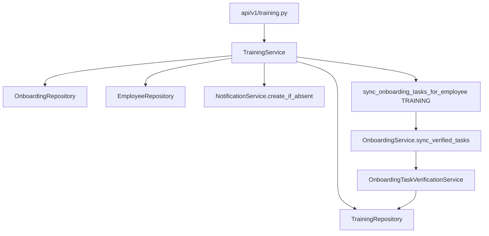

# Phase 10.1 — Training Agent Domain Audit

**Stance:** Read-only audit and design. No backend, frontend, database, migration, agent, tool, registry, or router code was changed in this phase.

**Context:** After Phase 9.2E, implemented unified agents are Knowledge, Leave, Recruitment, and Onboarding. This document audits Core HR **Training** so a future Training Agent can wrap **existing** services only.

**Architectural principle:**

```text
User
  ↓
HR Assistant (unified gateway)
  ↓
Training Agent   ← PROPOSED
  ↓
Training Tools   ← PROPOSED
  ↓
Existing TrainingService (+ Onboarding sync / verification where side effects already exist)
  ↓
PostgreSQL
```

The AI layer must **never** access repositories or the database directly. Domain services remain authoritative. The agent must **not** invent manager-scoped training APIs, certificates, due dates, or catalogue semantics the domain does not provide.

**Critical domain fact:** Training in this codebase is **onboarding-centric**, not a standalone L&D / lifelong-learning product. Assignments live on `OnboardingTraining` keyed by `onboarding_id`, not by a free-standing employee enrollment table.

---

## 1. Scope and stance

| In scope (10.1) | Out of scope |
|-----------------|--------------|
| Inspect Training + related Onboarding / identity / notifications / AI patterns | Any implementation |
| Document FACT FROM CODE | New permissions, migrations, tools, agent, registry |
| Propose AI boundary + phase plan (labeled **PROPOSED**) | Starting Phase 10.2A |

**FACT FROM CODE** vs **PROPOSED** are labeled throughout.

---

## 2. Existing Training architecture

### Module layout (FACT)

There is **no** `verification.py` or `sync.py` under `modules/training/`. Verification and sync live in **onboarding** and are *called by* TrainingService.

| Path | Role |
|------|------|
| [`backend/app/modules/training/models.py`](../app/modules/training/models.py) | `Training`, `OnboardingTraining`, `OnboardingTrainingStatus` |
| [`backend/app/modules/training/schemas.py`](../app/modules/training/schemas.py) | Catalogue + assignment API DTOs |
| [`backend/app/modules/training/repository.py`](../app/modules/training/repository.py) | Persistence |
| [`backend/app/modules/training/service.py`](../app/modules/training/service.py) | Business rules + assign notification + onboarding sync |
| [`backend/app/modules/training/dependencies.py`](../app/modules/training/dependencies.py) | `get_training_service` wiring |
| [`backend/app/api/v1/training.py`](../app/api/v1/training.py) | HTTP: catalogue, HR onboarding trainings, `/me/onboarding/trainings` |
| [`backend/app/api/router.py`](../app/api/router.py) | Includes `catalog_router`, `onboarding_router`, `me_router` |

### Related (FACT)

| Path | Why |
|------|-----|
| [`onboarding/models.py`](../app/modules/onboarding/models.py) | `OnboardingTaskType.TRAINING`; task/template `training_id` FK |
| [`onboarding/verification.py`](../app/modules/onboarding/verification.py) | TRAINING task verified iff matching assignment `COMPLETED` |
| [`onboarding/sync.py`](../app/modules/onboarding/sync.py) | `sync_onboarding_tasks_for_employee` |
| [`onboarding/service.py`](../app/modules/onboarding/service.py) | Template/task create may create `OnboardingTraining`; progress includes trainings |
| [`identity/service.py`](../app/modules/identity/service.py) | Seeds `training:read` / `training:write` |
| [`identity/hr_access.py`](../app/modules/identity/hr_access.py) | `require_hr_staff` on catalogue / HR assignment routes |
| [`notifications/models.py`](../app/modules/notifications/models.py) | `ONBOARDING_TRAINING_ASSIGNED`, `ONBOARDING_TRAINING_COMPLETED` |
| [`ai/registry/`](../app/ai/registry/) | Training **not** registered |
| Onboarding AI tools/prompts | Progress includes training counts; onboarding **writes** refuse TRAINING task types |

### Runtime shape (FACT)



---

## 3. Domain models

### 3.1 `Training` — table `trainings` (FACT)

| Aspect | Detail |
|--------|--------|
| PK | `id` |
| Fields | `title` (str 200), `description` (Text, nullable), `created_at`, `updated_at` |
| Relationships | `assignments` → `OnboardingTraining` (`cascade="all, delete-orphan"`) |
| Status / active | **None** — no soft-deactivate, no mandatory flag |
| Dates | No due/expiry; only created/updated |
| Catalogue semantics | Thin catalogue: title + description only |

### 3.2 `OnboardingTraining` — table `onboarding_trainings` (FACT)

| Aspect | Detail |
|--------|--------|
| PK | `id` |
| Unique | `(onboarding_id, training_id)` — one assignment per training per onboarding |
| FKs | `onboarding_id` → `onboardings.id` **ON DELETE CASCADE**; `training_id` → `trainings.id` **ON DELETE CASCADE** |
| Status | `OnboardingTrainingStatus`: `pending` \| `completed` |
| Dates | `assigned_at` (required), `completed_at` (nullable), `created_at`, `updated_at` |
| Employee link | **Indirect** via `Onboarding.employee_id` — no `employee_id` on the assignment row |
| Relationships | `training`, `onboarding` |

### 3.3 What the domain does **not** have (FACT)

Inspected code does **not** support:

- Standalone course catalogue beyond `Training` title/description
- Employee enrollment independent of onboarding
- Certification records
- Mandatory vs optional flags on training (optional/required exists only on **onboarding tasks**, not on `Training` / `OnboardingTraining`)
- Due dates / expiry dates / reminders
- Soft deactivate / archive (only hard `delete_training`)
- Progress percentages inside TrainingService (progress % is OnboardingService)
- Manager-of-record training views
- HR “complete on behalf of employee” training API

### 3.4 Adjacent onboarding models (FACT — cross-domain)

| Model | Training-related fields |
|-------|-------------------------|
| `OnboardingTask` / `OnboardingTaskTemplate` | `task_type=TRAINING` requires `training_id` FK (`ON DELETE SET NULL`) |
| `Onboarding` progress DTO | Aggregates assignment totals via TrainingRepository |

---

## 4. Training lifecycle

### FACT FROM CODE

```text
Catalogue Training created (HR)
    → (optional) Onboarding template/task with training_id
        → hire / create_for_employee / add task may insert OnboardingTraining PENDING
    → OR HR POST /onboarding/{id}/trainings assigns PENDING
        → notification ONBOARDING_TRAINING_ASSIGNED (employee)
        → sync TRAINING onboarding tasks
    → Employee PATCH /me/onboarding/trainings/{assignment_id}/complete
        → status COMPLETED + completed_at
        → sync TRAINING onboarding tasks
        → verification may mark TRAINING onboarding task COMPLETED
    → OR HR DELETE assignment
        → sync TRAINING tasks
    → OR HR DELETE catalogue Training
        → CASCADE deletes assignments
```

| Step | Who | How |
|------|-----|-----|
| Create / update / delete catalogue | HR/Admin (`require_hr_staff` + `training:write`) | `TrainingService.create/update/delete_training` |
| Assign | HR/Admin | `assign_training` — duplicate → 409 |
| Assign via onboarding template/task | OnboardingService | Creates `OnboardingTraining` if missing (no TrainingService notification path on that insert) |
| Complete | Authenticated user with linked employee + onboarding | `complete_assignment_for_user` — **not** idempotent (already completed → 400) |
| Unassign | HR/Admin | `remove_assignment` |
| Verify onboarding TRAINING task | System sync | Assignment must exist and be `COMPLETED` |
| Cancel / pause training | — | **Not supported** |
| Complete on behalf | — | **Not supported** |

**Completion verification:** Manual employee mark via TrainingService. Automatic for **onboarding task** status only after sync sees completed assignment. There is no separate “quiz / LMS evidence” verifier.

---

## 5. Existing read operations

### 5.1 Catalogue / HR (FACT)

| HTTP | Service | Auth gate | Scope |
|------|---------|-----------|-------|
| `GET /api/v1/trainings` | `list_trainings` | `require_hr_staff("training:read")` | All catalogue rows |
| `GET /api/v1/onboarding/{onboarding_id}/trainings` | `list_assignments_for_hr` | `require_hr_staff("training:read")` | One onboarding’s assignments; 404 if onboarding missing |

No dedicated `GET /trainings/{id}` HTTP endpoint. Repository `get_training` is internal.

**No** org-wide “list all assignments across employees” TrainingService method.

### 5.2 Self / employee (FACT)

| HTTP | Service | Auth gate | Scope |
|------|---------|-----------|-------|
| `GET /api/v1/me/onboarding/trainings` | `list_assignments_for_user(user_id)` | `get_current_user` only (no `training:read` check on route) | Assignments for **caller’s** onboarding via `Employee.user_id` → onboarding; 404 if no employee/onboarding |

Cross-employee: prevented by resolving onboarding from the authenticated user, not from client-supplied employee_id.

### 5.3 Manager (FACT)

- Seed grants managers `training:read`.
- Catalogue / HR list routes still require **HR or Admin role** via `require_hr_staff` → managers get **403** on those routes despite the permission (see integration RBAC test pattern for non-HR).
- **No** manager-reports training list/API; `manager_id` is unused in TrainingService.

### 5.4 Candidate (FACT)

- Pre-hire candidates: no TrainingService self path (no employee/onboarding).
- After hire, the hired user’s account uses `/me/onboarding/trainings` (tests use post-hire headers). Catalogue remains HR-gated (403 for non–HR staff).

### 5.5 Overlap: Onboarding reads already expose training aggregates (FACT)

Onboarding progress / tasks (and the Onboarding Agent read tools) already surface training counts and `training_id` on TRAINING tasks. That is **OnboardingService**, not TrainingService.

---

## 6. Existing write operations

| HTTP | Service method | Actor gate | Validation / side effects |
|------|----------------|------------|---------------------------|
| `POST /api/v1/trainings` | `create_training` | HR staff + `training:write` | Title/description normalize |
| `PATCH /api/v1/trainings/{id}` | `update_training` | HR staff + `training:write` | 404 if missing |
| `DELETE /api/v1/trainings/{id}` | `delete_training` | HR staff + `training:write` | Hard delete; **CASCADE** removes assignments |
| `POST /api/v1/onboarding/{id}/trainings` | `assign_training` | HR staff + `training:write` | Onboarding+training must exist; unique; notify assigned; sync TRAINING tasks |
| `DELETE /api/v1/onboarding/{id}/trainings/{assignment_id}` | `remove_assignment` | HR staff + `training:write` | Sync TRAINING tasks after delete |
| `PATCH /api/v1/me/onboarding/trainings/{assignment_id}/complete` | `complete_assignment_for_user` | Authenticated user | Must own onboarding assignment; reject if already completed; sync TRAINING tasks |

**Not present:** enroll, deactivate, Due-date update, certificate issue, HR force-complete assignment, bulk assign.

**OnboardingService writes** that also create assignments (templates/tasks with `training_id`) are **onboarding domain** — should stay on Onboarding Agent / Core HR UI, not duplicated as Training Agent catalogue/task editors unless explicitly scoped later.

---

## 7. Authorization matrix

### Permissions (FACT — seed)

| Permission | admin | hr | manager | employee |
|------------|-------|----|---------|----------|
| `training:read` | yes | yes | **yes** | **yes** |
| `training:write` | yes | yes | no | no |

Unlike `onboarding:read`, **employees and managers keep `training:read`**.

### Effective HTTP access (FACT)

| Actor | Catalogue | Assignments for any onboarding | Own assignments | Complete own |
|-------|-----------|--------------------------------|-----------------|--------------|
| Employee | 403 (`require_hr_staff`) | 403 | Yes if employee+onboarding | Yes (own only) |
| Manager | 403 | 403 | Yes if self has onboarding | Yes (own only) |
| HR / Admin | Yes with `training:read` | Yes | Yes if they also have employee/onboarding | Yes if self assignment exists |
| Candidate (no employee) | 403 | 403 | 404 | 404 |

### Layers (FACT)

| Layer | Training behavior |
|-------|-------------------|
| RBAC permission | `training:read` / `training:write` seeded; employees have read |
| Role gate | HR catalogue/assign APIs require **admin\|hr** via `require_hr_staff`, not permission alone |
| Org relationship | **Unused** — no manager_id checks |
| Domain scope | Self paths bind via `user_id` → employee → onboarding |

**Implication for AI availability:** A naive `permission_names ∩ {training:read}` would mark Training available for nearly every employee/manager, which is OK for **self** tools but must **not** imply HR catalogue authority. Tool auth must re-enforce `require_hr_staff`-equivalent rules for HR tools.

---

## 8. Onboarding cross-domain dependencies

### Dependency direction (FACT)

```text
Training catalogue (trainings)
    ↓ assigned as
OnboardingTraining (per onboarding)
    ↓ observed by
OnboardingTaskVerificationService (task_type=TRAINING + training_id)
    ↓ sync updates
OnboardingTask.status
    ↓ counted in
OnboardingService progress (trainings + required tasks)
```

Onboarding also **creates** assignments when applying templates / adding TRAINING tasks.

### Rules that an AI Training Agent must not bypass (FACT)

1. Completing training is marking `OnboardingTraining` completed — then sync may complete the linked onboarding TRAINING task.
2. Onboarding Agent write tools **explicitly reject** completing TRAINING tasks directly; evidence path is Training completion (or Core HR), then verification.
3. Deleting catalogue training CASCADE-deletes assignments → can break / reopen verification state via sync.
4. Removing assignment triggers sync — pending TRAINING tasks may become unverified again.
5. Progress “overall %” includes training assignment counts; force-complete onboarding remains an **OnboardingService** concern.

**PROPOSED:** Training Agent owns assignment list/complete/catalogue/assign wrappers. Onboarding Agent continues to own onboarding progress/tasks/ACK/force-complete. Router ambiguity rules needed when user says “training” vs “onboarding checklist.”

---

## 9. Notifications and side effects

| Event | Notification | Emitted? (FACT) |
|-------|--------------|-----------------|
| Assign via `TrainingService.assign_training` | `ONBOARDING_TRAINING_ASSIGNED` to employee (`create_if_absent`) | **Yes** |
| Assignment created only via OnboardingService template/task path | — | **No** TrainingService notify call |
| Employee completes assignment | `ONBOARDING_TRAINING_COMPLETED` | Enum **exists**; TrainingService.complete **does not emit** it (tests assert count unchanged / stays 0) |
| Sync after assign/complete/remove | May complete onboarding tasks; may eventually fire onboarding completion notifications via OnboardingService | Indirect |

**PROPOSED:** AI must call `TrainingService` methods so assign notifications and sync side effects stay identical. Do not invent a completion notification in the agent without a domain change.

---

## 10. Proposed Training Agent read surface

**PROPOSED** — smallest useful read-only set derived from existing `TrainingService` / HTTP capabilities. No tools created in 10.1.

### SELF

| Proposed tool | Purpose | Service method | Scope / auth |
|---------------|---------|----------------|--------------|
| `list_my_training_assignments` | Own pending/completed trainings | `list_assignments_for_user(context.user_id)` | Authenticated; soft-deny if no employee/onboarding (map domain 404 to agent-friendly error) |

**Output shape (from existing DTO):** assignment id, onboarding_id, training_id, status, assigned_at, completed_at, title, description.

**Not proposed as Training tools (already Onboarding Agent):** `get_my_onboarding_progress` training counts, list TRAINING onboarding tasks.

### HR / Admin

| Proposed tool | Purpose | Service method | Scope / auth |
|---------------|---------|----------------|--------------|
| `list_trainings` | Catalogue | `list_trainings` | Require HR/Admin + `training:read` (mirror `require_hr_staff`) |
| `list_onboarding_training_assignments` | Assignments for one onboarding | `list_assignments_for_hr(onboarding_id)` | Same; input `onboarding_id` |

**Optional later (still FACT-backed):** thin `get_training` wrapping `repository.get_training` via a small service getter if HTTP never added it — prefer list + id filter in prompts first to avoid inventing API surface.

**Explicitly not proposed (no service):** org-wide assignment search, manager team training dashboard, certificates, due-date queries.

---

## 11. Proposed Training Agent write surface

**PROPOSED** — confirmation-gated; wrap existing methods only.

### Priority 1 (smallest safe)

| Proposed tool | Service | Actor | Risk / side effects | Confirm? |
|---------------|---------|-------|---------------------|----------|
| `complete_my_training_assignment` | `complete_assignment_for_user` | Self | Syncs onboarding TRAINING tasks; not idempotent (400 if already done) | **Yes** |
| `assign_training_to_onboarding` | `assign_training` | HR/Admin + `training:write` | Notification + sync; 409 duplicate | **Yes** |

### Priority 2 (catalogue — higher blast radius)

| Proposed tool | Service | Notes | Confirm? |
|---------------|---------|-------|----------|
| `create_training` | `create_training` | Low risk | Yes |
| `update_training` | `update_training` | Metadata only | Yes |
| `remove_onboarding_training_assignment` | `remove_assignment` | Sync may un-verify tasks | Yes |
| `delete_training` | `delete_training` | **CASCADE deletes all assignments** — recommend **exclude** from AI or hard-gate late phase only | If ever: Yes + strong warning |

### Exclude from AI (PROPOSED)

- Creating/editing onboarding **templates/tasks** with `training_id` (Onboarding domain)
- Fabricating completion without `complete_assignment_for_user`
- Completing another employee’s assignment
- Direct repository/DB writes
- Emitting fake `ONBOARDING_TRAINING_COMPLETED` without service support

---

## 12. Agent availability

**PROPOSED** (do not implement in 10.1):

Training differs from Onboarding: employees **already have** `training:read`, so Onboarding’s `employee_id OR onboarding:read` pattern is not a 1:1 copy.

| Actor | Available? | Rationale |
|-------|------------|-----------|
| User with `employee_id` | **Yes** | Can use self list/complete paths when onboarding exists |
| HR/Admin with `training:read` | **Yes** | Catalogue / assign reads even without personal employee row |
| Manager with only `training:read` and **no** useful self need | Prefer: available only if `employee_id` set (self), **not** org training authority | No manager training APIs exist |
| Candidate without employee | **No** | No domain access |

Suggested special-case sketch (PROPOSED documentation only):

```text
available if:
  context.employee_id is not None
  OR (training:read in permissions AND user is HR/Admin staff)
```

`required_permissions_any={training:read}` on the definition can document the HR path; the special-case avoids treating every employee’s `training:read` as “HR catalogue agent” while still allowing self. Tool metadata remains authoritative.

**Availability ≠ authorization.** Self tools still soft-deny without onboarding; HR tools still require staff + write/read as appropriate.

---

## 13. Security boundaries

Future Training Agent **must not**:

| Boundary | Why (FACT) |
|----------|------------|
| Touch DB / repositories | ADR / project rule; services only |
| Let employees pass arbitrary `onboarding_id` / `employee_id` for reads/writes | Self methods bind from `user_id` |
| Grant manager access via `manager_id` | No such domain behavior |
| Complete assignments not on the caller’s onboarding | Service enforces; tools must not widen |
| Mark TRAINING onboarding tasks complete via Onboarding write tools | Already forbidden; keep split |
| Skip `sync_onboarding_tasks_for_employee` | Must use TrainingService |
| Soft-delete / invent mandatory / due dates | Not in domain |
| Treat `training:read` alone as HR staff | Catalogue uses `require_hr_staff` |
| Unconfirmed mutating tools | Match Leave / Onboarding / Recruitment HMAC confirm pattern |
| Bypass unique assignment / already-completed rules | Domain returns 409 / 400 |

---

## 14. Proposed phase plan

### 10.2A — Training Agent read-only

| | |
|--|--|
| **Objective** | `TrainingAgent` + self `list_my_training_assignments` + HR `list_trainings` / `list_onboarding_training_assignments`; `POST /ai/training/ask` |
| **Likely files** | `app/ai/agents/training/*`, `app/ai/tools/training_reads.py`, `app/api/v1/ai_training.py`, unit/integration tests |
| **Out of scope** | Writes, registry, FE redesign, migrations |

### 10.2B — Authorization / scoped capabilities

| | |
|--|--|
| **Objective** | Harden tool metadata: self vs HR staff; no manager team scope; soft-deny matrix; tests for employee/HR/candidate/manager |
| **Likely files** | training tools, agent prompts, auth tests |
| **Out of scope** | Writes, unified registration |

### 10.2C — Controlled writes

| | |
|--|--|
| **Objective** | Confirmation-gated `complete_my_training_assignment` + optionally `assign_training_to_onboarding`; HMAC + audit |
| **Likely files** | `training_writes.py`, confirmation wiring, `/ai/training/confirm` |
| **Out of scope** | `delete_training` CASCADE; template editing; FE polish |

### 10.2D — Hardening + frontend confirmation

| | |
|--|--|
| **Objective** | Confirm UX by `agentId`; replay/soft-deny hardening; docs |
| **Likely files** | FE assistant types/api/hook (pattern from onboarding), agent hardening |
| **Out of scope** | New business rules |

### 10.2E — Unified Assistant integration

| | |
|--|--|
| **Objective** | Register Training agent; router keywords; ambiguity vs Onboarding/Knowledge; dispatch from `/ai/assistant/ask` |
| **Likely files** | `registry.py`, `availability.py`, `router.py`, `ai_assistant.py`, tests, docs |
| **Out of scope** | Document/Offboarding agents; LLM supervisor |

**Stop after each phase gate. Do not auto-start 10.2A from 10.1.**

---

## 15. Comparison with existing agents

| Pattern | Leave | Onboarding | Recruitment | Training (PROPOSED) |
|---------|-------|------------|-------------|---------------------|
| Service-only tools | Yes | Yes | Yes | Yes |
| Self scope | employee_id / user | employee → onboarding | N/A (HR) | user → employee → onboarding |
| Manager org scope | Yes (`manager_id`) | **No** | No | **No** |
| HR staff gate | permissions | `onboarding:read` + staff patterns | `recruitment:read` | `require_hr_staff` + training perms |
| Confirmation writes | Yes | Yes | Yes | Yes (complete / assign) |
| Unified registry | Yes | Yes (9.2E) | Yes | 10.2E |
| Cross-domain coupling | Low | Medium (docs/profile/training) | Interviews/Meet | **High** (onboarding sync/verification) |
| Employee has `*:read` | leaves:read yes | onboarding:read **no** | no | training:read **yes** → availability special-case |

Do **not** copy Leave’s manager tools or Onboarding’s force-complete into Training.

---

## 16. Risks and known limitations

1. **Onboarding-bound product:** “My trainings” 404s without an onboarding record — lifelong training outside onboarding is unsupported.
2. **Permission vs role mismatch:** Employees/managers have `training:read` but cannot call catalogue APIs; AI must not confuse the two.
3. **Cascade delete:** Catalogue delete destroys assignments — dangerous for AI exposure.
4. **Notification gap:** `ONBOARDING_TRAINING_COMPLETED` unused by TrainingService.
5. **Template assign path** skips TrainingService notification.
6. **Router collision** with Onboarding (“complete my training” vs “onboarding progress”) and Knowledge (“training policy”).
7. **Non-idempotent complete** — confirm UX must handle 400 already completed cleanly.
8. **No statistics API** in Training module (dashboard has no training module hits).
9. Overlap with Onboarding Agent progress/training task reads — keep tool ownership clear to avoid double sources of truth.

---

## 17. 10.1 conclusion

| Question | Answer (FACT / PROPOSED) |
|----------|---------------------------|
| What exists? | Thin catalogue + onboarding-linked assignments + employee self-complete |
| Safe AI reads? | Self list assignments; HR list catalogue + per-onboarding assignments |
| Safe AI writes (later)? | Self complete; HR assign; defer/exclude cascade delete |
| Manager training AI? | **No** domain support |
| Availability? | **PROPOSED** `employee_id` OR (HR/Admin ∧ `training:read`) |
| Next phase? | **10.2A read-only** only when explicitly started |

**Phase 10.1 delivers only this document.** No Training Agent, tools, registry entry, migration, or frontend change.

---

## Appendix A — Files inspected

### Training

- `backend/app/modules/training/{models,schemas,repository,service,dependencies,__init__}.py`
- `backend/app/api/v1/training.py`
- `backend/app/api/router.py` (include lines)
- `backend/app/tests/integration/test_training_assignments.py`

### Onboarding / sync / verification

- `backend/app/modules/onboarding/{models,service,verification,sync,dependencies,schemas}.py`
- `backend/app/tests/integration/test_onboarding_notifications.py` (training notification expectations)
- `backend/app/tests/integration/test_onboarding_task_verification.py` (referenced via grep)

### Identity / notifications

- `backend/app/modules/identity/service.py` (permission seed)
- `backend/app/modules/identity/hr_access.py`
- `backend/app/modules/notifications/models.py`

### AI patterns (read-only)

- `backend/app/ai/registry/{registry,availability}.py`
- `backend/app/ai/agents/onboarding/prompts.py`
- `backend/app/ai/tools/onboarding_{reads,writes}.py`
- `backend/docs/phase_9_1_onboarding_agent_audit.md` (structure reference)

### Confirmed absent

- `modules/training/verification.py`, `modules/training/sync.py`
- Training usage under `modules/dashboard/`
- `TrainingAgent` / training AI tools / registry registration

---

## Appendix B — 10.1 deliverable check

| Check | Status |
|-------|--------|
| Only audit markdown created | Yes — `backend/docs/phase_10_1_training_agent_audit.md` |
| No migrations / tools / agent / registry / FE code from this phase | Required — verify with `git status` / `git diff` after write |
| Stop after 10.1 | Yes — do not start 10.2A automatically |
