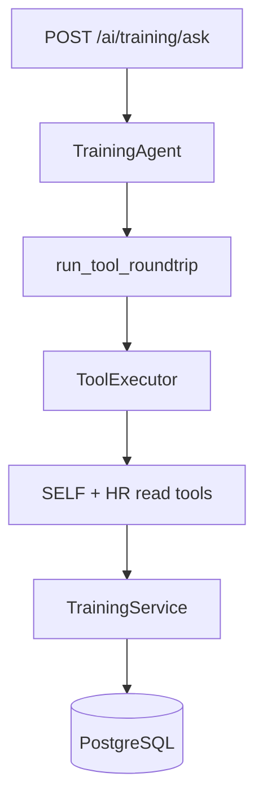

# Phase 10.2A — Training Agent (Read-Only)

**Stance:** Backend AI layer only. Wrap [`TrainingService`](../app/modules/training/service.py) reads. No writes, confirm/HMAC, AI audit changes, agent registry registration, unified Assistant routing, frontend changes, new permissions, new business rules, or migrations.

**Architectural principle:**

```text
User
  ↓
POST /ai/training/ask
  ↓
TrainingAgent
  ↓
run_tool_roundtrip → ToolExecutor
  ↓
SELF + HR read tools
  ↓
TrainingService
  ↓
PostgreSQL
```

The AI layer never touches repositories or the DB directly. Domain services remain authoritative.



---

## Files delivered

| Path | Role |
|------|------|
| [`app/ai/tools/training_reads.py`](../app/ai/tools/training_reads.py) | Three SELF/HR read tools + compact Pydantic I/O schemas |
| [`app/ai/agents/training/`](../app/ai/agents/training/) | Agent package: `agent`, `prompts`, `schemas`, `exceptions`, `service`, `__init__` |
| [`app/api/v1/ai_training.py`](../app/api/v1/ai_training.py) | `POST /ai/training/ask` |
| [`app/api/router.py`](../app/api/router.py) | Includes `ai_training.router` |
| `app/tests/unit/test_ai_tool_training_reads.py` | Tool auth + service wiring |
| `app/tests/unit/test_training_agent.py` | Agent roundtrip / registry (no writes) |
| `app/tests/integration/test_ai_training.py` | HTTP auth + ask smoke |
| This doc | Phase record |

**Untouched:** `app/ai/registry/`, `app/ai/routing/`, `app/api/v1/ai_assistant.py`, frontend.

Alembic head remains **`048_employee_training_progress`** (no migrations in this phase). Spec text that mentioned `046_training_resource_url` is historical; 10.1B/follow-on work already advanced the head.

---

## Tools

All tools call `TrainingService` only; `AppException` maps to `ToolExecutionError` without leaking other users’ data.

### SELF (`operates_on_current_user=True`, empty `required_permissions`)

| Tool | Service method |
|------|----------------|
| `list_my_training_assignments` | `list_assignments_for_user(context.user_id)` |

SELF tools take **no** `employee_id` / `onboarding_id` argument. Employees work without needing `training:read` for self access. Missing employee/onboarding → empty assignment list (controlled).

This phase does **not** wrap `list_catalogue_for_user` / employee catalogue progress — Training remains onboarding-assignment-centric for the agent.

### HR (`training:read` + roles `hr` / `admin`)

| Tool | Service method |
|------|----------------|
| `list_trainings` | `list_trainings()` |
| `list_onboarding_training_assignments` | `list_assignments_for_hr(onboarding_id)` |

Mirrors HTTP `require_hr_staff("training:read")`: `training:read` alone (employee/manager) does **not** authorize catalogue or HR assignment tools.

### Output schemas

| Schema | Fields |
|--------|--------|
| `TrainingAssignmentBrief` | `assignment_id`, `training_id`, `title`, `description`, `resource_url`, `status`, `assigned_at`, `completed_at` |
| `TrainingBrief` | `training_id`, `title`, `description`, `resource_url` |
| `OnboardingTrainingAssignmentBrief` | assignment brief + `onboarding_id` |

Status values: `pending` / `completed`. `resource_url` is nullable.

---

## Agent package

| File | Role |
|------|------|
| `exceptions.py` | `TrainingAgentError`, `TrainingAgentValidationError` |
| `schemas.py` | `TrainingAgentRequest`, `TrainingAgentAnswer` (answer, model, tool_names_called, usage) — **no** `pending_confirmation` |
| `prompts.py` | System prompt: onboarding-centric, pending vs completed, `resource_url`, no due dates/certificates/mandatory/% progress/expiry, no manager team authority, read-only |
| `agent.py` | Registry = exactly 3 read tools; `ask()` via `run_tool_roundtrip` |
| `service.py` | `build_training_agent` factory |
| `__init__.py` | Public exports |

---

## Authorization assumptions

| Caller | Self tool | HR tools |
|--------|-----------|----------|
| Employee | Yes | No (even with `training:read`) |
| Manager | Yes (own assignments only) | No (even with `training:read`) |
| HR/Admin + `training:read` | Yes if employee profile | Yes |
| Candidate | Empty list / no training | Denied |

Phase **10.2B** will audit/harden the exact matrix. This phase does not intentionally create bypasses.

---

## HTTP

- `POST /api/v1/ai/training/ask` — authenticated; builds `AIExecutionContext`; returns answer envelope.
- **No** `POST /ai/training/confirm`.
- Does **not** modify `/api/v1/ai/assistant/ask`.

---

## `resource_url` behavior

- Included on assignment and catalogue briefs when set on `Training`.
- Nullable; agent must not invent links.
- Validation remains in Core HR (http/https only) — AI does not re-validate URLs.

---

## Out of scope / known limitations

- No write tools (`complete_*`, `assign_*`, create/update/delete training)
- No confirmation / HMAC / AI audit changes
- No registry / unified Assistant registration (→ 10.2E)
- No frontend (→ 10.2D/E)
- No manager team-training scope
- No due dates, certificates, mandatory flags, quizzes, LMS, progress %
- Does not expose employee-wide catalogue completion (`EmployeeTrainingProgress`) via AI
- Does not duplicate Onboarding Agent TRAINING-task tools

### Future write scope (later phases)

- Employee complete own assignment
- HR assign / remove onboarding trainings
- Possibly catalogue create/update — confirmation-gated; not in 10.2A

---

## Confirmation checklist

| Check | Status |
|-------|--------|
| Writes added | No |
| Registry / unified Assistant touched | No |
| Frontend touched | No |
| Migrations added | No |
| Alembic head | `048_employee_training_progress` |
