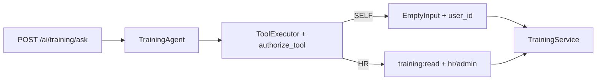

# Phase 10.2B — Training Agent Authorization Hardening

**Stance:** Audit and harden the read-only Training Agent authorization contract. No writes, confirm/HMAC, AI audit changes, FindEmployeesTool, registry, unified Assistant, frontend, new permissions, Core HR auth redesign, or migrations.

Alembic head remains **`048_employee_training_progress`**.

---

## Authorization model

| Actor | Scope |
|-------|--------|
| **Employee** | SELF only — own assignments via `context.user_id` |
| **Manager** | Own SELF only; `manager_id` / org-chart does **not** grant others’ training |
| **HR / Admin** | Catalogue + onboarding assignment tools; require `training:read` **and** role `hr` or `admin` |
| **Pre-hire candidate** | No employee profile → empty self list; HR tools denied |
| **Post-hire (candidate+employee)** | Self via employee/user relationship; still no HR catalogue unless HR/Admin |

**Critical:** `training:read` alone is **not** HR catalogue authority (mirrors HTTP `require_hr_staff("training:read")`).

HTTP `POST /ai/training/ask` remains **authenticated-only**. Agent availability ≠ tool authorization. Security is enforced by `authorize_tool` + ToolExecutor + `TrainingService` identity derivation — **not** by the system prompt.

---

## Tool-level authorization

### SELF — `list_my_training_assignments`

| Property | Value |
|----------|--------|
| Permissions | empty (no `training:read` required) |
| Roles | none |
| `operates_on_current_user` | `True` |
| Args | `EmptyInput` (`extra=forbid`) — rejects `employee_id` / `user_id` / `onboarding_id` |
| Service | `list_assignments_for_user(context.user_id)` |

Missing employee/onboarding → empty list (controlled). No foreign identity parameters.

### HR — `list_trainings` / `list_onboarding_training_assignments`

| Property | Value |
|----------|--------|
| Permissions | `training:read` (AND) |
| Roles | `hr` **or** `admin` |
| `operates_on_current_user` | `False` |
| Args | catalogue: none; assignments: `onboarding_id` only (no `employee_id`) |

Unauthorized callers receive **`Not authorized to execute this tool`** — no existence oracle. Soft-fail in `run_tool_roundtrip` does not invoke HR service methods.

Authorized HR/Admin may still receive domain 404 (`Onboarding not found`) — intentional for privileged readers.

### FindEmployees

**Not registered.** Training does not depend on `recruitment:read`.

---

## Code changes in this phase

| Path | Change |
|------|--------|
| [`app/ai/tools/training_reads.py`](../app/ai/tools/training_reads.py) | Stronger tool descriptions; `_call_service` sanitizes ORM/traceback-like AppException messages |
| [`app/ai/agents/training/prompts.py`](../app/ai/agents/training/prompts.py) | Explicit self-only, manager limits, `training:read` vs staff, cross-employee refuse, no FindEmployees |
| [`app/ai/agents/training/agent.py`](../app/ai/agents/training/agent.py) | Docstring note for 10.2B |
| Unit + integration tests | Expanded auth / soft-fail / leakage / tool-selection matrix |
| This doc | Phase record |

No domain permission changes. No write tools. No FE / registry / migrations.

---

## Self-scope behavior

1. Schema rejects forged identity args (`ToolValidationError`).
2. Service always called with **`context.user_id` only**.
3. Employee A cannot pass B’s `employee_id` / `onboarding_id` through the self tool.
4. Managers asking about reports soft-fail if they force HR tools; self tool never accepts foreign ids.

---

## Error safety

- Compact Pydantic briefs only (no ORM / repository objects).
- Unexpected exceptions → generic tool error strings (no SQLAlchemy / traceback text).
- AppException messages that look like ORM noise are replaced with the tool’s generic message.
- Unauthorized deny messages do not mention whether a target exists.
- HTTP 502 for agent failures uses a fixed user-facing detail (no internal exception text).

---

## Agent tool selection (expected)

| Actor | Question | Tool |
|-------|----------|------|
| Employee | “What trainings do I have?” | `list_my_training_assignments` |
| Employee forced catalogue | soft-fail; `list_trainings` not executed against service | — |
| Manager | own trainings | `list_my_training_assignments` |
| Manager | Sarah / report | soft-fail HR tool; no service call |
| HR | catalogue | `list_trainings` |
| HR | onboarding 42 | `list_onboarding_training_assignments` |

No manager-team tools exist.

---

## Tests

| File | Focus |
|------|-------|
| `unit/test_ai_tool_training_reads.py` | FULL matrix: staff+perm, training:read alone denial, post-hire, executor deny, metadata, sanitization |
| `unit/test_training_agent.py` | Soft-fail employee/manager HR tools; prompt limits; no find_employees/team tools; resource_url absent |
| `integration/test_ai_training.py` | Auth, envelope, controlled 422/502, manager soft-denial response |

Validation: **44 passed** (training tools + agent + AI training integration).

Regression (this phase): **157 passed**, **1 failed** — `test_unauthorized_tool_call_surfaces_as_agent_error` in `test_recruitment_agent.py` (known pre-existing soft-fail expectation drift; not introduced by 10.2B). Alembic head: `048_employee_training_progress`.

- Not registered in the multi-agent assistant / unified FE ask (→ 10.2E).
- No write / confirm tools (→ 10.2C+).
- No manager team-training APIs (by design — domain has none).
- Agent does not wrap employee catalogue progress (`list_catalogue_for_user`); remains onboarding-assignment-centric.
- Prompt cannot stop an LLM from *attempting* HR tools; server-side authorize + soft-fail remain authoritative.

---

## Explicit non-goals (confirmed)

Writes, confirmation, HMAC, AI audit redesign, FindEmployeesTool, manager team tools, registry, unified Assistant, frontend, new permissions, due dates / certificates / LMS, Alembic migrations.
