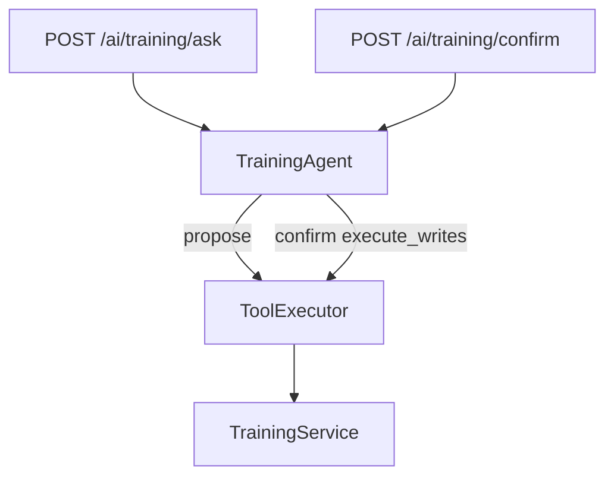

# Phase 10.2C — Training Agent Controlled Writes

**Stance:** Add two confirmation-gated write tools wrapping [`TrainingService`](../app/modules/training/service.py). Reuse shared confirmation / HMAC / audit. No catalogue create/update/delete AI tools, no FindEmployees, no registry/unified Assistant, no frontend, no migrations.

Alembic head remains **`048_employee_training_progress`**.

---

## Write tools

| Tool | Auth | Input | Service |
|------|------|-------|---------|
| `complete_my_training_assignment` | SELF: empty perms, `operates_on_current_user=True`, requires `employee_id` | `training_assignment_id` | `complete_assignment_for_user(user_id, id)` |
| `assign_training_to_onboarding` | HR/Admin + `training:write` | `onboarding_id`, `training_id` | `assign_training(...)` |

Both use `may_require_confirmation=True`. Mutations run only on confirm with `execute_writes=True`.

---

## Confirmation / HMAC / audit

- Shared `create_confirmation_token` / `verify_confirmation_token` (user-bound, argument-bound).
- `_infer_target`: `training_assignment_id` → `onboarding_training`; assign prefers `onboarding_id`.
- Audit phases: `proposed` → `confirmed` → `executed` / `failed` via `record_ai_tool_audit`.
- Authorization is rechecked at confirm time (token alone is not enough).

---

## Domain reuse & idempotency

- **Complete:** existing self-scope 404 for foreign assignments; already-completed is idempotent; TRAINING task sync; **no** completion notification (unchanged).
- **Assign:** 404 missing entities; **409** duplicate; notifies `ONBOARDING_TRAINING_ASSIGNED`; TRAINING task sync.

---

## Authorization matrix

| Actor | Complete own | Assign |
|-------|--------------|--------|
| Employee | Yes (confirm) | Denied |
| Manager | Own only | Denied |
| HR/Admin + `training:write` | Own if employee profile | Yes (confirm) |
| HR + `training:read` only | Own if employee profile | Denied |
| Candidate (no employee) | Denied at execute | Denied |

---

## Files delivered

| Path | Role |
|------|------|
| `app/ai/tools/training_writes.py` | Two write tools |
| `app/ai/tools/executor.py` | `_infer_target` for `training_assignment_id` |
| `app/ai/agents/training/*` | ask pending + confirm + prompts/schemas |
| `app/api/v1/ai_training.py` | `/ask` + `/confirm` |
| Unit/integration tests | Auth, confirm security, envelopes |
| This doc | Phase record |

**Untouched:** frontend, registry, routing, assistant, Recruitment/Leave/Onboarding agents (except shared executor target helper).

---

## Explicit exclusions

- `create_training` / `update_training` / `delete_training` / remove-assignment AI tools
- New notification types
- Manager team assign
- Registry registration (→ 10.2E)

---

## Known limitations

- Standalone `/ai/training/confirm` only — unified FE confirm routing deferred to 10.2D/E
- No FindEmployees for name→id (HR must use numeric ids from read tools)
- Complete does not emit `ONBOARDING_TRAINING_COMPLETED` (domain gap, out of scope)

---

## Validation

Targeted Training AI tests this phase: **71 passed** (reads + writes + agent + integration).

Regression: **162 passed**, **1 failed** — known pre-existing `test_unauthorized_tool_call_surfaces_as_agent_error` (untouched). Alembic head: `048_employee_training_progress`.
