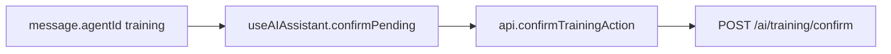

# Phase 10.2D — Training Agent Hardening + Frontend Confirmation

**Stance:** No new Training business capabilities. Harden confirm security coverage (HMAC tamper, expiry, re-auth); wire minimum frontend confirm plumbing for `agentId === "training"`. **No** registry, unified assistant routing, or migrations.

Alembic head remains **`048_employee_training_progress`**.

---

## Confirmation lifecycle (unchanged contract)

1. Ask → `execute_writes=False` → `pending_confirmation` (HMAC token bound to user, tool, exact args, target).
2. Confirm body = `confirmation_token` only → `verify_confirmation_token` → execute with `payload.arguments` from the verified token.
3. Authorization is **rechecked at confirm** (token alone is not enough).
4. Pending is **not** execution — `TrainingService` is not called until confirm succeeds.

---

## Hardened confirm guarantees

| Attack / case | Behavior |
|---------------|----------|
| Body tamper (altered `training_assignment_id` / assign ids, old signature) | Reject `invalid_or_expired_token`; no service call |
| Expired token (`exp` in the past) | Reject; no mutation |
| Wrong user | Reject (existing) |
| Wrong tool / unknown tool | Reject (existing) |
| HR assign token confirmed as employee | `TrainingAgentError`; no assign |
| Same user_id but lost `training:write` at confirm | Denied; no assign |
| Replay after success | Token may still verify; domain rejects duplicate/already-complete (no single-use `jti` — same as Leave/Onboarding) |

Audit continues: `proposed` → `confirmed` → `executed` | `failed`.

---

## Authorization recheck

- **Complete own:** executes as `context.user_id` only; employee cannot use an HR assign token.
- **Assign:** requires HR/Admin staff role **and** `training:write` at confirm time (weaker actor with only `training:read` is denied).

Prompt (`prompts.py`) already states pending ≠ success and Confirm is UI-only; no further prompt rewrite in this phase.

Unexpected agent failures continue to surface controlled `TrainingAgentError` messages (no stack/DB leaks to the client).

---

## Frontend confirmation plumbing

| Change | Detail |
|--------|--------|
| `AssistantAgentId` | Includes `"training"` |
| `TrainingAskResponse` | Mirrors onboarding ask/confirm shape |
| `api.confirmTrainingAction` | `POST /api/v1/ai/training/confirm` with `{ confirmation_token }` only |
| `confirmPending` | Routes by **message `agentId`**, not pathname; 409 surfaces API message like leave/onboarding |

FE must not invent HMAC, args, or identity. Reuses existing Confirm/Cancel UI — no Training-specific components.

**Known limit:** Unified `askAssistant` cannot yet return `agent_id: "training"` until Phase **10.2E** registry registration. Confirm plumbing is ready for messages that already carry `agentId: "training"`. Standalone `POST /ai/training/ask` + `/confirm` remain the full backend E2E path today.

---

## Explicit non-goals

Registry / routing / `ai_assistant.py`, Training-specific FE pages, catalogue CRUD AI tools, migrations, FindEmployees on Training.

---

## Tests

| Coverage | Tests |
|----------|-------|
| HMAC body tamper (complete + assign args) | `test_confirm_rejects_body_tamper_altered_assignment_id`, `test_confirm_rejects_body_tamper_altered_assign_ids` |
| Expired token | `test_confirm_rejects_expired_token` |
| Re-auth weaker actor | `test_confirm_assign_denied_when_hr_lacks_write_at_confirm` (+ existing employee-confirm-of-HR-token) |

### Validation (this phase)

| Suite | Result |
|-------|--------|
| Training AI unit + writes + reads + integration | **75 passed** |
| Regression (Training AI/domain + Onboarding/Leave/Recruitment peer units) | **163 passed**, **1 failed** — known pre-existing `test_unauthorized_tool_call_surfaces_as_agent_error` (untouched) |
| Frontend `tsc --noEmit` | **exit 0** |
| Frontend `npm run build` | **exit 0** |
| Alembic head | **`048_employee_training_progress`** |

Untouched: registry, routing, `ai_assistant.py`. Known Recruitment soft-fail not “fixed” in 10.2D.
