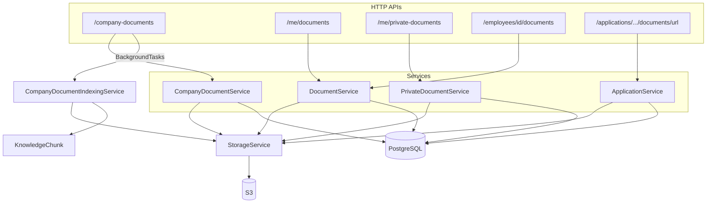
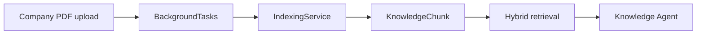

# Phase 11.1 — Document Agent Domain Audit

**Stance:** Read-only audit and design. No backend, frontend, database, migration, agent, tool, registry, router, or RAG code was changed in this phase.

**Context:** After Phase 10.2E, implemented unified agents are Knowledge, Leave, Recruitment, Onboarding, and Training. This document audits Core HR **Documents** (and related storage / RAG boundaries) so a future Document Agent can wrap **existing** services only.

**Architectural principle:**

```text
User
  ↓
HR Assistant (unified gateway)
  ↓
Document Agent   ← PROPOSED
  ↓
Document Tools   ← PROPOSED
  ↓
Existing Document*Service / ApplicationService
  ↓
StorageService → S3
  ↓
PostgreSQL (+ KnowledgeChunk for company library RAG only)
```

The AI layer must **never** call S3 or repositories directly. Domain services remain authoritative. Document **bytes** passed to an LLM must be treated as untrusted DATA (prompt-injection defense), never as instructions.

---

## 1. Executive summary

**FACT FROM CODE**

The platform already separates **four** storage-backed document concepts:

| Concept | Model | Service | Company RAG |
|---------|--------|---------|-------------|
| Company Document Library | `CompanyDocument` (+ categories) | `CompanyDocumentService` | Yes (PDF auto-index) |
| Employee / onboarding HR docs | `Document` | `DocumentService` | No |
| Private employee docs | `PrivateDocument` | `PrivateDocumentService` | No |
| Candidate application files | `ApplicationDocument` | `ApplicationService` | No |

Downloads use **presigned URLs** after authorization. API responses do **not** expose `storage_key`. Private documents are owner-scoped even from HR. Managers cannot use HR employee-document APIs despite seeded `documents:read`. Candidate CVs never enter Company RAG.

**HIGH gap:** archiving a company document hides it from employees on HTTP, but **HR Knowledge retrieval can still hit archived chunks** (no ACTIVE filter for HR staff; archive does not de-index).

**PROPOSED small domain enhancement (do not implement in 11.1):** archive withdraws from RAG for all actors (ACTIVE-only retrieval for HR as well; optionally skip reindex of archived docs).

**PROPOSED Document Agent:** start read-only over company library metadata + self private/employee metadata; confirmation-gated writes later; never Agent→S3; never LLM-supplied identity for ownership.

---

## 2. Existing document architecture



| Layer | Paths |
|-------|--------|
| Models | [`backend/app/modules/documents/models.py`](../app/modules/documents/models.py), recruitment `ApplicationDocument` |
| Services | `service.py`, `library_service.py`, `application_service.py` |
| APIs | `api/v1/documents.py`, `library_documents.py`, `applications.py`, careers |
| Storage | [`backend/app/shared/storage/`](../app/shared/storage/) |
| RAG | [`backend/app/ai/rag/indexing/`](../app/ai/rag/indexing/), chunking, retrieval filters |
| FE | `frontend/src/app/hr/documents`, `employee/documents`, `DocumentsWorkspace`, `DocumentsSection` |

---

## 3. Document types

### 3.1 Company Document Library — FACT FROM CODE

- **Models:** `CompanyDocument`, `CompanyDocumentCategory`
- **Fields:** title, description, category, filename, content_type, size, `storage_key`, `version`, `uploaded_by_user_id`, `status` (`active`/`archived`), `rag_index_status` (`pending`/`processing`/`ready`/`failed`), `rag_indexed_at`, `rag_indexing_error`
- **Ownership:** org-wide library (uploader recorded); not employee-owned
- **Upload / write:** HR/Admin + `company_documents:write` (`require_hr_staff`)
- **Read / download:** any user with `company_documents:read` (employees, managers, HR, admin); non-HR forced to ACTIVE
- **Delete:** hard delete (S3 + DB); chunks CASCADE
- **Archive:** status patch; does not remove chunks
- **RAG:** yes — background index on upload; PDF-only; retry `POST .../rag-index`
- **Categories (seeded):** hr_policies, company_policies, procedures, employee_handbook, it_security, forms_templates, other
- **Version:** column exists; update is metadata-only — **no file-replace** that bumps version

### 3.2 Employee / onboarding documents (`Document`) — FACT FROM CODE

- **Types:** `id_document`, `contract`, `diploma`, `certificate`, `other`
- **Ownership:** `employee_id`
- **Self:** list/upload/URL via `/me/documents` (auth + employee profile); **no self-delete**
- **HR:** list/upload/URL/delete via `/employees/{id}/documents*` + `require_hr_staff("documents:read|write")`
- **Managers:** cannot call HR employee-doc routes (staff gate)
- **Onboarding:** `OnboardingTaskType.DOCUMENT` verifies via `DocumentService.has_document_of_type` — **no separate onboarding file entity**
- **Side effect:** upload/delete syncs onboarding DOCUMENT tasks
- **RAG:** no

### 3.3 Private documents (`PrivateDocument`) — FACT FROM CODE

- **Ownership:** `owner_employee_id` from session `user_id` → Employee (`_require_owned`)
- **API:** `/me/private-documents` CRUD + URL — authenticated employee only
- **HR/Manager/Admin:** no override API; cross-owner access → **404** (tested)
- **RAG:** no
- **No** `private_documents:*` permission

### 3.4 Candidate application documents — FACT FROM CODE

- **Model:** `ApplicationDocument` (`cv` / `cover_letter`), unique per application+kind
- **Upload:** careers apply multipart; extract-only endpoint does not persist
- **Download:** HR/Admin + `recruitment:read` presigned URL; candidates have **no** download-own-CV route
- **Company RAG:** explicitly rejected by indexing/chunking (CompanyDocument only)
- **Recruitment AI:** CV bytes may be downloaded server-side for fit analysis — **not** Knowledge Agent RAG

### 3.5 Out of scope for Document Agent domain

- Profile pictures (`profile_picture_storage_key`)
- Training `resource_url` (external links, not document module)

---

## 4. Authorization model

### 4.1 Permissions (seeded) — FACT FROM CODE

| Permission | Used for |
|------------|----------|
| `company_documents:read` | Library list/categories/URL; Knowledge Agent / RAG |
| `company_documents:write` | Library upload/patch/delete/reindex (with HR staff) |
| `documents:read` | HR employee-doc list/URL (with HR staff) |
| `documents:write` | HR employee-doc upload/delete (with HR staff) |
| `recruitment:read` | Application document URL (with HR staff) |

Roles with `company_documents:read`: admin, hr, manager, employee.  
Roles with `company_documents:write` / `documents:write`: admin, hr.  
Managers/employees also have `documents:read` in seed, but HTTP employee-doc HR paths still require **HR/Admin role**.

### 4.2 Authorization matrix — FACT FROM CODE

| Operation | Employee | Manager | HR | Admin | Candidate |
|-----------|----------|---------|----|-------|-----------|
| List company docs (ACTIVE) | Yes* | Yes* | Yes | Yes | No |
| See archived company docs | No | No | Yes | Yes | No |
| Download company doc (ACTIVE) | Yes* | Yes* | Yes | Yes | No |
| Upload/update/delete company doc | No | No | Yes† | Yes† | No |
| Reindex company doc | No | No | Yes† | Yes† | No |
| RAG ask (company knowledge) | Yes* | Yes* | Yes | Yes | No |
| RAG retrieve archived chunks | No | No | **Yes (today)** | **Yes (today)** | No |
| List/upload own employee docs | Yes | Yes‡ | Yes‡ | Yes‡ | No |
| Delete own employee docs | No (no `/me` delete) | No | Yes† (HR API) | Yes† | No |
| Access peer employee docs | No | No | Yes† | Yes† | No |
| Own private docs CRUD + URL | Yes‡ | Yes‡ | Yes‡ | Yes‡ | No |
| Peer private docs | No (404) | No | No (404) | No (404) | No |
| Upload CV (careers) | — | — | — | — | Yes |
| Download application CV | No | No | Yes† | Yes† | No |

\* Requires `company_documents:read`.  
† Requires `require_hr_staff` + matching write/read permission.  
‡ Requires linked Employee profile.

---

## 5. Storage model

**FACT FROM CODE**

| Concern | Behavior |
|---------|----------|
| Abstraction | `StorageService` ABC → `S3StorageService` |
| Upload / delete | Via document services only |
| Download for clients | Presigned URL after auth (`expires_in=300`) |
| Server download | `download_file` for RAG ingest + CV fit |
| Validation | Shared `validate_employee_document`: max **5 MB**; pdf/doc/docx/jpg/png; magic-byte sniff; filename sanitize; executables blocked |
| Key prefixes | See §3 / inventory below |
| Key leakage | `DocumentResponse` / `CompanyDocumentResponse` / `PrivateDocumentResponse` / recruitment document responses **omit** `storage_key` |

```text
employees/{employee_id}/documents/{id}/{filename}
employees/{employee_id}/private/{id}/{filename}
company-documents/{id}/{filename}
applications/{app_id}/cv/{id}{ext}
applications/{app_id}/cover-letters/{id}{ext}
```

Failed upload after S3 put: services attempt S3 cleanup + DB rollback (company/private/employee paths).

**Invariant for future AI:** Agent → Tool → Service → StorageService → S3. Never Agent → S3.

---

## 6. RAG boundary



**FACT FROM CODE**

| Source | Indexed? |
|--------|----------|
| Company PDF | Yes (async on upload; retry endpoint) |
| Company non-PDF | Index attempt → FAILED (unsupported) |
| Private / employee / CV | Rejected by indexing & chunking |
| Archive | Chunks **kept**; non-HR retrieval ACTIVE-only; **HR retrieval unrestricted by status** |
| Hard delete | Chunks **CASCADE** removed |
| Reindex archived | Allowed (write gate only; no ACTIVE check) |

Retrieval requires `company_documents:read` (`retrieval/filters.py`). Document text is untrusted context for generation (existing Knowledge Agent posture).

---

## 7. API surface

Prefix `/api/v1`. Auth unless noted.

### Company library (`library_documents.py`)

| Method | Path | Gate | Side effects |
|--------|------|------|--------------|
| GET | `/company-documents/categories` | `company_documents:read` | — |
| GET | `/company-documents` | `company_documents:read` | Non-HR → ACTIVE only |
| POST | `/company-documents` | HR staff + write | S3 upload; BG RAG index |
| POST | `/company-documents/{id}/rag-index` | HR staff + write | BG reindex (202) |
| PATCH | `/company-documents/{id}` | HR staff + write | Metadata / status |
| DELETE | `/company-documents/{id}` | HR staff + write | S3 + DB (+ chunk cascade) |
| GET | `/company-documents/{id}/url` | `company_documents:read` | Presign; non-HR ACTIVE only |

### Private (`library_documents.py`)

| Method | Path | Gate |
|--------|------|------|
| GET/POST | `/me/private-documents` | Current user + employee |
| PATCH/DELETE | `/me/private-documents/{id}` | Owned |
| GET | `/me/private-documents/{id}/url` | Owned |

### Employee docs (`documents.py`)

| Method | Path | Gate |
|--------|------|------|
| GET/POST | `/me/documents` | Current user + employee |
| GET | `/me/documents/{id}/url` | Own employee scope |
| GET/POST | `/employees/{id}/documents` | HR staff + documents:read/write |
| GET | `/employees/{id}/documents/{id}/url` | HR staff + read |
| DELETE | `/employees/{id}/documents/{id}` | HR staff + write |

### Candidate / recruitment

| Method | Path | Gate |
|--------|------|------|
| POST | careers apply (multipart) | Candidate |
| POST | `/careers/cv/extract` | Candidate (no persist) |
| GET | `/applications/{id}/documents/{id}/url` | HR staff + `recruitment:read` |

### Knowledge

| Method | Path | Gate |
|--------|------|------|
| POST | `/ai/knowledge/ask` | `company_documents:read` |

These service methods are the reusable surface for future tools.

---

## 8. Existing service layer (AI reuse)

| Service method family | Reusable for AI? | Notes |
|----------------------|------------------|-------|
| `CompanyDocumentService.list_*` / update / delete / presigned_url | Yes | Auth must mirror HTTP (staff + status) |
| `PrivateDocumentService.*` | Yes (self only) | Bind `context.user_id` → employee; never LLM ids |
| `DocumentService.list/upload/presign` | Yes (self / HR staff) | Self vs HR tools differ |
| `ApplicationService.presigned_document_url` | Recruitment Agent domain | Keep out of Document Agent unless scoped |
| `StorageService` | Indirect only | Never tool-wrap raw S3 |
| Indexing | Ops / HR write | Prefer existing reindex endpoint semantics |

---

## 9. Existing tests

| Area | Files |
|------|--------|
| Company library | `test_company_documents.py` |
| Private IDOR | `test_private_documents.py` |
| Employee docs | `test_employee_documents.py`, `test_rbac_idor.py` |
| RAG index | `test_company_document_rag_indexing.py` |
| RAG ACL | `test_rag_retrieval.py`, `test_ai_knowledge.py` |
| Applications CV | `test_applications.py` |
| Validation / storage | `test_file_validation.py`, `test_storage.py` |

**Coverage gaps (for later phases):** archived company doc still retrieved by HR RAG; reindex of archived docs; Document Agent tool soft-denies; no FE assistant tests for documents.

---

## 10. Security risks

| Severity | Risk | Notes |
|----------|------|-------|
| **HIGH** | Archive ≠ withdraw from HR RAG | Employees lose HTTP access; HR Knowledge can still cite archived chunks; reindex of archived allowed |
| **HIGH** | LLM identity spoofing (future) | Private/self tools must use `AIExecutionContext`, never tool args for owner id |
| **HIGH** | Prompt injection via document content | Company (and any future content tools) must treat text as DATA |
| **MEDIUM** | Manager `documents:read` seed vs staff gate | Confusing but HTTP-safe today; agent must not treat permission alone as HR access |
| **MEDIUM** | Presigned URL sharing | Short TTL (300s); still sensitive if leaked from chat |
| **MEDIUM** | No self-delete on employee docs | Product asymmetry; HR-only delete |
| **LOW** | Unused `version` without file replace | Stale semantics risk if agents claim “version history” |
| **LOW** | Non-PDF company uploads fail indexing | Library still accessible; RAG status FAILED |

Private peer access and CV→Company RAG appear **well defended** by current code + tests.

---

## 11. AI capability candidates

### SAFE / HIGH-VALUE READS — PROPOSED

| Capability | Actor | Auth | Service | Confirm? | Risk |
|------------|-------|------|---------|----------|------|
| List company documents (ACTIVE for non-HR) | Employee+ | `company_documents:read` | `CompanyDocumentService.list_documents` | No | Low (metadata) |
| Get company document metadata | Employee+ | same | `_require_document` + status rules | No | Low |
| List categories | Employee+ | read | `list_categories` | No | Low |
| List my private documents | Self | session employee | `PrivateDocumentService` | No | Low |
| List my employee documents | Self | session employee | `DocumentService.list_for_user` | No | Low |
| HR list employee documents | HR/Admin | staff + `documents:read` | `list_for_employee` | No | Med (PII metadata) |
| Explain RAG index status | HR | staff + write/read | response fields | No | Low |

### POTENTIAL WRITES — PROPOSED

| Capability | Actor | Auth | Confirm? | Notes |
|------------|-------|------|----------|-------|
| Archive / restore company doc | HR | staff + write | Yes | Prefer status patch; pair with RAG withdrawal enhancement |
| Upload company document | HR | staff + write | Yes | Triggers indexing |
| Retry RAG index | HR | staff + write | Yes or soft | Prefer ACTIVE-only after enhancement |
| Upload private document | Self | session | Yes | Owner from context |
| Delete private document | Self | session | Yes | |
| Upload own employee doc | Self | session | Yes | Syncs onboarding |
| HR upload/delete employee doc | HR | staff + write | Yes | |

### DEFERRED / DANGEROUS — PROPOSED

- Dumping private / employee / CV **file contents** into the LLM context
- HR browse-all private documents (no domain API)
- Agent → S3 or raw key exposure in tool results
- “Search inside any PDF” bypassing RAG ACL
- Candidate CV into Company Knowledge
- File replace / version history claims until domain supports replace
- Manager team document access

---

## 12. Small domain enhancement recommendation

**PROPOSED (do not implement in 11.1):**

### Archive withdraws from RAG for all actors

**What:** When a company document is `archived` (or at retrieval time), exclude it from Knowledge retrieval for **HR/Admin as well as employees**. Optionally: refuse reindex while archived; or de-index chunks on archive.

**Why it qualifies:**

1. Small scope (retrieval filter + optional index gate / de-index)
2. Clear business meaning of “archive”
3. Fits existing `status` + `company_document_eligibility_clause`
4. Hardens Knowledge Agent **and** future Document Agent archive tools
5. Avoids inventing new tables/permissions
6. Does not duplicate existing ACTIVE filter for non-HR

**Deferred alternative:** company-library **file replace** bumping `version` + reindex (fields/`version` already present; update path is metadata-only today).

**Not recommended as “new features for novelty”:** tags, expiration, mandatory training-style flags — library already has description, categories, status, RAG lifecycle.

---

## 13. Proposed Document Agent scope

**PROPOSED** phases (adjusted vs Training where Documents differ — especially RAG + multi-type storage):

| Phase | Scope |
|-------|--------|
| **11.1B** (optional pre-agent) | Archive withdraws from RAG (enhancement above) |
| **11.2A** | Read-only Document Agent: company metadata + self private/employee lists; standalone `/ai/documents/ask` |
| **11.2B** | Auth hardening: context identity only; soft-deny peer private; clarify manager vs HR staff; document-as-DATA prompts |
| **11.2C** | Confirmation-gated writes: archive company; self private upload/delete; maybe self employee upload — **no** CV tools |
| **11.2D** | Confirm security tests + FE `agentId=documents` (or `document`) confirm plumbing |
| **11.2E** | Registry + router + unified `/ai/assistant/ask` |

**Availability sketch (PROPOSED):** `employee_id` present **or** HR/Admin with `company_documents:read` / relevant doc perms — finalize in 11.2E against Training/Onboarding patterns; tools remain authoritative.

Do **not** fold Recruitment CV tools into Document Agent; keep Knowledge Agent as RAG Q&A over company library.

---

## 14. Deferred capabilities

- File replace / true versioning UI
- HR private-document override
- Manager team documents
- Streaming document content to chat
- Document Agent that replaces Knowledge Agent
- Soft-delete table (archive + hard delete already exist)
- New permissions for private docs

---

## 15. Open questions

1. Should archive **purge** chunks or only filter them at retrieval?
2. Should Document Agent and Knowledge Agent both answer “what’s in the handbook?” or should routing prefer Knowledge for policy Q&A and Document for library management?
3. Should employees gain self-delete for `/me/documents` in Core HR before AI wraps it?
4. Naming: registry id `documents` vs `document`?

---

## 16. Final recommendation

1. Treat Documents as a **multi-type** domain — never merge company / private / employee / CV.
2. Ship **archive→RAG withdrawal** as a small Core HR enhancement before or at the start of Document Agent work.
3. Build Document Agent **read-only first** on existing services; confirmation-gated library/self writes next.
4. Keep **Knowledge Agent** for RAG Q&A; Document Agent for library/metadata/self vault operations.
5. Preserve storage mediation and untrusted-content rules.

**11.1 deliverable complete.** No production behavior changed.

---

## Validation of this phase

| Check | Result |
|-------|--------|
| Audit markdown written | `backend/docs/phase_11_1_document_agent_audit.md` |
| Production code / migrations / FE / RAG / registry | **Unchanged** |
| Enhancement / Document Agent implemented | **No** (STOP) |
