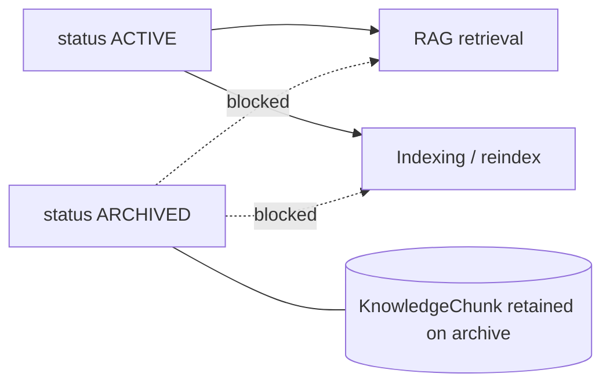

# Phase 11.1B — Company Document Archive Withdraws from RAG

**Stance:** Small Core HR / RAG hardening only. No Document Agent, registry, router, FE, permissions, migrations, or schema changes. Alembic head remains **`048_employee_training_progress`**.

---

## Previous behavior

| Surface | ACTIVE | ARCHIVED |
|---------|--------|----------|
| HTTP list/presign (employee) | Visible | Hidden (404) |
| HTTP list (HR/Admin) | Visible | Visible |
| RAG retrieval (employee) | Eligible | Excluded |
| RAG retrieval (HR/Admin) | Eligible | **Also eligible** (no status filter) |
| Index / reindex | Allowed | Allowed (could re-embed archived) |

HR could still list archived library docs over HTTP (correct for management) but RAG treated them as searchable — a security/business inconsistency once archive means “withdrawn from day-to-day use.”

---

## New invariant

```text
ACTIVE   → RAG eligible (retrieval + indexing)
ARCHIVED → RAG ineligible (no retrieval, no index/reindex)
```

HTTP library rules for HR listing archived documents are **unchanged**. Only RAG eligibility and indexing guards change.



---

## Retrieval

[`company_document_eligibility_clause`](../app/ai/rag/retrieval/filters.py) **always** returns `CompanyDocument.status == ACTIVE` for every actor (employee, manager, HR, admin). `require_company_documents_read` is unchanged.

Evaluation security suite asserts `hr_archived_filtered` (HR/Admin ACTIVE-only), not the former “HR can access archived” check.

---

## Reindex / indexing

| Entry point | Archived behavior |
|-------------|-------------------|
| `CompanyDocumentIndexingService.index_document` | Raises `DocumentNotIndexableError` **before** mutating `rag_index_status` |
| `retry_document` | Same (calls `index_document`) |
| BG `run_company_document_indexing` | Catches `DocumentNotIndexableError`, logs skip, no crash |
| `POST .../rag-index` | `CompanyDocumentService.assert_indexable` → **409** with restore guidance |
| Upload of new docs | Still `ACTIVE` + schedules BG index |

---

## Chunk retention

- **Archive (PATCH status):** metadata-only. Existing `KnowledgeChunk` rows are **retained** (not purged).
- **Hard delete:** existing FK cascade on `company_documents` → chunks remains unchanged.
- **Restore (PATCH `status: active`):** document becomes retrieval-eligible again; existing chunks are reused. This phase does **not** force reindex on restore.

---

## Restore

No new endpoint. Existing `PATCH /api/v1/company-documents/{id}` with `{"status": "active"}` restores library status; RAG eligibility follows immediately via the ACTIVE filter.

---

## Explicit non-goals

Document Agent, FE changes, registry/router/unified Assistant, chunk purge on archive, new restore endpoint, schema/migrations.

---

## Tests

| Coverage | Location |
|----------|----------|
| ACTIVE-only eligibility for all roles | `test_rag_retrieval.py`, `test_rag_evaluation.py` |
| Archived index rejected before PROCESSING; BG/retry skip | `test_company_document_rag_indexing.py` |
| Reindex archived → 409; active reindex schedules | `test_company_documents.py` |
| HR/Admin/manager excluded from archived retrieval | `test_rag_retrieval_pg.py`, `test_rag_hybrid_pg.py` |
| Knowledge no citations when no context (archived filtered) | `test_knowledge_agent.py` |

### Validation (this phase)

| Suite | Result |
|-------|--------|
| Targeted (indexing + filters + eval + knowledge + company docs API) | **50 passed** |
| Regression (RAG unit/integration + Knowledge + company documents) | **133 passed**, **13 skipped** (PG unreachable) |
| Alembic heads | **`048_employee_training_progress`** (no new migration) |
| Frontend | Untouched |
| Document Agent / registry / router | Not created / not modified |

Known Recruitment soft-fail `test_unauthorized_tool_call_surfaces_as_agent_error` left untouched.

---

## Known limitations

- Restored documents reuse existing chunks; no automatic reindex on restore in this phase.
- Archived chunks remain in the DB until hard delete (storage cost; not searchable via RAG).
- HR HTTP list of archived docs still works; only RAG and indexing are withdrawn.
