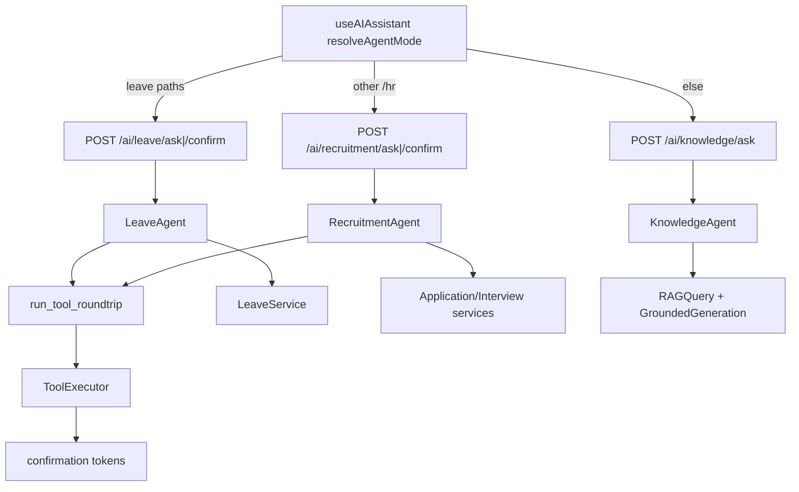
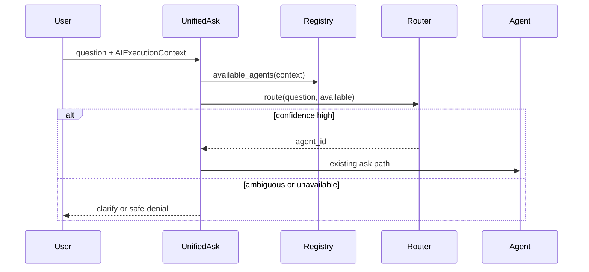

# Phase 8.1 — Multi-Agent HR Assistant Audit & Capability Registry Design

**Stance:** Audit + design only. No global router, FE redesign, new agents, migrations, or domain-service changes were made in this phase.

**Locked for Phase 8.2:** A code-based Agent Registry (knowledge / leave / recruitment only) plus a unified ask gateway that routes among **available** agents. Router selects agent; tool and domain services remain authoritative for authorization.

---

## A. Current AI architecture

There is **no** multi-agent gateway, supervisor, or intent router. Agent selection is **frontend path-based**. Each domain agent exposes its own FastAPI router and builds its own tool stack.



| Layer | Path | Role |
|-------|------|------|
| Context | `backend/app/ai/core/context/` | `AIExecutionContext`: `user_id`, `role_names`, `permission_names`, `employee_id`, `candidate_id` — built from JWT user + DB only (`build_ai_execution_context`) |
| LLM | `backend/app/ai/core/llm/` | Provider-agnostic `LLMProvider` (Gemini / Mistral) |
| Tools | `backend/app/ai/tools/` | Per-agent `ToolRegistry`; `authorize_tool`; `ToolExecutor` (HMAC gate when `may_require_confirmation`) |
| Roundtrip | `backend/app/ai/orchestration/tool_roundtrip.py` | Multi-round LLM ↔ tools loop; soft-fails tool auth/validation/execution into tool results |
| Confirmation | `backend/app/ai/confirmation/` | HMAC tokens bound to `user_id` + tool name + canonical args + expiry |
| Audit | `backend/app/ai/audit/` | `ai_tool_action_audits`: `proposed` → `confirmed` → `executed` / `failed` |
| Agents | `backend/app/ai/agents/{knowledge,recruitment,leave}/` | Independent classes — **no shared agent ABC/interface** |
| APIs | `backend/app/api/v1/ai_*.py` | Mounted in `backend/app/api/router.py` under `/api/v1` |

**Not present (verified):** `AgentRegistry`, unified `/ai/ask`, cross-agent dispatcher, Training / Onboarding / Document agents.

`backend/app/ai/agents/__init__.py` currently re-exports **Knowledge only**.

---

## B. Current implemented agents

| Agent | Class | Tools? | Writes? | Confirm? |
|-------|-------|--------|---------|----------|
| Knowledge | `KnowledgeAgent` | No — RAG pipeline | No | No |
| Recruitment | `RecruitmentAgent` | Yes (recruitment + interview) | Yes (gated) | Yes |
| Leave | `LeaveAgent` | Yes (self / team / HR + writes) | Yes (gated) | Yes |

**Not implemented:** Training Agent, Onboarding Agent, Document Agent. Do not register them as available.

Related non-chat AI: `CvExtractionService`, `FitAnalysisService` under recruitment (careers HTTP, not the floating assistant).

---

## C. Current agent endpoints

| Agent | Ask | Confirm | HTTP permission |
|-------|-----|---------|-----------------|
| Knowledge | `POST /api/v1/ai/knowledge/ask` | — | `company_documents:read` |
| Recruitment | `POST /api/v1/ai/recruitment/ask` | `POST /api/v1/ai/recruitment/confirm` | `recruitment:read` / `recruitment:write` |
| Leave | `POST /api/v1/ai/leave/ask` | `POST /api/v1/ai/leave/confirm` | `leaves:read` / `leaves:write` |

All ask/confirm handlers inject `AIExecutionContext` via `Depends(get_ai_execution_context)`.

Sources: `backend/app/api/v1/ai_knowledge.py`, `ai_recruitment.py`, `ai_leave.py`.

---

## D. Current frontend routing

Source: `frontend/src/hooks/useAIAssistant.tsx`.

```
/hr/leave* | /employee/leave*  → agentMode "leave"
                                 → askLeaveAgent + confirmLeaveAction
/hr* (else)                    → agentMode "recruitment"
                                 → askRecruitmentAgent + confirmRecruitmentAction
else                           → agentMode "knowledge"
                                 → askKnowledgeAgent (no confirm)
```

| Behavior | Detail |
|----------|--------|
| Mode type | `AIAssistantAgentMode = "knowledge" \| "recruitment" \| "leave"` (`frontend/src/types/ai.ts`) |
| Mode change | Clears messages, draft, error |
| Pathname change | Closes assistant panel |
| Mount | `AIAssistantProvider` on HR + employee layouts only |
| Capability catalog | **None** — hardcoded modes, URLs, suggestions, footers |
| Pending confirm UI | Shared shape (`token`, `tool_name`, `summary`, `expires_at`) for leave + recruitment |

Confirmed exploration: path routing only; no backend agent list fetch.

---

## E. Current authorization model

Five layers must stay distinct:

| # | Layer | Where | Question answered |
|---|-------|-------|-------------------|
| 1 | HTTP gate | `require_permissions` on AI routes | Can this user hit this endpoint? |
| 2 | Agent availability | **Not implemented yet** (registry in 8.2) | May this user use this agent at all? |
| 3 | Tool authorization | `ToolMetadata` + `authorize_tool` | May this context call this tool? |
| 4 | Resource scope | Self/team helpers; org-chart in Leave tools/service | Which employee/request may be targeted? |
| 5 | Domain business | `LeaveService`, Application/Interview services, RAG ACL | Is the mutation/transition valid? |

**Manager clarification (from Phase 7.3A):** Product “manager” for Leave team scope is **org-chart** (`Employee.manager_id`), not reliance on RBAC role `"manager"`. A seeded `"manager"` role exists for some permissions (and `recruitment:read` is revoked from it), but Leave approve/reject authority comes from `classify_actor` / direct-report checks inside `LeaveService`.

**Recruitment:** Endpoint requires `recruitment:read` / `recruitment:write`. Employees and typical managers lack these → **403 before any tool runs** → agent effectively HR/Admin-only.

**Knowledge:** Endpoint requires `company_documents:read` (seeded on employee, manager, hr, admin). Document ACL enforced inside RAG retrieval (ACTIVE docs for non-HR).

**Leave:** Ask requires `leaves:read`; confirm requires `leaves:write` (seeded on employee, manager, hr, admin). Tool roles further restrict HR org-wide reads (`required_roles={"hr","admin"}` on most `leave_reads` tools). Writes wrap `LeaveService` AS-IS.

Router (future) must answer **only** agent selection among available agents — never reimplement layers 4–5.

---

## F. Proposed Agent Registry

**Storage:** Code/configuration under something like `backend/app/ai/registry/` — **not** a database table.

**Active registrations only:**

- `knowledge`
- `leave`
- `recruitment`

**Conceptual definition** (adapt naming to project conventions in 8.2):

```python
AgentDefinition(
    id="leave",                      # stable string
    display_name="Leave",
    description="Leave balances, requests, approvals…",
    intents=[...],                   # routing hints / classifier labels
    required_permissions_any=frozenset({"leaves:read"}),  # availability
    supports_confirm=True,
    # entrypoint: factory / enum → existing agent DI builders
)
```

**Future agents (Training, Onboarding, Documents):** document the **same contract** as an extension point. Do **not** add them to the live registry until implemented — availability must not imply they exist.

---

## G. Proposed availability matrix

Aligned with current HTTP permission gates:

| Actor | Knowledge (`company_documents:read`) | Leave (`leaves:read`) | Recruitment (`recruitment:read`) |
|-------|--------------------------------------|------------------------|----------------------------------|
| Employee | yes | yes | **no** |
| Manager (RBAC and/or org-chart) | yes | yes | **no** |
| HR | yes | yes | yes |
| Admin | yes | yes | yes |
| Candidate | typically **no** | **no** | **no** |

Availability ≠ capability. An employee with Leave available still cannot approve others’ requests (tool/service deny).

---

## H. Proposed capability / scope model

| Concept | Meaning | Owner |
|---------|---------|-------|
| Agent availability | User may open/invoke this agent | Registry + permissions |
| Capability | Which tools exist for that agent | Agent tool registration + `ToolMetadata` |
| Resource scope | Which employee/request IDs are valid targets | Tools + domain services |
| Business authorization | Status transitions, dual approval, overlaps, ACL | Domain services |

**Examples**

| User | Agent available | Intended action | Outcome |
|------|-----------------|-----------------|---------|
| Employee | Leave | Own balance / create own request | Allowed via self tools + `LeaveService` |
| Employee | Leave | Approve another employee | Denied (tool/service) |
| Org manager | Leave | Approve direct report | Allowed if `LeaveService` classifies manager |
| Org manager | Leave | Approve unrelated employee | Denied by service |
| Employee | Recruitment | Shortlist candidate | Agent **unavailable** (HTTP 403 / registry) |
| HR | Recruitment | Shortlist | Available → confirmation → ApplicationService |

---

## I. Proposed routing architecture



**Rules**

1. Filter to **available** agents first; never route to an unavailable agent.
2. Router output = `agent_id` or `clarify` / `unavailable` — not a business allow/deny on a specific leave request.
3. Low confidence → ask which domain (Leave vs Knowledge vs Recruitment), do not invent selection.
4. Recruitment intent + employee → deny with safe message; never invoke Recruitment tools.
5. Per-agent confirm endpoints remain (`/ai/leave/confirm`, `/ai/recruitment/confirm`) unless a later phase adds unified confirm.

**Default Phase 8.2 approach:** `POST /api/v1/ai/assistant/ask` using registry + lightweight router (keyword and/or LLM classify over available IDs only), dispatching to existing Knowledge / Leave / Recruitment builders. Keep existing per-agent endpoints for FE interim path routing.

---

## J. Shared context proposal

**Reuse** `AIExecutionContext` as-is. Do not add a parallel identity system.

| Need | Derive from |
|------|-------------|
| Who is calling | `user_id`, roles, permissions, `employee_id`, `candidate_id` |
| Available agents | Registry filter on `permission_names` (and roles if needed) per request |
| Direct reports / manager | Existing Employee / Leave services when Leave tools need them — not preloaded into context by default |

Optional later (gateway only): compute `available_agent_ids` once per request for routing and response metadata — still not persisted.

---

## K. Tool namespace recommendation

| Fact | Detail |
|------|--------|
| Registry model | **Per-agent** `ToolRegistry` (no global merged pool today) |
| Tool names | ~41 distinct name strings across leave / recruitment / interview / smoke |
| Shared name | `find_employees` — same class registered on Leave and Recruitment; Leave usage still requires `recruitment:read` on that tool (existing quirk; do not “fix” in registry) |
| Collisions | No two different tool classes share a name; a single registry rejects duplicate names |

**Recommendation:** Keep per-agent registries in 8.2. Introduce dotted namespaces (`leave.get_balance`) only if a future unified executor merges tools into one pool. Not required while agents stay isolated.

Knowledge Agent has **no** tools (RAG only).

---

## L. Frontend / backend contract recommendation

| Endpoint | Purpose | When |
|----------|---------|------|
| `POST /api/v1/ai/assistant/ask` | Unified ask → available agents → route → existing agent | **Phase 8.2 core** |
| `GET /api/v1/ai/agents` | List available agents + display metadata for authenticated user | Optional in 8.2; useful when FE stops path-routing |
| Existing `/ai/knowledge|leave|recruitment/*` | Back-compat / current FE | Retain |

**Response shape note:** Knowledge returns citations; Leave/Recruitment may return `pending_confirmation`. Unified ask should wrap a common envelope, e.g. `{ agent_id, answer, citations?, pending_confirmation?, ... }` without changing agent internals.

FE today does **not** require `GET /ai/agents` until path-based `resolveAgentMode` is retired.

---

## M. Exact files that would be modified in Phase 8.2

**Create**

- `backend/app/ai/registry/` — `AgentDefinition`, static definitions, `available_agents(context)`
- `backend/app/ai/routing/` — router interface + first classifier (available-only)
- `backend/app/api/v1/ai_assistant.py` — unified ask (and optionally `GET /agents`)
- Unit tests: availability matrix + routing cases (see section below)

**Modify lightly**

- `backend/app/api/router.py` — include assistant router
- Possibly `backend/app/ai/agents/__init__.py` — export helpers if useful (optional)

**Do not modify in 8.2**

- `LeaveService` business rules / manager model
- Recruitment tool permissions or confirmation semantics
- Leave/Recruitment write tool behavior
- Migrations / new RBAC roles / `"manager"` role inventing
- Training / Onboarding / Document agent implementations
- FE redesign (path routing may remain until a later FE phase)

---

## N. Risks / ambiguities

1. **FE path routing vs backend intent routing** will diverge until the assistant FE migrates to unified ask.
2. **`find_employees` + `recruitment:read`** on Leave Agent — leave as-is; registry must not silently broaden permissions.
3. **RBAC `"manager"` vs org-chart manager** — availability uses permissions; Leave team scope uses org chart.
4. **Router misclassification** — must constrain candidates to available agents and fall back to clarify.
5. **Heterogeneous responses** — Knowledge (citations) vs Leave/Recruitment (`pending_confirmation`) need a stable envelope.
6. **Confirm UX** — typing “I confirm” in chat still does nothing; only HMAC UI Confirm. Unified ask must preserve that.
7. **Candidate / inactive users** — typically lack agent permissions; deny safely without leaking resource existence.

---

## O. Exact implementation plan for Phase 8.2

1. **Registry** — Define `knowledge`, `leave`, `recruitment` with availability predicates matching current HTTP gates; document future-agent contract without registering them.
2. **Routing** — `route(question, available_agent_ids) → agent_id | clarify | unavailable`. Prefer deterministic hints + optional LLM classify **only** over the available set.
3. **Gateway** — `POST /ai/assistant/ask`: build context → available agents → route → call existing Knowledge/Leave/Recruitment ask builders → normalize response envelope.
4. **Errors** — Unavailable agent / ambiguous route / agent failure → sanitized messages (no unauthorized resource leakage).
5. **Tests (implement in 8.2, not 8.1)**
   - Availability: Employee/Manager → Knowledge+Leave yes, Recruitment no; HR/Admin → all three yes.
   - Routing: leave question → Leave; knowledge question → Knowledge; recruitment from employee → blocked; from HR → Recruitment.
6. **Out of scope for 8.2** — FE redesign, Training/Onboarding/Documents agents, Leave/Recruitment auth changes, migrations.

---

## Error / security model (design)

| Situation | Expected behavior |
|-----------|-------------------|
| Agent unavailable | Safe denial (“not available for your account”); no tool execution |
| Permission missing at HTTP | Existing 403 |
| Tool unauthorized / scope denied | Soft-fail or service error already sanitized to client |
| Ambiguous employee / request | Agent asks for clarification (existing Leave/Recruitment behavior) |
| Routing ambiguous | Clarify which domain; do not invent agent |
| Agent / LLM failure | Generic safe 502-style message (existing pattern) |
| Replay / bad confirm token | Existing 409 confirmation errors |

---

## Test strategy (proposed for 8.2 — not implemented in 8.1)

| Suite | Cases |
|-------|-------|
| Availability | Employee / Manager / HR / Admin × Knowledge / Leave / Recruitment |
| Routing | Leave vs Knowledge vs Recruitment intents; unavailable Recruitment for employee |
| Negative | Ambiguous question → clarify; never call tools on unavailable agent |

---

## References

- Leave auth audit: `backend/docs/phase_7_3a_auth_audit.md`
- Leave writes audit: `backend/docs/phase_7_4a_leave_writes_audit.md`
- FE assistant: `frontend/src/hooks/useAIAssistant.tsx`, `frontend/src/types/ai.ts`
- Agent APIs: `backend/app/api/v1/ai_knowledge.py`, `ai_recruitment.py`, `ai_leave.py`
- Context: `backend/app/ai/core/context/`
- Tools / confirm / audit: `backend/app/ai/tools/`, `confirmation/`, `audit/`

---

**Phase 8.1 complete.** Ready for Phase 8.2 registry + routing + unified ask when approved.
