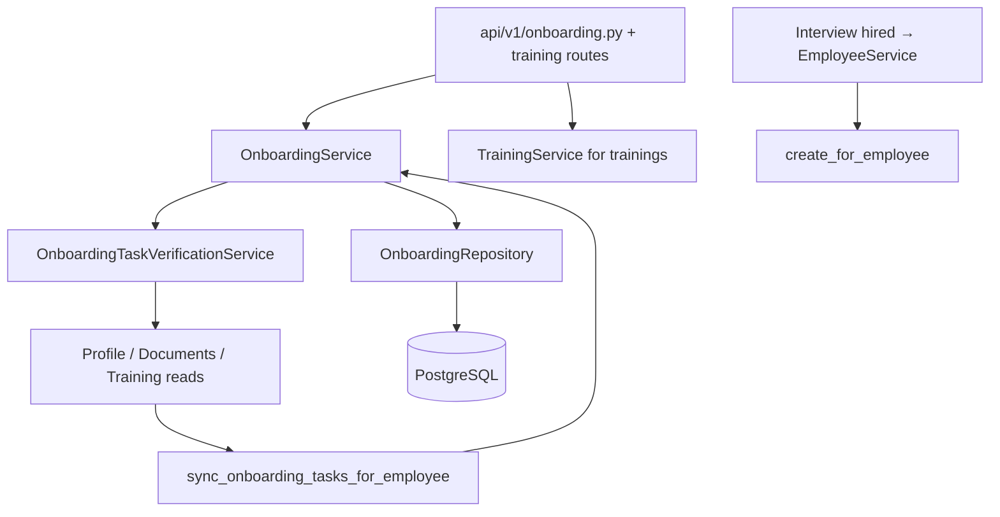

# Phase 9.1 — Onboarding Agent Domain Audit

**Stance:** Read-only audit and design. No backend, frontend, database, migration, or agent code was changed in this phase.

**Context:** After Phase 8 (unified gateway + FE integration), implemented agents are Knowledge, Leave, and Recruitment. This document audits Core HR Onboarding so a future Onboarding Agent can wrap **existing** services only.

**Architectural principle:**

```text
User
  ↓
HR Assistant (unified gateway)
  ↓
Onboarding Agent
  ↓
Onboarding Tools
  ↓
Existing Onboarding Business Services (+ Training where needed)
  ↓
PostgreSQL
```

The AI layer must **never** access repositories or the database directly. Domain services remain authoritative. The agent must **not** invent permissions or manager-scoped APIs the domain does not provide.

---

## A. Files inspected

### Core onboarding module

| Path | Role |
|------|------|
| [`backend/app/modules/onboarding/models.py`](../app/modules/onboarding/models.py) | `Onboarding`, `OnboardingTask`, `OnboardingTaskTemplate`; enums status / task status / task type |
| [`backend/app/modules/onboarding/schemas.py`](../app/modules/onboarding/schemas.py) | API DTOs (list, progress, tasks, templates) |
| [`backend/app/modules/onboarding/repository.py`](../app/modules/onboarding/repository.py) | `OnboardingRepository` |
| [`backend/app/modules/onboarding/service.py`](../app/modules/onboarding/service.py) | `OnboardingService` — business rules |
| [`backend/app/modules/onboarding/verification.py`](../app/modules/onboarding/verification.py) | `OnboardingTaskVerificationService.verify_task` |
| [`backend/app/modules/onboarding/sync.py`](../app/modules/onboarding/sync.py) | `sync_onboarding_tasks_for_employee` |
| [`backend/app/modules/onboarding/dependencies.py`](../app/modules/onboarding/dependencies.py) | Service wiring; `require_careers_access`; `require_employee_access_cleared` |

### HTTP API

| Path | Role |
|------|------|
| [`backend/app/api/v1/onboarding.py`](../app/api/v1/onboarding.py) | HR `/onboarding/*`, employee `/me/onboarding*`, `/employees/{id}/onboarding` |
| [`backend/app/api/v1/training.py`](../app/api/v1/training.py) | Onboarding-linked trainings (`/onboarding/{id}/trainings`, `/me/onboarding/trainings`) |
| [`backend/app/api/router.py`](../app/api/router.py) | Router include |

### Identity / hire / sync callers

| Path | Role |
|------|------|
| [`backend/app/modules/identity/service.py`](../app/modules/identity/service.py) | Seeds `onboarding:read` / `onboarding:write`; revokes manager `onboarding:read`; `/auth/me` onboarding status |
| [`backend/app/modules/identity/hr_access.py`](../app/modules/identity/hr_access.py) | `require_hr_staff` |
| [`backend/app/modules/employees/service.py`](../app/modules/employees/service.py) | Hire → `create_for_employee` |
| [`backend/app/modules/interviews/service.py`](../app/modules/interviews/service.py) | Hired outcome → employee + onboarding notify |
| [`backend/app/modules/profile/service.py`](../app/modules/profile/service.py) | Profile mutations → onboarding sync |
| [`backend/app/modules/documents/service.py`](../app/modules/documents/service.py) | Document upload/delete → sync |
| [`backend/app/modules/training/service.py`](../app/modules/training/service.py) | Training assign/complete → sync |
| [`backend/app/modules/notifications/models.py`](../app/modules/notifications/models.py) | Onboarding notification types |
| [`backend/app/modules/dashboard/service.py`](../app/modules/dashboard/service.py) | Incomplete onboarding KPIs |

### AI registry (current)

| Path | Role |
|------|------|
| [`backend/app/ai/registry/registry.py`](../app/ai/registry/registry.py) | Registers **knowledge / leave / recruitment only** — Onboarding **not** registered |

### Tests (reference)

Integration coverage under `backend/app/tests/integration/`: `test_onboarding*.py` (access, tasks, progress, templates, verification, notifications, backfill).

---

## B. Existing onboarding architecture



### Domain model (summary)

| Entity | Table | Notes |
|--------|-------|-------|
| `Onboarding` | `onboardings` | 1:1 `employee_id`; status `in_progress` \| `completed` |
| `OnboardingTaskTemplate` | `onboarding_task_templates` | Catalogue (title, type, required, active, optional document_type / training_id) |
| `OnboardingTask` | `onboarding_tasks` | Instance snapshot on an onboarding |

**Task types:** `profile_personal_info`, `profile_picture`, `education`, `experience`, `document`, `training`, `acknowledgement`, `manual`.

**Default seeded templates** (including optional “Meet your manager” manual task): personal info, profile picture, education, experience, ID document, assigned training, company policies acknowledgement, meet manager (optional).

### Lifecycle

1. **Create:** Interview hire → `EmployeeService.create_from_hired_candidate` → `OnboardingService.create_for_employee` (assigns active templates; may create `OnboardingTraining` rows) → `notify_onboarding_started`. Manual `create_employee` does **not** start onboarding.
2. **Progress:** Employees complete profile/docs/training in their domains; `sync_verified_tasks` marks matching tasks complete (or reopens if evidence disappears). Employees **acknowledge** acknowledgement tasks. HR completes **manual** tasks and can force-complete onboarding.
3. **Auto-complete:** `_maybe_complete_onboarding` when **all required** tasks are completed (optional tasks do not block). Zero required tasks → does not auto-complete. HR `complete_for_hr` can force complete without that gate.
4. **Access gates:** In-progress onboarding blocks careers (`require_careers_access`) and employee-home (`require_employee_access_cleared`) until cleared.

---

## C. Existing capabilities

### READ operations

| Operation | Service method | HTTP (typical) | Authorization | Actor |
|-----------|----------------|----------------|---------------|-------|
| Get my onboarding | `get_for_employee_user` | `GET /me/onboarding` | Authenticated; resolves employee by `user_id` | Employee (self) |
| Get my progress | `get_progress_for_employee_user` | `GET /me/onboarding/progress` | Same | Employee (self) |
| List my tasks | `list_tasks_for_employee_user` | `GET /me/onboarding/tasks` | Same | Employee (self) |
| Active / status helpers | `get_active_onboarding_for_user`, `get_onboarding_status_for_user` | Used by deps / `/auth/me` | Authenticated | Any user with employee link |
| List onboardings | `list_for_hr` | `GET /onboarding` | `require_hr_staff("onboarding:read")` | HR / Admin |
| Get onboarding | `get_for_hr` | `GET /onboarding/{id}` | `onboarding:read` | HR / Admin |
| Get by employee | `get_by_employee_id_for_hr` | `GET /employees/{id}/onboarding` | `onboarding:read` | HR / Admin |
| Progress (HR) | `get_progress_for_hr` | `GET /onboarding/{id}/progress` | `onboarding:read` | HR / Admin |
| List tasks (HR) | `list_tasks_for_hr` | `GET /onboarding/{id}/tasks` | `onboarding:read` | HR / Admin |
| List / get templates | `list_templates`, `get_template` | `GET /onboarding/task-templates*` | `onboarding:read` | HR / Admin |
| List my trainings | `TrainingService.list_assignments_for_user` | `GET /me/onboarding/trainings` | Authenticated | Employee (self) |
| List HR trainings on onboarding | TrainingService list | `GET /onboarding/{id}/trainings` | `require_hr_staff("training:read")` | HR / Admin |

HR methods generally do **not** re-check RBAC inside the service — the API layer enforces `require_hr_staff`. Employee methods enforce **self-ownership** (404 if no employee / not owner).

### WRITE operations

| Operation | Service method | HTTP (typical) | Authorization | Actor | Notes |
|-----------|----------------|----------------|---------------|-------|-------|
| Acknowledge ACK task | `acknowledge_task_for_employee` | `PATCH /me/onboarding/tasks/{id}/acknowledge` | Self + ownership; acknowledgement type only | Employee | Primary employee explicit write |
| Complete task (legacy alias) | `complete_task_for_employee_user` → acknowledge | `PATCH /me/onboarding/tasks/{id}/complete` | Same | Employee | Still ACK-only |
| Complete training assignment | `TrainingService.complete_assignment_for_user` | `PATCH /me/onboarding/trainings/{id}/complete` | Self | Employee | Triggers onboarding sync |
| Force complete onboarding | `complete_for_hr` | `POST /onboarding/{id}/complete` | `onboarding:write` | HR / Admin | Skips required-task auto gate |
| Complete manual task | `complete_manual_task_for_hr` | `PATCH /onboarding/tasks/{id}/complete` | `onboarding:write` | HR / Admin | Manual type |
| Create / update / delete task | `create_task`, `update_task`, `delete_task` | `/onboarding/.../tasks*` | write | HR / Admin | Instance management |
| Template CRUD | `create_template`, `update_template`, `delete_template` | `/onboarding/task-templates*` | write | HR / Admin | Catalogue |
| Create onboarding | `create_for_employee` | Hire path (not free HTTP create) | Internal hire | System | Assigns active templates |
| Backfill missing | `backfill_missing_onboardings` | **No HTTP API** | Migration / ops | Ops | May create bare onboardings without templates |
| Sync verified tasks | `sync_verified_tasks` | Internal after profile/docs/training | System | Side-effect completion / reopen |
| Notifications | `notify_onboarding_started`, task-assigned / completed helpers | Internal | System | See section H |

### Verification (not a separate employee “verify” write)

`OnboardingTaskVerificationService.verify_task` checks underlying evidence:

| Task type | Auto-verified when |
|-----------|-------------------|
| Profile / picture / education / experience | Profile completeness / records exist |
| Document | Employee has document of required `document_type` |
| Training | Matching `OnboardingTraining` assignment completed |
| Acknowledgement / manual | **Never** auto-verified — explicit action required |

---

## D. Authorization matrix

| Actor | Own onboarding | Other employees’ onboarding | Templates / HR manage | Manager reports via org chart |
|-------|----------------|----------------------------|----------------------|-------------------------------|
| Employee | Yes (`/me/onboarding*`) | No | No | N/A |
| Manager (RBAC role) | Only as self-employee if linked | No (`onboarding:*` revoked) | No | **No** — `manager_id` unused in onboarding |
| HR | Via HR APIs | Yes | Yes | N/A |
| Admin | Same as HR (all perms) | Yes | Yes | N/A |
| Candidate (no employee) | 404 | No | No | N/A |
| Hired (candidate + employee) | Yes while in progress | No | No | Careers blocked until complete |

**Permissions** (seeded in identity bootstrap):

- `onboarding:read` — assigned to **admin**, **hr** (not employee, not manager).
- `onboarding:write` — assigned to **admin**, **hr**.
- `MANAGER_PERMISSIONS_TO_REVOKE` includes `onboarding:read` (historical drift cleanup).

**Implication for a future agent:** Do **not** treat RBAC `"manager"` or `Employee.manager_id` as onboarding authority. Leave uses org chart; Onboarding does not.

**AI must not introduce new permissions.** Tool auth should reuse:

- Self tools: `operates_on_current_user` / employee ownership checks already in service.
- HR tools: `onboarding:read` / `onboarding:write` (+ `require_hr_staff` semantics at API; tools should require matching permissions/roles consistent with Leave/Recruitment tool metadata patterns).

---

## E. Proposed Onboarding Agent tools

Design only — **not implemented**.

### Agent availability (registry — Phase 9.2+)

Employees lack `onboarding:read` but must use SELF tools. Recommended availability rule for later registration:

> Available when `AIExecutionContext.employee_id` is set **OR** the user has `onboarding:read`.

Do **not** grant employees `onboarding:read` solely for the AI. Do **not** register Training / Documents agents here.

### Read tools (Phase 9.2A)

| Tool name | Purpose | Underlying service | Required permission / gate | Resource scope | Allowed actor | Confirm? | Domain auth exists? |
|-----------|---------|-------------------|----------------------------|----------------|---------------|----------|---------------------|
| `get_my_onboarding` | Current user’s onboarding record | `get_for_employee_user` | Authenticated + employee | Self | Employee | No | Yes |
| `get_my_onboarding_progress` | Progress % / counts | `get_progress_for_employee_user` | Same | Self | Employee | No | Yes |
| `list_my_onboarding_tasks` | Task list for self | `list_tasks_for_employee_user` | Same | Self | Employee | No | Yes |
| `list_onboardings` | Company onboarding list | `list_for_hr` | `onboarding:read` (+ HR staff) | Company | HR / Admin | No | Yes (API) |
| `get_onboarding` | Onboarding by id | `get_for_hr` | `onboarding:read` | By id | HR / Admin | No | Yes |
| `get_onboarding_by_employee` | Onboarding by employee id | `get_by_employee_id_for_hr` | `onboarding:read` | By employee_id | HR / Admin | No | Yes |
| `get_onboarding_progress` | Progress for an onboarding | `get_progress_for_hr` | `onboarding:read` | By id | HR / Admin | No | Yes |
| `list_onboarding_tasks` | Tasks for an onboarding | `list_tasks_for_hr` | `onboarding:read` | By onboarding_id | HR / Admin | No | Yes |
| `list_onboarding_templates` | Active/all templates | `list_templates` | `onboarding:read` | Catalogue | HR / Admin | No | Yes |

Optional later (Training domain, not core OnboardingService): `list_my_onboarding_trainings` via `TrainingService` — defer unless 9.2A explicitly includes training reads.

### Write tools (Phase 9.2C — confirmation-gated)

| Tool name | Purpose | Underlying service | Required permission / gate | Resource scope | Allowed actor | Confirm? | Domain auth exists? |
|-----------|---------|-------------------|----------------------------|----------------|---------------|----------|---------------------|
| `acknowledge_onboarding_task` | Acknowledge policies / ACK task | `acknowledge_task_for_employee` | Self + ownership; ACK type | `task_id` | Employee | **Yes** | Yes |
| `complete_manual_onboarding_task` | Mark manual task done | `complete_manual_task_for_hr` | `onboarding:write` | `task_id` | HR / Admin | **Yes** | Yes |
| `complete_onboarding` | Force-complete onboarding | `complete_for_hr` | `onboarding:write` | `onboarding_id` | HR / Admin | **Yes** | Yes |

### Explicitly deferred / out of agent scope

| Capability | Reason |
|------------|--------|
| Template CRUD | Catalogue admin; high blast radius; no chat need in early phases |
| Arbitrary task create / update / delete | Prefer HR UI; easy to corrupt checklist |
| `create_for_employee` | Hire-path only; not a free-form chat create |
| `backfill_missing_onboardings` | Ops/migration only |
| Direct `sync_verified_tasks` | Side-effect of Profile/Documents/Training — not an AI write |
| “Complete profile / upload document” via Onboarding tools | Belongs to those domains / UI |
| Manager-report onboarding tools | **No domain authorization** |
| Employee force-complete onboarding | Only `complete_for_hr` |
| Invented “verify_task” employee write | Verification is sync/evidence-based |

---

## F. Confirmation requirements

Reuse the **existing** Leave/Recruitment pattern:

- Tool metadata `may_require_confirmation=True` for writes.
- HMAC-bound confirmation tokens via `ToolExecutor`.
- Future endpoint: `POST /api/v1/ai/onboarding/confirm` (not created in 9.1).
- Unified ask may return `pending_confirmation`; FE confirms via agent-specific confirm using `agentId` (Phase 8.3B pattern).

| Action | Confirmation |
|--------|----------------|
| All read tools | No |
| `acknowledge_onboarding_task` | **Yes** |
| `complete_manual_onboarding_task` | **Yes** |
| `complete_onboarding` | **Yes** |

Do **not** create a second confirmation architecture or a unified `/ai/assistant/confirm` for this domain.

---

## G. Security boundaries

| Boundary | Classification |
|----------|----------------|
| Agent never uses repositories/DB directly | Architecture rule (must enforce in 9.2) |
| No new RBAC permissions for AI | Explicit — reuse existing seed |
| No manager org-chart onboarding scope | Explicitly absent in service/routes |
| Employee cannot force-complete onboarding | Explicit — only `complete_for_hr` |
| Employee cannot complete manual tasks | Explicit — HR `complete_manual_task_for_hr` |
| Employee ACK limited to acknowledgement type | Explicit in `acknowledge_task_for_employee` |
| Create onboarding only via hire (or ops backfill) | Explicit — no free HTTP create |
| Completing onboarding does not change `EmploymentStatus` | Explicit domain behavior — do not invent employment writes |
| Template/task catalogue mutation from chat | Not forbidden by a special lock, but **unsupported / dangerous** — keep out of agent until justified |
| Soft-fail unauthorized tool calls in roundtrip | Pattern from Leave — apply in 9.2 |
| Bypass completed-onboarding immutability | Follow `OnboardingService` rules as-is; do not add AI bypasses |

---

## H. Cross-domain dependencies

| Domain | Relationship |
|--------|----------------|
| **Recruitment / Interviews** | Hire outcome → create employee → `create_for_employee` → notify started |
| **Profile** | Personal info / picture / education / experience mutations → `sync_onboarding_tasks_for_employee` |
| **Documents** | Upload/delete → DOCUMENT task sync; progress counts documents |
| **Training** | Assign / complete / remove → TRAINING task sync; separate HR/`me` training routes |
| **Notifications** | `ONBOARDING_STARTED`, task assigned, onboarding completed (to employee + HR staff). Per-task / per-training complete notification types exist in enum but are intentionally not emitted for every complete |
| **Identity / access** | Active onboarding blocks careers and employee-home until complete; `/auth/me` exposes onboarding status |
| **Dashboard** | Incomplete onboarding counts / attention items |
| **Organization / manager_id** | **Not** used for onboarding authorization (unlike Leave) |

---

## I. Recommended Phase 9.2 implementation plan

Do **not** start automatically from this document.

### 9.2A — Read-only Onboarding Agent

1. Implement `OnboardingAgent` (tool roundtrip, no writes).
2. Register SELF + HR **read** tools only (section E).
3. Wire `POST /api/v1/ai/onboarding/ask` with appropriate HTTP gate (authenticated; availability filtered in tools / later registry).
4. Unit tests for tool auth (employee vs HR vs candidate) and soft-fail.
5. Do **not** change FE path routing beyond what’s needed later in 9.2E.

### 9.2B — Scoped capabilities

1. Harden tool metadata (`required_permissions`, `required_roles`, `operates_on_current_user`).
2. Prompts: clarify ACK vs auto-verified vs HR-manual tasks.
3. Ensure no manager-report tools sneak in.

### 9.2C — Controlled write actions

1. Confirmation-gated tools: acknowledge, complete manual, complete onboarding.
2. `POST /api/v1/ai/onboarding/confirm` reusing HMAC executor + audit.
3. Tests: employee ACK confirm; HR writes; employee cannot call HR complete tools.

### 9.2D — Hardening

1. Completed onboarding / missing employee edge cases.
2. Regression against Core HR onboarding integration suites.
3. Optional light eval prompts.

### 9.2E — Unified Assistant integration

1. Register `onboarding` in [`ai/registry`](../app/ai/registry/) with availability rule from section E.
2. Deterministic router intents (onboarding, checklist, tasks, acknowledge, progress).
3. FE: unified ask already routes by backend; add confirm via `agentId === "onboarding"`; neutral suggestions optional.

---

## Phase 9.1 deliverable status

| Criterion | Status |
|-----------|--------|
| Domain audited from code | Done |
| Read vs write capabilities listed | Done |
| Authorization matrix (incl. no manager org-chart) | Done |
| Tool proposal limited to existing services | Done |
| Confirmation strategy aligned with Leave/Recruitment | Done |
| Cross-domain dependencies documented | Done |
| 9.2 sequence proposed | Done |
| Application code / migrations changed | **None** |
| Onboarding Agent implemented | **No** |

**Ready for Phase 9.2A** when product owner approves starting a read-only Onboarding Agent against `OnboardingService` as specified above.
