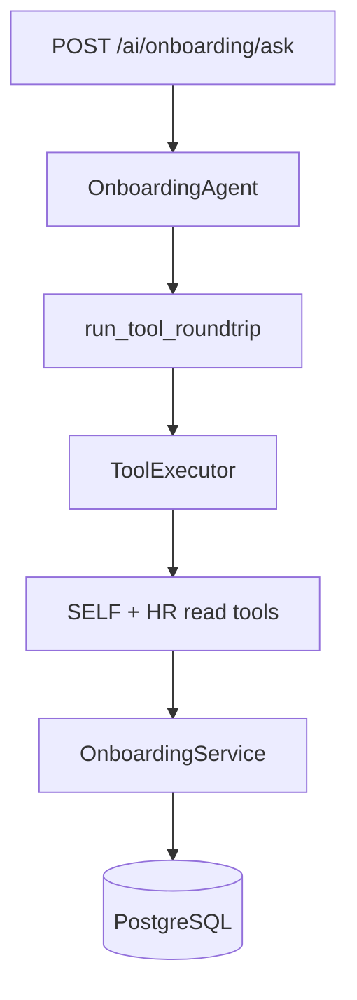

# Phase 9.2A — Onboarding Agent (Read-Only)

**Stance:** Backend AI layer only. Wrap [`OnboardingService`](../app/modules/onboarding/service.py) reads. No writes, confirm/HMAC, agent registry registration, frontend changes, Training tools, manager/team scope, RBAC changes, or migrations.

**Architectural principle:**

```text
User
  ↓
POST /ai/onboarding/ask
  ↓
OnboardingAgent
  ↓
run_tool_roundtrip → ToolExecutor
  ↓
SELF + HR read tools (+ FindEmployeesTool for HR name→id)
  ↓
OnboardingService
  ↓
PostgreSQL
```

The AI layer never touches repositories or the DB directly. Domain services remain authoritative.



---

## Files delivered

| Path | Role |
|------|------|
| [`app/ai/tools/onboarding_reads.py`](../app/ai/tools/onboarding_reads.py) | Nine SELF/HR read tools + compact Pydantic I/O schemas |
| [`app/ai/agents/onboarding/`](../app/ai/agents/onboarding/) | Agent package: `agent`, `prompts`, `schemas`, `exceptions`, `__init__` |
| [`app/api/v1/ai_onboarding.py`](../app/api/v1/ai_onboarding.py) | `POST /ai/onboarding/ask` |
| [`app/api/router.py`](../app/api/router.py) | Includes `ai_onboarding.router` |
| `app/tests/unit/test_ai_tool_onboarding_reads.py` | Tool auth + service wiring |
| `app/tests/unit/test_onboarding_agent.py` | Agent roundtrip / registry (no writes) |
| `app/tests/integration/test_ai_onboarding.py` | HTTP auth + ask smoke |
| This doc | Phase record |

Alembic head remains **`045_application_rejection_reason`** (no migrations in this phase).

---

## Tools

All tools call `OnboardingService` only; `AppException` maps to `ToolExecutionError` without leaking other users’ data.

### SELF (`operates_on_current_user=True`, empty `required_permissions`)

| Tool | Service method |
|------|----------------|
| `get_my_onboarding` | `get_for_employee_user(context.user_id)` |
| `get_my_onboarding_progress` | `get_progress_for_employee_user` |
| `list_my_onboarding_tasks` | `list_tasks_for_employee_user` |

SELF tools take **no** `employee_id` argument. Employees keep working without `onboarding:read` RBAC.

### HR (`onboarding:read` + roles `hr` / `admin`)

| Tool | Service method |
|------|----------------|
| `list_onboardings` | `list_for_hr` |
| `get_onboarding` | `get_for_hr(onboarding_id)` |
| `get_onboarding_by_employee` | `get_by_employee_id_for_hr(employee_id)` |
| `get_onboarding_progress` | `get_progress_for_hr(onboarding_id)` |
| `list_onboarding_tasks` | `list_tasks_for_hr(onboarding_id)` |
| `list_onboarding_templates` | `list_templates(active_only=…)` |

### Shared (HR name resolution)

| Tool | Notes |
|------|-------|
| `find_employees` | Existing `FindEmployeesTool`; still requires `recruitment:read` (known debt — not broadened in 9.2A). HR without recruitment must use numeric ids. |

Compact outputs: status, dates, progress %, required/optional, task title/type/status, employee identifiers on HR list items — no invented fields, no ORM leak.

---

## Agent package

Mirrors Leave (without confirm/writes):

| File | Role |
|------|------|
| `exceptions.py` | `OnboardingAgentError`, `OnboardingAgentValidationError` |
| `schemas.py` | `OnboardingAgentRequest`, `OnboardingAgentAnswer` (answer, model, tool_names_called, usage) — **no** `pending_confirmation` |
| `prompts.py` | System prompt: status semantics, required vs optional, evidence vs ACK vs manual, no manager authority, no fabrication, read-only |
| `agent.py` | Registry = 9 onboarding tools + `FindEmployeesTool`; `ask()` via `run_tool_roundtrip`; soft-fail auth |
| `__init__.py` | Public exports |

**No `confirm()` method** in this phase. Registry has **no write tools**.

---

## Auth model

| Layer | Rule |
|-------|------|
| HTTP | Authenticated user + `get_ai_execution_context` (same pattern as unified assistant). **Do not** gate the ask route on `onboarding:read` — employees lack that permission. |
| SELF tools | `operates_on_current_user=True`; empty permissions; service scopes by `user_id`. |
| HR tools | `required_permissions={"onboarding:read"}` + `required_roles={"hr","admin"}` (mirrors Leave HR reads). |
| Manager | HTTP 200 into agent; HR tools soft-fail / deny — **no** org-chart or `manager_id` onboarding access. |
| Candidate | Same: authenticated ask allowed; no employee/HR onboarding data via tools. |

Unauthorized tool calls soft-fail inside `run_tool_roundtrip`; responses must not leak other users’ onboarding data.

---

## Prompt rules (summary)

1. Answer only from tool results; never invent status, progress, tasks, or templates.
2. Read-only: never claim a task was completed, verified, or acknowledged via chat.
3. Required tasks block automatic onboarding completion; optional do not.
4. Evidence / ACK / manual task semantics explained; writes deferred to later phases.
5. Managers have no report-scoped onboarding tools.
6. HR resolves names via `find_employees`; on 0/>1 matches or `recruitment:read` failure, ask for numeric id.

---

## Endpoint

`POST /api/v1/ai/onboarding/ask`

- Depends: `get_current_user`, `get_ai_execution_context`, `get_onboarding_service`, `get_employee_service`, `get_db`, `get_llm_provider`.
- Body: `{ "question": "..." }`.
- Response: `{ answer, model, tool_names_called, usage }` — aligned with Leave ask, **without** confirm / pending_confirmation.
- No `/confirm` route.

---

## Tests

| File | Focus |
|------|-------|
| `unit/test_ai_tool_onboarding_reads.py` | Employee/manager/HR/candidate authorize matrix; SELF uses `user_id`; HR deny without `onboarding:read` |
| `unit/test_onboarding_agent.py` | Mock LLM → correct tools; **no write tools** in registry; empty question; safe fallbacks |
| `integration/test_ai_onboarding.py` | 401 unauthenticated; employee/HR ask 200; manager/candidate reach ask authenticated; no confirm route |

Validation runs (this phase):

| Suite | Result |
|-------|--------|
| Phase 9.2A targeted (tools + agent + `test_ai_onboarding`) | **21 passed** |
| Unit regression (`test_ai_tool_onboarding_reads`, `test_onboarding_agent`, `test_leave_agent`) | **25 passed** |
| Integration: `test_ai_onboarding` + `test_onboarding_access` + `test_onboarding_progress` | **21 passed** |
| Integration: onboarding domain (`test_onboarding`, tasks, templates, verification, notifications) | **47 passed** |

Regression note: known pre-existing failures outside this phase (e.g. stale recruitment soft-fail unit; onboarding backfill flake) are **not** “fixed” here for a green full suite. Alembic head must stay `045_application_rejection_reason`.

---

## Limitations / non-goals (explicit)

- No writes, confirm, HMAC, or pending confirmation.
- Not registered in the multi-agent assistant registry / router — not reachable via unified FE ask yet.
- No frontend changes in this phase.
- No Training tools.
- No manager/team / `manager_id` scope.
- No template/task CRUD via agent.
- No RBAC seed changes; employees still lack `onboarding:read` by design.
- `find_employees` still requires `recruitment:read` (known debt).

---

## Ready for Phase 9.2B?

**Yes**, for write/confirm design on top of this read-only spine — provided 9.2B stays service-backed, reuses confirm patterns from Leave where appropriate, and still does not invent manager-scoped onboarding APIs. Registry/FE wiring remains a later decision after writes (or a dedicated integration phase).
