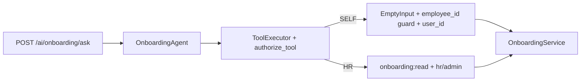

# Phase 9.2B — Onboarding Agent Authorization Hardening

**Stance:** Verify and harden the read-only Onboarding Agent authorization contract. No writes, confirm/HMAC, registry, frontend, RBAC seed changes, Core HR service auth redesign, Training tools, or migrations.

Alembic head remains **`045_application_rejection_reason`**.

---

## Authorization model (unchanged from 9.1 / 9.2A)

| Actor | Scope |
|-------|--------|
| **Employee** | SELF tools only — own onboarding via `context.user_id` |
| **Manager** | Own SELF only; `manager_id` / org-chart does **not** grant others’ onboarding |
| **HR / Admin** | Organizational HR tools; require `onboarding:read` + role `hr` or `admin` |
| **Candidate** | No onboarding data (missing `employee_id` → safe error before service) |

HTTP `POST /ai/onboarding/ask` remains **authenticated-only**. Agent availability ≠ tool authorization. Security is enforced by `authorize_tool` + ToolExecutor + service identity derivation — **not** by the system prompt.

---

## Tool-level authorization

### SELF (`operates_on_current_user=True`, empty `required_permissions`)

| Tool | Identity | Accepts foreign `employee_id`? |
|------|----------|--------------------------------|
| `get_my_onboarding` | Guard `context.employee_id`; service `get_for_employee_user(context.user_id)` | No (`EmptyInput`, `extra=forbid`) |
| `get_my_onboarding_progress` | same | No |
| `list_my_onboarding_tasks` | same | No |

**Self identity derivation:**

1. Reject any `employee_id` / `user_id` in tool args (schema validation → `ToolValidationError`).
2. Require `context.employee_id` (`_require_employee_id`) — candidates / non-employees get `"No employee profile for the authenticated user"` without calling the service.
3. Call OnboardingService with **`context.user_id` only** (never a user-supplied id).

### HR (`onboarding:read` + roles `{hr, admin}`)

| Tool | Args |
|------|------|
| `list_onboardings` | none |
| `get_onboarding` | `onboarding_id` |
| `get_onboarding_by_employee` | `employee_id` (HR only, after auth) |
| `get_onboarding_progress` | `onboarding_id` |
| `list_onboarding_tasks` | `onboarding_id` |
| `list_onboarding_templates` | optional `active_only` |

Unauthorized callers (employee / manager / candidate) receive the generic deny: **`Not authorized to execute this tool`** — no existence oracle (no “not found”, no names). Soft-fail in `run_tool_roundtrip` does not invoke HR service methods.

Authorized HR/Admin may still receive domain 404s (`Onboarding not found` / `Employee not found`) from OnboardingService — that is intentional for privileged readers.

### FindEmployees (unchanged)

`FindEmployeesTool` still requires **`recruitment:read`**. Not broadened in 9.2B. HR with `onboarding:read` but without recruitment must use numeric `employee_id` / `onboarding_id`.

---

## Code changes in this phase

| Path | Change |
|------|--------|
| [`app/ai/tools/onboarding_reads.py`](../app/ai/tools/onboarding_reads.py) | `_require_employee_id` on all three SELF tools |
| [`app/ai/agents/onboarding/prompts.py`](../app/ai/agents/onboarding/prompts.py) | Explicit candidate / manager / soft-fail / “prompt is not security layer” wording |
| Unit + integration tests | Expanded auth / identity / soft-fail / leakage matrix |
| This doc | Phase record |

No domain permission changes. No write tools. No FE / registry / migrations.

---

## Prompt (UX only)

Prompt clarifies managers cannot manage reports’ onboarding, candidates get no data, unauthorized soft-fails must not invent existence, and one completed task ≠ whole onboarding complete. **Prompt is not the security layer.**

---

## Tests

| File | Focus |
|------|-------|
| `unit/test_ai_tool_onboarding_reads.py` | Full SELF/HR/admin/manager/candidate authorize matrix; missing employee guard; identity arg rejection; generic deny (no leak); find_employees still needs `recruitment:read` |
| `unit/test_onboarding_agent.py` | Forced HR tools soft-fail for employee/manager without calling HR services; no write/manager tools; prompt documents limits |
| `integration/test_ai_onboarding.py` | Auth 401; ask envelope without confirm; manager soft-denial response |

Validation: **33 passed** (tools + agent + integration AI onboarding).

Regression (this phase): **59 passed**, **1 failed** — `test_unauthorized_tool_call_surfaces_as_agent_error` in `test_recruitment_agent.py` (known pre-existing soft-fail expectation drift; not introduced by 9.2B). Onboarding access integration + leave agent unit: green. Alembic head: `045_application_rejection_reason`.

---

## Known limitations

- Not registered in the multi-agent assistant registry / unified FE ask.
- No write / confirm tools (deferred).
- `find_employees` still requires `recruitment:read`.
- No manager/team onboarding tools (by design).
- Employees still lack `onboarding:read` RBAC (by design).

---

## Explicit non-goals (confirmed)

Writes, confirm/HMAC, AI audit redesign, registry/unified assistant, frontend, Training/Document/Offboarding agents, manager onboarding tools, template/task mutation, new RBAC permissions, Core HR authorization redesign, Alembic migrations.
