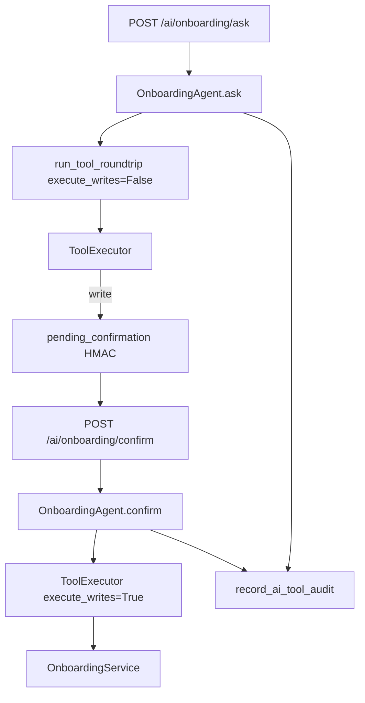

# Phase 9.2C — Onboarding Agent Controlled Writes

**Stance:** Three confirmation-gated write tools only. Reuse existing `OnboardingService` methods + shared Leave/Recruitment HMAC confirmation + `record_ai_tool_audit`. No registry, frontend, new RBAC, migrations, or manager writes.

Alembic head remains **`045_application_rejection_reason`**.

---

## Write tools

| Tool | Service method | Inputs | Auth |
|------|----------------|--------|------|
| `acknowledge_onboarding_task` | `acknowledge_task_for_employee(user_id, task_id)` | `task_id` only | SELF: empty perms + `operates_on_current_user` + `employee_id` required; execute with `context.user_id` |
| `complete_manual_onboarding_task` | `complete_manual_task_for_hr(task_id)` | `task_id` | HR/Admin + `onboarding:write` |
| `complete_onboarding` | `complete_for_hr(onboarding_id)` | `onboarding_id` | HR/Admin + `onboarding:write` |

All three set `may_require_confirmation=True`. Domain type checks (ACK / MANUAL only), ownership, and already-completed rules live in **OnboardingService** — tools do not duplicate them.

HTTP confirm uses **authenticated user only** (same as ask). Do **not** require `onboarding:write` on the confirm route — employee ACK has no that permission; tool metadata enforces gates.

---

## Authorization matrix

| Actor | ACK | Manual complete | Force-complete |
|-------|-----|-----------------|----------------|
| Employee | Own ACK tasks | Deny | Deny |
| Manager | Own ACK only (no reports) | Deny | Deny |
| HR / Admin | N/A (use HR tools) | Allow | Allow |
| Candidate | Deny (no employee profile) | Deny | Deny |

---

## Confirmation / HMAC

1. Ask path: `ToolExecutor(execute_writes=False)` → pending token bound to user, tool name, exact arguments, target.
2. Confirm: `verify_confirmation_token` → `execute_writes=True` → service call.
3. Altered args / wrong user / forged HMAC → rejected (shared confirmation module).

`ToolExecutor._infer_target` maps `task_id` → `onboarding_task`, `onboarding_id` → `onboarding`.

---

## Audit lifecycle

Via `record_ai_tool_audit` (existing table):

`proposed` → `confirmed` → `executed` | `failed` (`invalid_or_expired_token`, `unauthorized`, `validation`, `execution`)

---

## Files

| Path | Role |
|------|------|
| [`app/ai/tools/onboarding_writes.py`](../app/ai/tools/onboarding_writes.py) | Three write tools |
| [`app/ai/tools/executor.py`](../app/ai/tools/executor.py) | `_infer_target` for task/onboarding ids |
| [`app/ai/agents/onboarding/`](../app/ai/agents/onboarding/) | ask pending + `confirm()` + audit + prompt |
| [`app/api/v1/ai_onboarding.py`](../app/api/v1/ai_onboarding.py) | `pending_confirmation` on ask; `POST /confirm` |
| Tests | `test_ai_tool_onboarding_writes.py`, agent + integration updates |
| This doc | Phase record |

---

## Explicit out of scope

Registry / unified assistant, frontend confirm UI, Training/Document tools, manager onboarding tools, template/task CRUD, create/backfill/sync, evidence-task completion via AI, new permissions, Core HR auth redesign, Alembic migrations.

---

## Known limitations

- Not registered in multi-agent assistant / FE ask yet — confirm UI deferred (agentId pattern exists for Leave/Recruitment).
- `find_employees` still requires `recruitment:read`.
- Force-complete does not change employment status (domain semantics unchanged).

---

## Tests

| Suite | Result |
|-------|--------|
| Writes + agent + integration AI onboarding | **39 passed** |
| Regression (above + onboarding reads + leave agent/writes + onboarding access) | **85 passed** |

Alembic head: `045_application_rejection_reason`.
