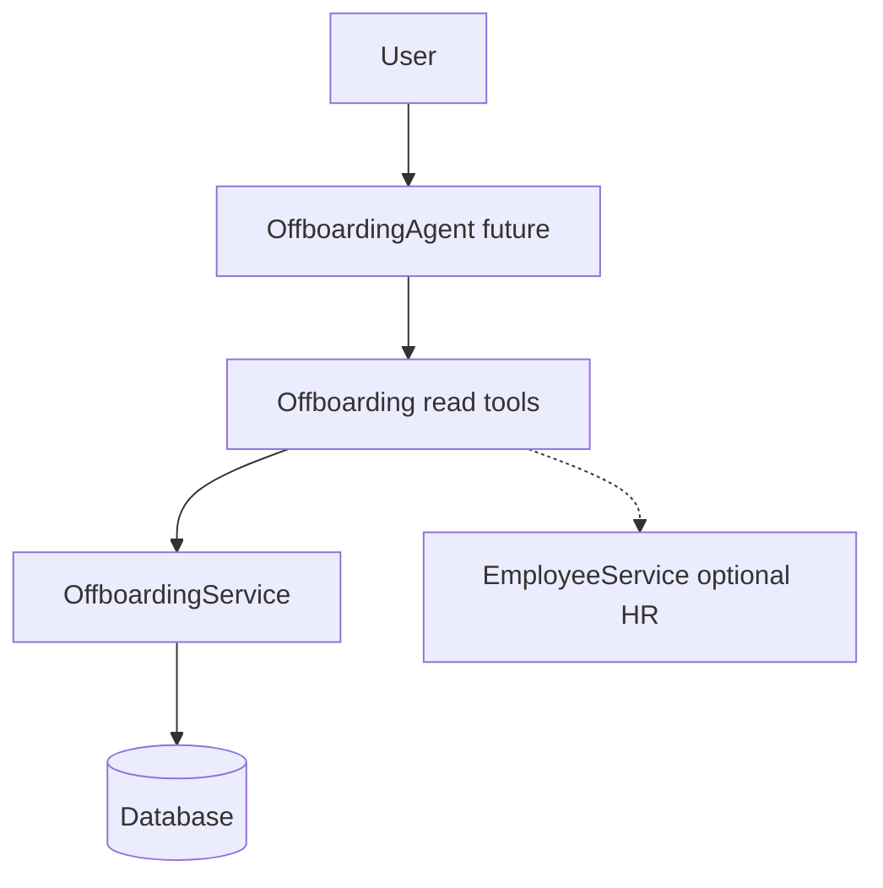

# Phase O.6A — Offboarding Agent Audit (READ-ONLY)

**Stance:** Audit and design only. No Offboarding domain changes, no AI tools/agent/registry/unified-assistant code, and no migrations in this phase.

**Context:** Core HR Offboarding is complete (request → O.1 case → O.2 checklist → O.3 clearance → O.4 exit interview → O.5 readiness → account deactivation). This document blueprints a future **READ-ONLY** Offboarding Agent that wraps **existing** services only.

**Architectural principle:**

```text
User
  ↓
Offboarding Agent (future)
  ↓
Offboarding Tools (future)
  ↓
Existing Offboarding Business Services
  ↓
PostgreSQL
```

The AI layer must **never** access repositories, SQL, S3, or Google Meet APIs directly. Domain services remain authoritative. The LLM is not business logic.

---

## A. Files inspected

### Offboarding domain

| Path | Role |
|------|------|
| [`backend/app/modules/offboarding/service.py`](../app/modules/offboarding/service.py) | Single `OffboardingService` — cases, tasks, clearance, exit interview, `can_complete`, `complete` + deactivation |
| [`backend/app/modules/offboarding/schemas.py`](../app/modules/offboarding/schemas.py) | HR vs employee DTOs |
| [`backend/app/modules/offboarding/models.py`](../app/modules/offboarding/models.py) | Statuses, `ACTIVE_OFFBOARDING_STATUSES` |
| [`backend/app/modules/offboarding/repository.py`](../app/modules/offboarding/repository.py) | Persistence (tools must **not** call this) |
| [`backend/app/modules/offboarding/meeting_service.py`](../app/modules/offboarding/meeting_service.py) | Meet link provisioning only |
| [`backend/app/modules/offboarding/dependencies.py`](../app/modules/offboarding/dependencies.py) | Service wiring |
| [`backend/app/api/v1/offboarding.py`](../app/api/v1/offboarding.py) | HR + `/me` routes; RBAC at API layer |
| [`backend/app/modules/offboarding_requests/service.py`](../app/modules/offboarding_requests/service.py) | Pre-case requests (out of six-tool MVP) |

### Identity / employees

| Path | Role |
|------|------|
| [`backend/app/modules/identity/service.py`](../app/modules/identity/service.py) | `AuthService.authenticate` / `deactivate_user`; `User.is_active` |
| [`backend/app/modules/identity/dependencies.py`](../app/modules/identity/dependencies.py) | `get_current_user` rejects inactive |
| [`backend/app/modules/identity/hr_access.py`](../app/modules/identity/hr_access.py) | `require_hr_staff` |
| [`backend/app/modules/employees/service.py`](../app/modules/employees/service.py) | `employment_status`; hire/list/get |

### AI stack (peers — Offboarding **not** registered)

| Path | Role |
|------|------|
| [`backend/app/ai/registry/registry.py`](../app/ai/registry/registry.py) | `AgentDefinition` catalog; offboarding absent |
| [`backend/app/ai/registry/availability.py`](../app/ai/registry/availability.py) | Special cases for onboarding / training / documents |
| [`backend/app/ai/routing/router.py`](../app/ai/routing/router.py) | Keyword router |
| [`backend/app/ai/core/context/models.py`](../app/ai/core/context/models.py) | `AIExecutionContext` |
| [`backend/app/ai/tools/base.py`](../app/ai/tools/base.py) / `executor.py` / `authorization.py` | Tool + RBAC patterns |
| [`backend/app/ai/tools/find_employees.py`](../app/ai/tools/find_employees.py) | Name lookup; requires `recruitment:read` |
| [`backend/app/ai/agents/onboarding/`](../app/ai/agents/onboarding/) | Closest peer (`_SELF_META` / `_HR_META`) |
| [`backend/app/ai/agents/documents/`](../app/ai/agents/documents/) | Read-only agent pattern |
| [`backend/app/ai/agents/leave/`](../app/ai/agents/leave/) | Self / team / HR tool split |

---

## B. Existing reusable services

There is **one** domain service: `OffboardingService` (no separate Task/Clearance/ExitInterview services).

| Capability | Method(s) | Notes |
|------------|-----------|--------|
| HR case list / filter | `list_for_hr(status=, employee_id=)` | `OffboardingListItemResponse` |
| HR case detail | `get_for_hr(case_id)` + `build_detail_response` | Includes `reason_details`, `created_by` |
| Employee cases | `list_for_user(user_id)` + `build_employee_view_response` | All statuses including completed |
| Checklist progress | `get_progress(case_id)` | Task aggregates + `required_complete` |
| Tasks HR | `list_tasks_for_hr(case_id)` | Includes `completed_by_user_id` |
| Tasks employee | `list_tasks_for_user(user_id)` | Active-case assignee filter; no `completed_by_user_id` |
| Clearance HR | `list_clearance_for_hr` / `get_clearance_progress` / `is_clearance_complete` | |
| Clearance employee | `list_clearance_for_user(user_id)` | **Active case only** — empty after complete |
| Exit interview HR | `get_exit_interview_for_hr(case_id)` | Includes `feedback` |
| Exit interview employee | `get_exit_interview_for_user(user_id)` | **Active case only**; no `feedback` |
| Readiness | `can_complete(case_id) -> (bool, list[str])` | O.5 rules; **does not check case status** |
| Complete + deactivate | `complete(case_id)` | **WRITE — out of agent scope** |
| Employment status | `EmployeeService.get_employee` | Not on offboarding detail schema |
| Account flag | `User.is_active` | Login/JWT gate; not on offboarding schemas |

**RBAC:** Service methods do **not** check roles. APIs use `require_hr_staff("offboarding:read"|"write")` or `get_current_user` for `/me`. Future tools must mirror that.



---

## C. Proposed six read-only tools

All tools call **services only**. Six tools are **sufficient** if progress/readiness compose existing methods and readiness short-circuits on terminal status.

| Tool | HR | Employee (self) | Service wiring |
|------|----|-----------------|----------------|
| `get_offboarding_case` | `case_id` or resolved `employee_id` | `list_for_user(context.user_id)` only | `get_for_hr` / `list_for_hr` / employee view |
| `get_offboarding_progress` | Checklist + clearance + exit + readiness | Own case where APIs allow | Compose `get_progress` + `get_clearance_progress` + exit get + readiness — **do not recompute** O.2/O.3/O.5 |
| `list_offboarding_tasks` | `list_tasks_for_hr`; optional in-memory status filter | `list_tasks_for_user` | Existing lists |
| `get_offboarding_clearance` | List + progress | Employee clearance view | `list_clearance_for_*` |
| `get_exit_interview` | Full HR incl. feedback | Schedule, interviewer, `meeting_url`; **no feedback** | `get_exit_interview_for_hr` / `_for_user` |
| `get_offboarding_readiness` | Load case first: if `completed`/`cancelled` return terminal state; else `can_complete` unchanged | Own case only after ownership check | Case get then `can_complete` |

**Not in MVP:** offboarding requests, Meet ensure/retry, writes, raw `User.is_active` to employees.

**Companion:** optional `FindEmployeesTool` for HR name lookup — see entity resolution caveat.

---

## D. Authorization model

| Principal | Agent available when | Tool access |
|-----------|----------------------|-------------|
| **HR / Admin** | Staff + `offboarding:read` | All six tools; `case_id` / `employee_id` after authorized resolution |
| **Employee** | `context.employee_id` set (special-case like onboarding — employees typically lack `offboarding:read`) | Self tools only; `operates_on_current_user=True` |
| **Manager** | **Unavailable** unless also HR offboarding | Domain has **no** manager offboarding scope |
| **Candidate** | **Unavailable** | — |

**Hard rules:**

- Identity from `AIExecutionContext` only (`user_id`, `employee_id`, roles, permissions).
- Reject LLM-supplied `user_id` / `employee_id` on self tools.
- Never trust name→id without authorized lookup; then service proves access.
- Employee cannot query another employee’s case.

---

## E. Employee vs HR visibility

| Data | HR | Employee |
|------|----|----------|
| Case status, LWD, reason enum, dates | Yes | Yes |
| `reason_details` | Yes | **No** |
| Task / checklist progress | Yes | Own / assigned as today |
| `completed_by_user_id` | Yes | **No** |
| Clearance notes | Yes | Yes (API parity; treat as DATA) |
| Exit interview feedback | Yes | **No** |
| Exit `meeting_url` | Yes | Yes if present |
| Case/exit `created_by*` | Yes | **No** |
| Readiness blockers | Yes | Own case only if exposed |
| `User.is_active` internals | Prefer `employment_status` via EmployeeService | Case `completed` is enough; do not expose auth flags |
| Storage keys / S3 / Meet credentials | Never | Never |

---

## F. Entity resolution

Flow for “What is Sarah’s offboarding status?” (HR):

1. Router → Offboarding Agent.
2. `find_employees` (or future offboarding-scoped lookup) with `"Sarah"`.
3. 0 matches → not found; **>1 → ask clarification; never guess**.
4. Unique `employee_id` → `list_for_hr(employee_id=…)` / `get_offboarding_case`.
5. Return compact DTO from service data.

Self questions use `context.user_id` only.

**Caveat:** `FindEmployeesTool` requires **`recruitment:read`**, not `offboarding:read`. Before O.6B: accept numeric `case_id`/`employee_id` without recruitment:read, **or** add a dedicated search path authorized by `offboarding:read` / `employees:read` (product decision — do not silently change `FindEmployeesTool` metadata).

---

## G. Sensitive fields & prompt injection

**Exclude from employee tool outputs:** `reason_details`, exit `feedback`, `completed_by_user_id`, exit/case `created_by*`, other employees’ PII, raw `User.is_active`, passwords/tokens, storage keys, private docs, Meet OAuth internals.

**Treat as DATA (never instructions):** task descriptions, clearance notes, feedback, `reason_details`.

Prompt must copy Leave/Onboarding/Documents authority blocks:

- Tools + services are the security layer; prompt is not.
- Explicit **PROMPT-INJECTION DEFENSE** for free-text fields.
- READ-ONLY: no complete / deactivate / clear / approve / schedule as actions.
- Completed cases: state from tool results only; do not invent deactivation.
- Do not steal Knowledge questions about general resignation **policy**.

---

## H. Future agent architecture (do not implement in O.6A)

| Item | Proposal |
|------|----------|
| Agent id | `offboarding` |
| Display name | Offboarding Agent |
| Layout | `backend/app/ai/agents/offboarding/` (`agent.py`, `prompts.py`, `schemas.py`, `exceptions.py`) |
| Tools | `backend/app/ai/tools/offboarding_reads.py` |
| Pattern | DocumentsAgent + Onboarding `_SELF_META` / `_HR_META` |
| Orchestration | `run_tool_roundtrip` + private `ToolRegistry` |
| Confirmation | `supports_confirmation=False` |
| HTTP | Future `ai_offboarding.py`; unified assistant later |

**Never:** repositories, SQL, S3, Google APIs, rewriting O.5 rules, write tools.

---

## I. Proposed registry availability (not coded)

```text
AgentDefinition(
  id="offboarding",
  display_name="Offboarding Agent",
  required_permissions_any={"offboarding:read"},
  supports_confirmation=False,
)
```

**`is_agent_available` special case (proposed):** available if `employee_id` is set **OR** (hr/admin and `offboarding:read`). Candidates / pure managers: unavailable.

---

## J. Proposed routing rules (not coded)

**Strong markers:** offboarding, leaving the company, departure, last working day, exit interview, clearance, offboarding tasks, laptop return, account deactivation (offboarding context), pending clearance, ready to complete offboarding.

**Knowledge wins:** handbook/policy about resignation/exit **without** a specific employee/case.

**Avoid stealing:** leave, training, recruitment, private PDF Q&A, generic documents.

Score only if agent available; clarify on multi-intent ties.

---

## K. Tests required (when implementing — not O.6A)

- Tool auth: HR vs employee vs candidate vs manager; spoofed `employee_id` rejected.
- Self tools only return own case.
- Progress/readiness match service numbers; readiness on `COMPLETED` is terminal (not falsely ready).
- Exit interview: HR sees feedback; employee does not.
- Injection: notes/feedback as data.
- Router markers vs Knowledge policy; registry availability matrix.
- Entity resolution: 0 / 1 / many matches.
- Regression: offboarding + AI registry suites green.

---

## L. Gaps to address before / during O.6B implementation

1. **`can_complete` ignores terminal status** — readiness tool must short-circuit on `completed`/`cancelled`; optional later service helper `get_completion_readiness`.
2. **No single aggregated progress DTO** — compose in tool; optional domain facade later.
3. **Employee clearance / exit after completion** — `*_for_user` is active-case only; fix before promising “was my exit interview completed?” post-complete.
4. **Deactivation not on offboarding schemas** — HR: `EmployeeService.employment_status`; employee: case `completed` only.
5. **`FindEmployeesTool` + `recruitment:read`** — name Q&A blocker for offboarding-only HR.
6. **No task list filter API** — in-memory filter OK for v1.
7. **Offboarding requests** — not in six tools; may need a later read tool.

---

## M. Explicit non-goals

- No code changes in O.6A (this document is the deliverable)
- No write tools (complete, deactivate, clear, approve, cancel, schedule, mutate)
- No Agent Registry / Unified Assistant changes until a later phase
- No O.1–O.5 domain refactor

---

## N. Next phase

**O.6B** (separate approval): implement read-only tools + Offboarding Agent + tests, addressing gaps above as needed. Registry/unified routing may be O.6C depending on product sequencing.
