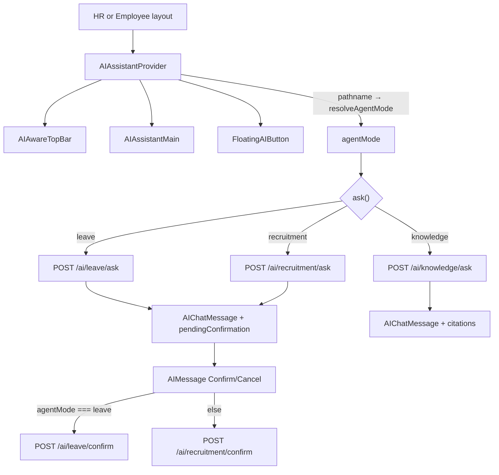

# Phase 8.3A — Frontend Audit for Unified HR Assistant

**Stance:** Read-only audit. No frontend, backend, API contract, or confirmation changes in this phase.

**Context:** Phase 8.2 added `POST /api/v1/ai/assistant/ask` (registry → deterministic router → existing agents). The frontend still selects Knowledge / Leave / Recruitment from the URL path. This document records the actual FE implementation before Phase 8.3B migration.

---

## A. Files inspected

### Core orchestration

| Role | Path |
|------|------|
| Provider + hook | [`frontend/src/hooks/useAIAssistant.tsx`](../src/hooks/useAIAssistant.tsx) |
| Drag position hook | [`frontend/src/hooks/useDraggableAI.ts`](../src/hooks/useDraggableAI.ts) |
| TypeScript AI types | [`frontend/src/types/ai.ts`](../src/types/ai.ts) |
| HTTP client (AI methods) | [`frontend/src/lib/api.ts`](../src/lib/api.ts) (approx. lines 1125–1277) |

### UI components (`frontend/src/components/ai-assistant/`)

| Component | Path |
|-----------|------|
| Barrel | [`index.ts`](../src/components/ai-assistant/index.ts) |
| Full-screen swap | [`AIAssistantMain.tsx`](../src/components/ai-assistant/AIAssistantMain.tsx) |
| Panel shell | [`AIAssistantPanel.tsx`](../src/components/ai-assistant/AIAssistantPanel.tsx) |
| Welcome + suggestions | [`AIAssistantWelcome.tsx`](../src/components/ai-assistant/AIAssistantWelcome.tsx) |
| Top bar (AI title when open) | [`AIAwareTopBar.tsx`](../src/components/ai-assistant/AIAwareTopBar.tsx) |
| Floating orb | [`FloatingAIButton.tsx`](../src/components/ai-assistant/FloatingAIButton.tsx) |
| Message list | [`AIConversation.tsx`](../src/components/ai-assistant/AIConversation.tsx) |
| Bubble + confirm UI | [`AIMessage.tsx`](../src/components/ai-assistant/AIMessage.tsx) |
| Knowledge sources | [`AICitationList.tsx`](../src/components/ai-assistant/AICitationList.tsx) |
| Input | [`AIComposer.tsx`](../src/components/ai-assistant/AIComposer.tsx) |
| Loading copy | [`AILoadingState.tsx`](../src/components/ai-assistant/AILoadingState.tsx) |

### Layout integration

| Layout | Path | Assistant mounted? |
|--------|------|--------------------|
| HR | [`frontend/src/app/hr/layout.tsx`](../src/app/hr/layout.tsx) | Yes — `AIAssistantProvider` → `AIAwareTopBar` + `AIAssistantMain` + `FloatingAIButton` |
| Employee | [`frontend/src/app/employee/layout.tsx`](../src/app/employee/layout.tsx) | Yes — same pattern |
| Careers / admin / manager / candidate / login / root | — | **No** |

### Backend reference (comparison only)

| Path | Role |
|------|------|
| [`backend/app/api/v1/ai_assistant.py`](../../backend/app/api/v1/ai_assistant.py) | Unified ask envelope |
| [`backend/docs/phase_8_2_multi_agent_gateway.md`](../../backend/docs/phase_8_2_multi_agent_gateway.md) | Phase 8.2 gateway design |

---

## B. Current architecture

### Flow (actual)

```text
HR layout  OR  Employee layout
  ↓
AIAssistantProvider  (pathname → resolveAgentMode → agentMode)
  ↓
AIAwareTopBar + AIAssistantMain + FloatingAIButton
  ↓
User opens orb → AIAssistantMain swaps children for AIAssistantPanel
  ↓
ask(question) branches on agentMode
  ↓
api.askLeaveAgent | askRecruitmentAgent | askKnowledgeAgent
  ↓
POST /api/v1/ai/{leave|recruitment|knowledge}/ask
  ↓
Map response → AIChatMessage (citations and/or pendingConfirmation)
  ↓
AIConversation → AIMessage (+ Confirm UI / AICitationList)
```

### Diagram



### Behavioral notes

- Opening the assistant **replaces** page children with a full-height panel (`AIAssistantMain`); it is not a side drawer over content.
- Conversation state (`messages`, `draft`, `error`, `loading`, `open`) lives in React context only — **no** chat history API or localStorage persistence.
- `pendingConfirmation` is stored **on the assistant message**, not as a separate top-level context field.
- There is **no** call to `POST /api/v1/ai/assistant/ask` anywhere in the frontend today.

### Context API surface

From [`useAIAssistant.tsx`](../src/hooks/useAIAssistant.tsx):

- Panel: `open`, `openAssistant`, `closeAssistant`, `toggleAssistant`
- Chat: `messages`, `draft`, `setDraft`, `ask`, `hasConversation`
- Confirm: `confirmPending`, `cancelPending`
- Status: `loading`, `error`, `clearError`
- Mode: `agentMode` (`AIAssistantAgentMode`)

---

## C. Current agent routing

### Exact selector

```46:52:frontend/src/hooks/useAIAssistant.tsx
function resolveAgentMode(pathname: string): AIAssistantAgentMode {
  if (pathname.startsWith("/hr/leave") || pathname.startsWith("/employee/leave")) {
    return "leave";
  }
  if (pathname.startsWith("/hr")) return "recruitment";
  return "knowledge";
}
```

### Path → mode matrix

| Path prefix | `agentMode` | Ask client |
|-------------|-------------|------------|
| `/hr/leave*` | `leave` | `askLeaveAgent` |
| `/employee/leave*` | `leave` | `askLeaveAgent` |
| other `/hr*` | `recruitment` | `askRecruitmentAgent` |
| other `/employee*` (non-leave) | `knowledge` | `askKnowledgeAgent` |

Examples:

- `/hr/jobs`, `/hr/dashboard`, `/hr/employees` → recruitment  
- `/hr/leave`, `/hr/leave/policies`, `/hr/leave/my` → leave  
- `/employee/dashboard`, `/employee/documents` → knowledge  
- `/employee/leave` → leave  

### Path side effects

| Event | Panel | Messages / draft / error |
|-------|-------|---------------------------|
| Any pathname change | Closes (`setOpen(false)`) | Unchanged unless mode also changes |
| `agentMode` change | (also closes via pathname) | **Cleared** |
| Same-mode nav (e.g. `/hr/jobs` → `/hr/employees`) | Closes | **Kept** |

### Assumption that must disappear in 8.3B

**`agent = route`.** The frontend decides which backend agent runs based solely on `pathname`. There is no user-facing agent picker; `agentMode` also drives welcome topic, suggestion chips, composer labels, and loading text.

---

## D. Current API contracts

Defined on the `api` client in [`frontend/src/lib/api.ts`](../src/lib/api.ts). All use Bearer token when present; failures throw `ApiClientError`.

| Method | HTTP | Body type | Response type |
|--------|------|-----------|---------------|
| `askKnowledgeAgent` | `POST /api/v1/ai/knowledge/ask` | `KnowledgeAskPayload` `{ question, top_k? }` | `KnowledgeAskResponse` |
| `askLeaveAgent` | `POST /api/v1/ai/leave/ask` | `LeaveAskPayload` `{ question }` | `LeaveAskResponse` |
| `askRecruitmentAgent` | `POST /api/v1/ai/recruitment/ask` | `RecruitmentAskPayload` `{ question }` | `RecruitmentAskResponse` |
| `confirmLeaveAction` | `POST /api/v1/ai/leave/confirm` | `RecruitmentConfirmPayload` `{ confirmation_token }` | `LeaveAskResponse` |
| `confirmRecruitmentAction` | `POST /api/v1/ai/recruitment/confirm` | `RecruitmentConfirmPayload` `{ confirmation_token }` | `RecruitmentAskResponse` |

**Missing for 8.3B:** `askAssistant` → `POST /api/v1/ai/assistant/ask` with `{ message }`.

Naming note: search aliases like `askKnowledge` / `confirmLeave` map to the `*Agent` / `*Action` method names above.

---

## E. Current TypeScript types

Source: [`frontend/src/types/ai.ts`](../src/types/ai.ts).

### Mode and messages

| Type | Shape / role |
|------|----------------|
| `AIAssistantAgentMode` | `"knowledge" \| "recruitment" \| "leave"` |
| `AIChatRole` | `"user" \| "assistant"` |
| `AIChatMessage` | `id`, `role`, `content`; optional `citations`, `has_context`, `pendingConfirmation`, `confirmationResolved` |

### Knowledge

| Type | Notable fields |
|------|----------------|
| `KnowledgeAskPayload` | `question`, optional `top_k` |
| `KnowledgeAskResponse` | `query`, `answer`, `citations[]`, `has_context`, retrieval counts, `model`, `usage` |
| `KnowledgeCitation` | `citation_id`, `document_name`, `page_start`, `page_end`, `company_document_id` |

### Leave / Recruitment (ask + confirm)

| Type | Notable fields |
|------|----------------|
| `LeaveAskPayload` / `RecruitmentAskPayload` | `question` |
| `LeaveAskResponse` / `RecruitmentAskResponse` | `answer`, `model`, `tool_names_called`, `usage`, optional `pending_confirmation` |
| `RecruitmentPendingConfirmation` | `token`, `tool_name`, `summary`, `expires_at` — **shared by leave** |
| `RecruitmentConfirmPayload` | `{ confirmation_token }` — **shared by leave confirm** |

### Response-shape assumptions today

| Agent | Frontend expects |
|-------|------------------|
| Knowledge | `answer` + `citations` (+ stores `has_context`; UI does not display it) |
| Leave | `answer` + optional `pending_confirmation` |
| Recruitment | `answer` + optional `pending_confirmation` |
| Errors | HTTP status via `ApiClientError` (403 / 409 / 422 / 0 / other) — **no** response `status` field |

### vs Phase 8.2 unified envelope

Backend unified response (conceptual):

```json
{
  "agent_id": "knowledge|leave|recruitment|null",
  "answer": "...",
  "citations": [],
  "pending_confirmation": null,
  "status": "completed|clarification_required|unavailable",
  "model": "...",
  "tool_names_called": [],
  "usage": null
}
```

| Can reuse? | Notes |
|------------|--------|
| Citation object shape | Yes — aligns with `KnowledgeCitation` |
| Pending confirmation shape | Yes — aligns with `RecruitmentPendingConfirmation` |
| Existing ask response types | **No** — missing `agent_id`, `status`; request uses `message` not `question` |
| Clarification / unavailable | **New** — today FE has no concept of soft routing outcomes |

**Conclusion:** Phase 8.3B needs new types (e.g. `AssistantAskPayload`, `AssistantAskResponse`, `AssistantAskStatus`) and mapping into `AIChatMessage`. Do not force-fit `KnowledgeAskResponse` / `LeaveAskResponse` onto the unified envelope.

---

## F. Confirmation flow

### Must preserve (unchanged endpoints)

- Leave: `POST /api/v1/ai/leave/confirm`
- Recruitment: `POST /api/v1/ai/recruitment/confirm`

The unified ask endpoint does **not** replace confirmation. There is no unified confirm API.

### Current sequence

```text
User ask (leave or recruitment path mode)
  ↓
Agent returns pending_confirmation
  ↓
Hook stores pendingConfirmation on AIChatMessage
  ↓
AIMessage renders amber “Confirmation required” card
  ↓
Confirm → confirmPending(messageId)
     → token from message.pendingConfirmation
     → agentMode === "leave"
          ? api.confirmLeaveAction({ confirmation_token })
          : api.confirmRecruitmentAction({ confirmation_token })
  ↓
Clear pending on that message; set confirmationResolved: "confirmed"
  ↓
Append new assistant message with confirm result.answer

Cancel → cancelPending(messageId)
  ↓
Local only: clear pending, confirmationResolved: "cancelled",
append "(Cancelled — no changes were made.)" to content
  ↓
No API call
```

### UI code

[`AIMessage.tsx`](../src/components/ai-assistant/AIMessage.tsx): Confirm / Cancel buttons call `confirmPending` / `cancelPending`. Shows tool name + summary. After confirm, shows “Action confirmed.” badge when `confirmationResolved === "confirmed"`.

### Critical bug risk for migration

`confirmPending` selects the confirm endpoint from **current path `agentMode`**, not from which agent produced the pending payload:

```205:210:frontend/src/hooks/useAIAssistant.tsx
        const result =
          agentMode === "leave"
            ? await api.confirmLeaveAction({ confirmation_token: token })
            : await api.confirmRecruitmentAction({
                confirmation_token: token,
              });
```

Today this works only because path mode matches the ask agent. After unified ask, a leave write proposed while the user sits on `/employee/dashboard` (today “knowledge”) would call **recruitment** confirm if this logic stays.  

**8.3B requirement:** store `agent_id` (`"leave"` | `"recruitment"`) on the message when pending is present; route confirm from that field.

---

## G. Current user experience (as-is)

| Topic | Behavior |
|-------|----------|
| Is selected agent visible? | Indirectly only — welcome topic, suggestion chips, composer label / placeholder / footer, loading string. No “Mode: Leave” chip. |
| Agent selector? | **No** |
| Does assistant change by page? | **Yes** — path → `agentMode` → different ask endpoint + copy |
| Can user switch agents? | Only by navigating to another section (e.g. Leave ↔ Jobs) |
| Confirmation cards? | Yes — amber card on the assistant message |
| Citations? | Knowledge path only — `AICitationList` (“Sources”) + inline `[N]` chips via `renderAnswer` |
| Markdown? | **No** Markdown library; answers use `whitespace-pre-wrap` + citation chip split |
| Errors | Red banner in `AIAssistantPanel` above composer; Dismiss via `clearError` |
| 403 | Mode-specific copy in `mapError` (leave / recruitment / knowledge) |
| Conversation history | In-memory only; cleared when `agentMode` changes |
| `has_context` | Stored on knowledge messages; **never rendered** |

Mode-specific copy examples:

- Welcome [`AIAssistantWelcome.tsx`](../src/components/ai-assistant/AIAssistantWelcome.tsx): `TOPIC` + `SUGGESTIONS` keyed by `agentMode`
- Composer [`AIComposer.tsx`](../src/components/ai-assistant/AIComposer.tsx): `LABEL` / `PLACEHOLDER` / `FOOTER`
- Loading [`AILoadingState.tsx`](../src/components/ai-assistant/AILoadingState.tsx): mode-specific “Consulting …” strings

---

## H. Migration risks

1. **Confirm keyed by path `agentMode`** — will break under unified routing; must key off response `agent_id` stored on the message.
2. **Mode-specific welcome / composer / loading** — path mode becomes meaningless for ask; need neutral “HR Assistant” copy (minimal UX change) or optional last-response agent label.
3. **Clear-on-mode-change** — removing path modes stops forced clears when navigating HR ↔ Leave; conversations may span pages (usually desirable). Closing the panel on pathname change can remain.
4. **New soft statuses** — `clarification_required` and `unavailable` return HTTP 200 with `status` + `answer`; FE must render them as assistant messages, not as `ApiClientError`.
5. **403 semantics shift** — per-agent ask endpoints 403 when the user lacks that agent’s permission. Unified ask is authenticated-only; capability denial is often `status: "unavailable"`. Update error mapping accordingly.
6. **Old `ask*Agent` methods** — keep temporarily for compatibility; stop calling them from the hook after switch; remove dead path branching only after validation.
7. **Do not invent unified confirm** — keep `confirmLeaveAction` / `confirmRecruitmentAction`.
8. **Request field rename** — unified body uses `message`; hook currently sends `question`.

---

## Recommended Phase 8.3B plan (do not execute in 8.3A)

1. Add `askAssistant({ message })` → `POST /api/v1/ai/assistant/ask` in [`api.ts`](../src/lib/api.ts).
2. Add unified request/response types (`agent_id`, `status`, citations, `pending_confirmation`) in [`types/ai.ts`](../src/types/ai.ts).
3. Update `ask()` in [`useAIAssistant.tsx`](../src/hooks/useAIAssistant.tsx) to call unified ask only; map envelope → `AIChatMessage`.
4. On pending messages, store `agentId: "leave" | "recruitment"` from `agent_id`; **`confirmPending` uses that**, not path — keep existing confirm methods.
5. Stop using `resolveAgentMode` for API selection; remove path→ask branching.
6. Soften UI copy that depends on `agentMode` (generic assistant strings; suggestions can be multi-domain / static).
7. Keep old `ask*Agent` methods unused until validation; then delete path resolver + dead ask branches only after checks pass.
8. Manually validate HR + Employee flows (leave, recruitment, knowledge intents; clarification / unavailable).
9. Validate Leave confirmation still hits `/ai/leave/confirm`.
10. Validate Recruitment confirmation still hits `/ai/recruitment/confirm`.
11. Run `tsc --noEmit`.
12. Run Next.js build.

---

## Phase 8.3A deliverable status

| Criterion | Status |
|-----------|--------|
| Frontend audited | Done |
| Path routing documented | Done |
| Confirmation flow documented | Done |
| Unified vs current type gap documented | Done |
| Migration risks listed | Done |
| 8.3B plan sketched | Done |
| Frontend/backend code modified | **None** |
| Phase 8.3B started | **No** |

**Ready for Phase 8.3B** when product owner approves migrating ask to the unified gateway while preserving agent-specific confirm endpoints.
